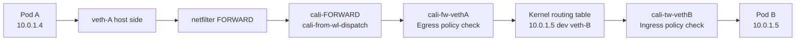
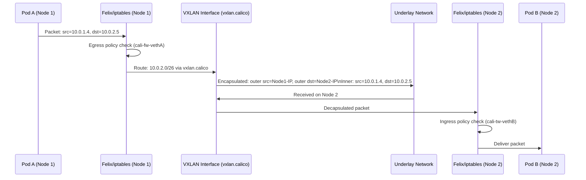
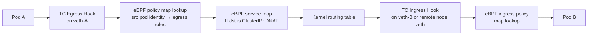

# How to Map the Calico Data Path to Real Kubernetes Traffic

Author: [nawazdhandala](https://github.com/nawazdhandala)

Tags: Calico, Kubernetes, Data Path, CNI, Traffic Flows, Networking, iptables, eBPF

Description: A packet-level walkthrough of how real Kubernetes traffic flows through Calico's data path, showing the processing stages for same-node, cross-node, and external traffic.

---

## Introduction

Mapping real traffic to data path stages transforms debugging from guesswork into systematic investigation. When you know that cross-node VXLAN traffic traverses the outer IP routing table before being decapsulated, you know to check outer IP routing (not pod routing) when cross-node connectivity fails but same-node connectivity works.

This post traces four representative traffic scenarios through Calico's data path in iptables mode and eBPF mode, showing which processing stages each packet traverses and what artifacts you can inspect at each stage.

## Prerequisites

- Understanding of Calico's iptables chain structure
- Familiarity with VXLAN encapsulation basics
- A Calico cluster for live verification

## Scenario 1: Same-Node Pod-to-Pod (iptables mode)



Artifacts to inspect:
```bash
# Egress policy chain (from Pod A)
sudo iptables -L cali-fw-<veth-a> -n -v

# Ingress policy chain (to Pod B)
sudo iptables -L cali-tw-<veth-b> -n -v

# Host route for Pod B
ip route show 10.0.1.5
```

## Scenario 2: Cross-Node Pod-to-Pod (VXLAN mode)



The VXLAN encapsulation/decapsulation is handled by the Linux kernel's VXLAN driver, not by Calico. Felix programs the FDB (forwarding database) entries that tell the VXLAN driver which Node IP to use for each pod CIDR:

```bash
# View Calico's VXLAN FDB entries
bridge fdb show dev vxlan.calico
# Expected: MAC→IP mappings for each remote node's pod CIDR
```

## Scenario 3: Pod-to-External (egress with SNAT)

```mermaid
graph LR
    Pod[Pod\n10.0.1.4] --> VETH[veth pair]
    VETH --> EGRESS[cali-fw-vethA\nEgress policy check]
    EGRESS --> ROUTING[Default route\n0.0.0.0/0 via node gateway]
    ROUTING --> POSTROUTING[POSTROUTING\nCALICO-MASQ rule]
    POSTROUTING --> NIC[Node NIC\nSrc: 203.0.113.1 (Node IP)]
    NIC --> Internet[External service]
```

The MASQUERADE rule is in the `nat` table POSTROUTING chain:
```bash
sudo iptables -t nat -L CALICO-MASQ -n -v
# Shows: MASQUERADE for pod CIDR traffic to non-cluster destinations
```

## Scenario 4: eBPF Mode - Direct Path

In eBPF mode, the netfilter chain traversal is replaced with TC hook programs:



eBPF map inspection:
```bash
# Policy map - contains policy rules per endpoint
sudo bpftool map list | grep calico_policy
sudo bpftool map dump id <policy-map-id> | head -30

# Service map - contains ClusterIP to pod IP mappings
sudo bpftool map list | grep svc_ports
```

## Comparing Packet Counts Between Data Paths

A useful diagnostic technique: count packets at each stage to find where packets are dropped:

```bash
# iptables mode: reset counters and send a packet, then check
sudo iptables -Z
kubectl exec pod-a -- wget -qO- http://10.0.2.5
sudo iptables -L cali-FORWARD -n -v  # Should show packet count > 0
sudo iptables -L cali-fw-<iface> -n -v  # Egress policy count
sudo iptables -L cali-tw-<iface2> -n -v  # Ingress policy count on dest node
```

If a count is 0 at a stage, the packet is not reaching that stage — look earlier in the path for the drop.

## Best Practices

- Build a data path flowchart for your specific encapsulation mode and keep it in your runbook
- Use packet counting at each stage to bisect connectivity issues
- For VXLAN, always check both inner and outer packet paths when debugging cross-node issues

## Conclusion

Mapping real Kubernetes traffic to Calico data path stages reveals exactly where to look for each type of connectivity issue. Same-node traffic uses only the local veth policy chains. Cross-node traffic adds encapsulation. External traffic adds SNAT. eBPF mode collapses netfilter traversal into TC hook programs. Knowing which stages a specific traffic type traverses enables systematic, efficient debugging during incidents.
