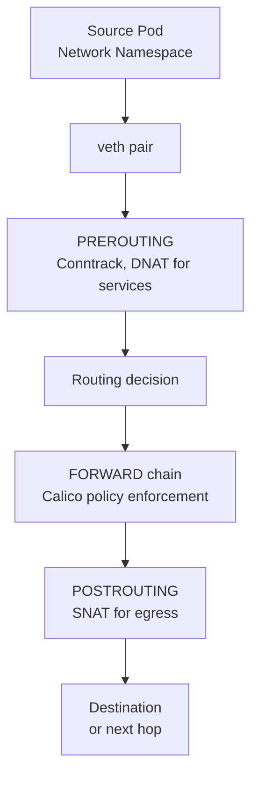
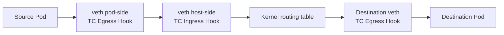
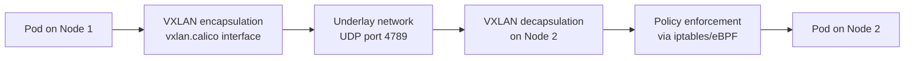

# How to Understand the Calico Data Path

Author: [nawazdhandala](https://github.com/nawazdhandala)

Tags: Calico, Kubernetes, Data Path, CNI, Iptables, EBPF, Networking, Packet Processing

Description: A deep dive into how packets flow through Calico's dataplane, covering the iptables and eBPF data paths and the role of each processing stage.

---

## Introduction

The Calico data path is the sequence of processing stages that every packet traverses from source pod to destination pod. Understanding this path - which kernel hooks are involved, what processing happens at each stage, and where policy is enforced - is essential for diagnosing connectivity issues and understanding the performance characteristics of different Calico configurations.

Calico supports three dataplanes: standard Linux (iptables/nftables), eBPF, and Windows HNS. This post focuses on the two Linux dataplanes because they represent the choice most production clusters make.

## Prerequisites

- Basic understanding of Linux networking (netfilter, routing tables)
- Familiarity with iptables concepts (chains, tables, rules)
- Understanding of network namespaces

## The iptables Data Path

In the standard Linux dataplane, every packet traverses netfilter's hook points:



**Calico's iptables chains** are inserted into the FORWARD chain. For each workload endpoint (pod), Felix creates a pair of chains:
- `cali-tw-<iface>`: Traffic to the workload (ingress policy)
- `cali-fw-<iface>`: Traffic from the workload (egress policy)

Viewing these chains:
```bash
sudo iptables -L cali-FORWARD -n --line-numbers
# Shows the jump rules to per-interface policy chains
```

## Calico's iptables Chain Structure

The iptables chain structure is hierarchical:

```plaintext
FORWARD
└── cali-FORWARD
    ├── cali-from-host-endpoint (host traffic)
    ├── cali-to-host-endpoint (host traffic)
    ├── cali-from-wl-dispatch (pod egress)
    │   └── cali-fw-<pod-iface> (per-pod egress policy)
    └── cali-to-wl-dispatch (pod ingress)
        └── cali-tw-<pod-iface> (per-pod ingress policy)
```

Each leaf chain contains the actual allow/deny rules derived from the Calico NetworkPolicy resources applied to that pod.

## The eBPF Data Path

In eBPF mode, Calico bypasses netfilter entirely and attaches programs at TC (Traffic Control) hook points:



eBPF programs at TC hooks handle:
1. **Policy enforcement**: The eBPF program checks connection permission against eBPF maps containing policy rules
2. **Connection tracking**: Maintained in eBPF maps instead of the kernel's conntrack table
3. **Service routing**: DNAT from ClusterIP to pod IP (replacing kube-proxy)

## Comparing the Two Paths

| Aspect | iptables | eBPF |
|---|---|---|
| Hook point | netfilter (FORWARD chain) | TC (per-interface hooks) |
| Connection tracking | Kernel conntrack | eBPF maps |
| Service routing | kube-proxy | Calico eBPF |
| Rule lookup | O(n) linear scan | O(1) hash map |
| Kernel version required | Any | 5.3+ |
| Debugging tools | iptables -L, conntrack -L | bpftool, Felix metrics |

## The VXLAN Encapsulation Stage

When pods are on different nodes using VXLAN encapsulation, the packet has an additional stage:



Felix programs the VXLAN interface and forwards database (FDB) entries needed for the encapsulation.

## Best Practices

- Use `tcpdump` at the veth host-side interface to capture all traffic entering/leaving a pod: `tcpdump -i cali<hash> -n`
- In iptables mode, use `iptables -L -n -v --line-numbers` and look for the per-pod chains to trace policy enforcement
- In eBPF mode, use `bpftool prog show` to list eBPF programs and confirm they are attached to the correct interfaces
- Monitor Felix's `felix_int_dataplane_apply_time_seconds` metric to detect slow rule application

## Conclusion

The Calico data path processes packets through netfilter hooks (iptables mode) or TC eBPF hooks (eBPF mode), with policy enforcement implemented as iptables chains or eBPF programs respectively. Understanding which hook point processes which traffic type, and what Calico artifacts exist at each stage, transforms the data path from a black box into a traceable and debuggable system.
