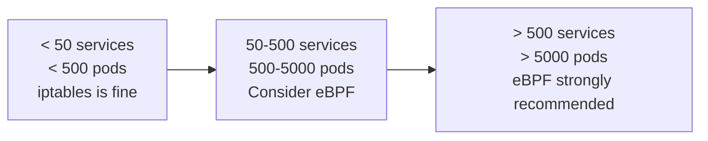

# How to Choose eBPF in Calico for Production

Author: [nawazdhandala](https://github.com/nawazdhandala)

Tags: Calico, Kubernetes, eBPF, CNI, Production, Decision Framework, iptables, Performance

Description: A structured decision framework for choosing between Calico's eBPF and iptables dataplanes for production Kubernetes deployments.

---

## Introduction

Calico supports three dataplanes in production: standard Linux (iptables/nftables), eBPF, and Windows HNS. For Linux-based clusters, the decision between iptables and eBPF is the most consequential networking choice you will make for your cluster's performance profile and operational model.

Both dataplanes are production-ready and fully supported by Tigera. The decision is not "stable vs. experimental" — it is a question of which set of tradeoffs best matches your workload characteristics, kernel constraints, and operational requirements.

This post gives you a structured framework for making that decision with confidence.

## Prerequisites

- Understanding of the Linux kernel version on your nodes
- Knowledge of your cluster's scale (number of nodes, pods, and services)
- Awareness of any Windows nodes in the cluster
- Baseline understanding of kube-proxy's role in Kubernetes service routing

## Decision Factor 1: Kernel Version

eBPF mode requires Linux kernel 5.3 as a minimum, with 5.8+ recommended for full feature support including DSR (Direct Server Return):

| Kernel Version | eBPF Mode Support |
|---|---|
| < 5.3 | Not supported |
| 5.3 – 5.7 | Basic support, no DSR |
| 5.8+ | Full support including DSR |

Check your kernel version:

```bash
kubectl get nodes -o jsonpath='{range .items[*]}{.metadata.name}{"\t"}{.status.nodeInfo.kernelVersion}{"\n"}{end}'
```

If any nodes run kernels below 5.3, you cannot use eBPF mode cluster-wide without first upgrading the node images.

## Decision Factor 2: Cluster Scale

eBPF provides the most tangible performance improvements in large clusters. The iptables rule count grows linearly with pods and services:



For small clusters (fewer than 50 services), iptables overhead is negligible. For large clusters, eBPF's O(1) map lookups provide measurably lower latency and CPU usage.

## Decision Factor 3: Source IP Requirements

If your applications need to see the original client IP for external traffic (load balancer or NodePort), eBPF provides this natively through DSR without requiring `externalTrafficPolicy: Local` on every service. With iptables mode, you must configure each service individually and accept that only nodes receiving the request directly can see the source IP.

## Decision Factor 4: Windows Nodes

Calico's eBPF dataplane is Linux-only. If you have Windows nodes in the same cluster, you need a hybrid approach: eBPF on Linux nodes, HNS on Windows nodes. This is supported but requires more careful configuration and testing.

## Decision Factor 5: Operational Familiarity

iptables has decades of tooling (`iptables -L`, `iptables-save`). eBPF requires different tools (`bpftool`, Felix logs) for debugging. If your networking team is not comfortable with eBPF debugging workflows, the operational overhead of eBPF may outweigh the performance benefits in the short term.

## Recommendation Matrix

| Situation | Recommended Dataplane |
|---|---|
| Kernel < 5.3 on any node | iptables |
| Windows nodes present | iptables (or hybrid) |
| < 50 services, small team | iptables |
| > 200 services, modern kernel | eBPF |
| Source IP preservation required | eBPF |
| High-performance latency-sensitive workloads | eBPF |

## Best Practices

- Never switch dataplanes without a full lab validation first — the switch requires restarting all calico-node pods
- Keep your kernel version documented and aligned with your eBPF decision in your cluster runbook
- Monitor CPU usage on nodes after enabling eBPF to confirm the expected reduction in `kube-proxy` and `calico-node` CPU overhead
- Plan for kube-proxy removal before enabling eBPF — leaving kube-proxy running causes duplicate service processing

## Conclusion

Choosing eBPF over iptables in Calico is the right decision for clusters with modern kernels, more than 50 services, source IP preservation requirements, or high-performance latency goals. The iptables dataplane remains appropriate for smaller clusters, mixed OS environments, or teams with limited eBPF debugging experience. Use the decision matrix to make the choice explicit and document it in your cluster's operational runbook.
