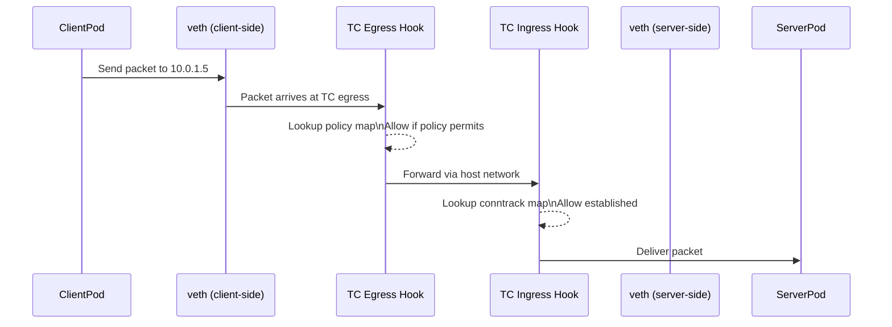
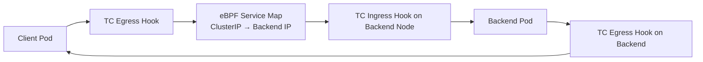
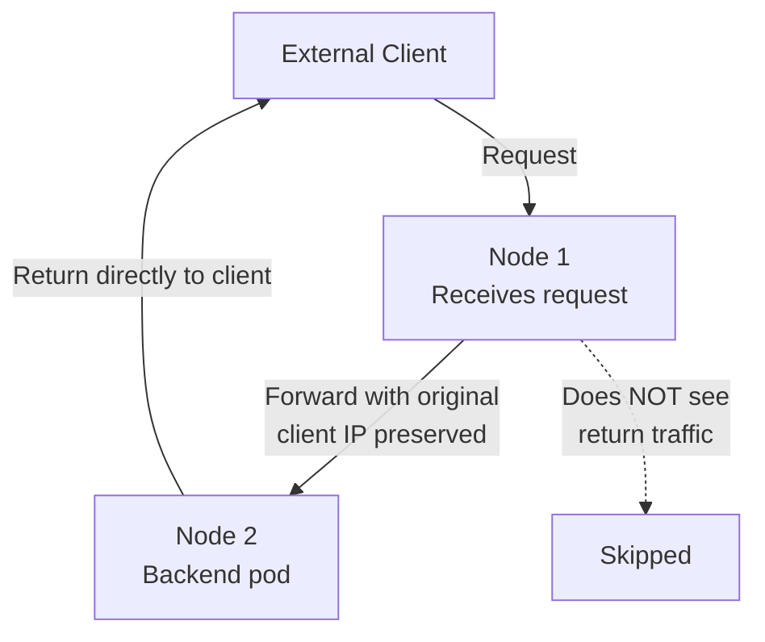

# How to Map eBPF in Calico to Real Kubernetes Traffic

Author: [nawazdhandala](https://github.com/nawazdhandala)

Tags: Calico, Kubernetes, eBPF, CNI, Traffic Flows, Networking, Dataplane

Description: A packet-level walkthrough of how Calico's eBPF dataplane processes real Kubernetes traffic flows including pod-to-pod, service, and external ingress scenarios.

---

## Introduction

Understanding eBPF abstractly is one thing - understanding what actually happens to a packet in Calico's eBPF dataplane is another. Mapping real traffic flows to eBPF hook points, map lookups, and program actions gives you the mental model needed to debug networking issues and explain packet behavior confidently.

This post traces three representative traffic scenarios through Calico's eBPF dataplane: pod-to-pod within a node, pod-to-service across nodes, and external ingress via a NodePort. For each scenario, we show which eBPF hooks are invoked and what decisions are made at each hook.

## Prerequisites

- Calico running in eBPF mode
- Basic understanding of Linux network namespaces
- Familiarity with how kube-proxy handles services (to contrast with eBPF behavior)

## Scenario 1: Pod-to-Pod on the Same Node



For same-node pod-to-pod traffic, Calico's eBPF programs intercept the packet at the TC egress hook on the sending pod's veth interface, apply network policy from the eBPF policy map, and forward directly without any iptables involvement. Return traffic is matched against the eBPF connection tracking map.

## Scenario 2: Pod-to-ClusterIP Service (Cross-Node)

This is where eBPF's advantage over kube-proxy is most visible. In iptables mode, the packet path is:

1. Pod → iptables PREROUTING (DNAT to a backend pod IP) → routing → iptables POSTROUTING (SNAT) → network

In eBPF mode:



The eBPF program at the TC egress hook on the client pod performs the DNAT directly using a map lookup - no iptables rule traversal. The result is a single NAT operation instead of the double NAT that iptables + SNAT requires.

## Scenario 3: External Traffic via NodePort (DSR Mode)

Direct Server Return (DSR) is an eBPF-specific capability. In standard iptables mode, return traffic from a backend pod must flow back through the node that received the original request (because it applied SNAT). With eBPF DSR:



The backend pod receives the packet with the original client IP intact and sends the response directly back to the client, bypassing Node 1 entirely. This reduces latency and Node 1's load for return traffic.

## Inspecting eBPF Maps at Runtime

You can observe Calico's eBPF maps directly on a node:

```bash
# List all Calico eBPF maps
sudo bpftool map list | grep calico

# Inspect the service map
sudo bpftool map dump name cali_v4_svc_ports
```

Felix also exposes eBPF-specific metrics via Prometheus that let you observe map hit rates, program execution counts, and error rates.

## Best Practices

- Use `bpftool prog show` on nodes to verify that Calico's eBPF programs are loaded after enabling eBPF mode
- Monitor Felix's eBPF map update rate in Prometheus - spikes indicate rapid policy or endpoint changes
- Enable DSR only after verifying your upstream load balancer can handle asymmetric return paths
- When debugging a connectivity issue, check both the TC egress hook (on the sender) and the TC ingress hook (on the receiver) to isolate where the packet is dropped

## Conclusion

Calico's eBPF dataplane processes Kubernetes traffic through TC hook programs attached to veth interfaces, using hash map lookups for policy, service routing, and connection tracking. The result is a single-pass packet processing model that eliminates iptables rule traversal and enables DSR for external traffic. Tracing these packet paths helps you debug connectivity issues more accurately and explain eBPF's performance advantages with concrete evidence.
