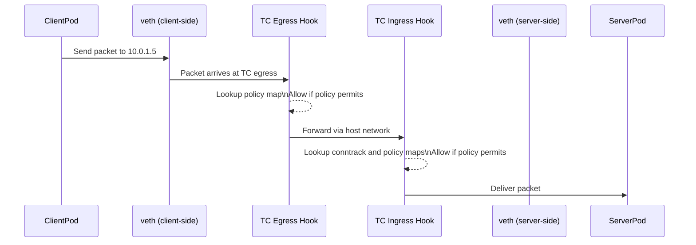
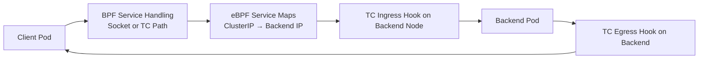
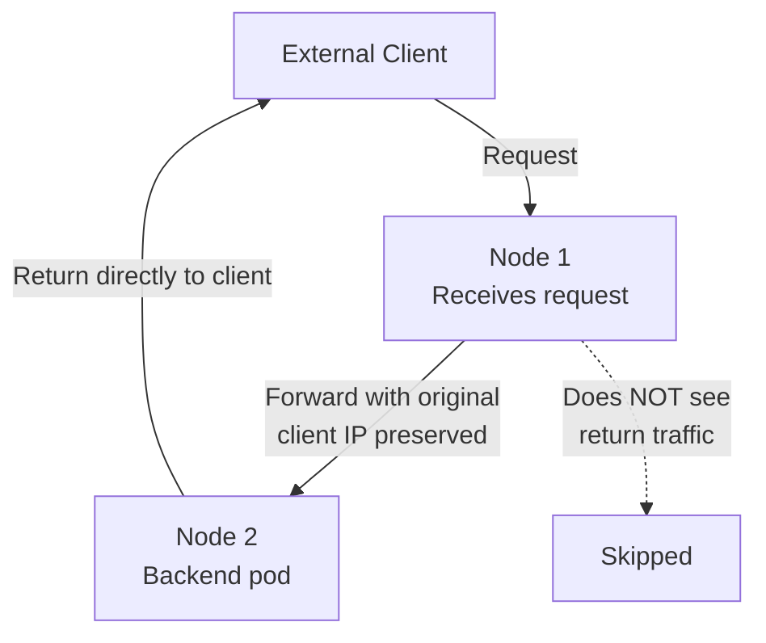

# How to Map eBPF in Calico to Real Kubernetes Traffic

Author: [nawazdhandala](https://github.com/nawazdhandala)

Tags: Calico, Kubernetes, eBPF, CNI, Traffic Flows, Networking, Dataplane

Description: A packet-level walkthrough of how Calico's eBPF dataplane processes real Kubernetes traffic flows including pod-to-pod, service, and external ingress scenarios.

---

## Introduction

Understanding eBPF abstractly is one thing - understanding what actually happens to a packet in Calico's eBPF dataplane is another. Mapping real traffic flows to eBPF hook points, map lookups, and program actions gives you the mental model needed to debug networking issues and explain packet behavior confidently.

This post traces three representative traffic scenarios through Calico's eBPF dataplane: pod-to-pod within a node, pod-to-service across nodes, and external ingress via a NodePort. For each scenario, we show which eBPF hooks are invoked and what decisions are made at each hook.

## Prerequisites

- Calico running in eBPF mode
- Basic understanding of Linux network namespaces
- Familiarity with how kube-proxy handles services (to contrast with eBPF behavior)

## Scenario 1: Pod-to-Pod on the Same Node


```mermaid
sequenceDiagram
    participant ClientPod
    participant VethClient as veth (client-side)
    participant TC_Egress as TC Egress Hook
    participant TC_Ingress as TC Ingress Hook
    participant VethServer as veth (server-side)
    participant ServerPod

    ClientPod->>VethClient: Send packet to 10.0.1.5
    VethClient->>TC_Egress: Packet arrives at TC egress
    TC_Egress-->>TC_Egress: Lookup policy map\nAllow if policy permits
    TC_Egress->>TC_Ingress: Forward via host network
    TC_Ingress-->>TC_Ingress: Lookup conntrack and policy maps\nAllow if policy permits
    TC_Ingress->>ServerPod: Deliver packet
```

For same-node pod-to-pod traffic, Calico's eBPF programs intercept the packet on the workload egress path from the sending pod and the workload ingress path toward the receiving pod. They apply the relevant egress and ingress network policy from BPF policy data, update connection tracking, and forward directly without any iptables involvement. Return traffic is matched against the eBPF connection tracking map.

## Scenario 2: Pod-to-ClusterIP Service (Cross-Node)

This is where eBPF's advantage over kube-proxy is most visible. In iptables mode, the packet path is:

1. Pod → iptables service chains (DNAT to a backend pod IP) → routing → network

In eBPF mode:


```mermaid
graph LR
    ClientPod[Client Pod] --> BPFService[BPF Service Handling\nSocket or TC Path]
    BPFService --> ServiceMap[eBPF Service Maps\nClusterIP → Backend IP]
    ServiceMap --> TCIngress[TC Ingress Hook on Backend Node]
    TCIngress --> BackendPod[Backend Pod]
    BackendPod --> TCRET[TC Egress Hook on Backend]
    TCRET --> ClientPod
```

Calico's eBPF kube-proxy replacement uses BPF programs and service maps to select the backend - no iptables rule traversal. For TCP traffic that originates inside the cluster, Calico can also use connect-time load balancing so the socket connects directly to the backend pod IP, removing per-packet service NAT for that connection. In contrast, kube-proxy in iptables mode normally DNATs ClusterIP traffic without rewriting the client pod's source IP.

## Scenario 3: External Traffic via NodePort (DSR Mode)

Direct Server Return (DSR) is an eBPF-specific capability. In standard iptables mode, return traffic from a backend pod must flow back through the node that received the original request (because it applied SNAT). With eBPF DSR:


```mermaid
graph TD
    Client[External Client] -->|Request| Node1[Node 1\nReceives request]
    Node1 -->|Forward with original\nclient IP preserved| Node2[Node 2\nBackend pod]
    Node2 -->|Return directly to client| Client
    Node1 -.->|Does NOT see\nreturn traffic| SKIP[Skipped]
```

The backend pod receives the packet with the original client IP intact and sends the response directly back to the client, bypassing Node 1 entirely. This reduces latency and Node 1's load for return traffic.

## Inspecting eBPF Maps at Runtime

You can observe Calico's eBPF dataplane state from a `calico-node` pod:

```bash
# Find a calico-node pod

kubectl get pod -n calico-system -o wide

# Inspect the service NAT table
kubectl exec -n calico-system <calico-node-name> -- calico-node -bpf nat dump

# Inspect the connection tracking table
kubectl exec -n calico-system <calico-node-name> -- calico-node -bpf conntrack dump
```

Felix also exposes Prometheus metrics for dataplane update timing, failures, BPF endpoint counts, and related runtime state. For packet-level dataplane diagnostics, Calico's `calico-node -bpf` tool can dump counters, policy, NAT, conntrack, and profiling data.

## Best Practices

- Use `bpftool prog show` on nodes to verify that Calico's eBPF programs are loaded after enabling eBPF mode
- Monitor Felix dataplane apply time and failure metrics in Prometheus - spikes can indicate rapid policy, endpoint, or service churn
- Enable DSR only after verifying your underlying network can handle asymmetric return paths; some cloud load balancers expect the response to return through the same node and are not compatible with DSR
- When debugging a connectivity issue, check both the TC egress hook (on the sender) and the TC ingress hook (on the receiver) to isolate where the packet is dropped

## Conclusion

Calico's eBPF dataplane processes Kubernetes traffic through TC hook programs attached to veth interfaces, using hash map lookups for policy, service routing, and connection tracking. The result is a single-pass packet processing model that eliminates iptables rule traversal and enables DSR for external traffic. Tracing these packet paths helps you debug connectivity issues more accurately and explain eBPF's performance advantages with concrete evidence.
