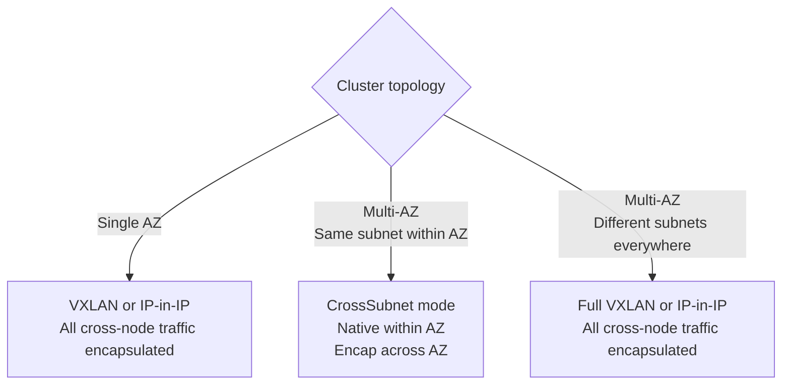

# How to Choose L2 Interconnect Fabric with Calico for Production

Author: [nawazdhandala](https://github.com/nawazdhandala)

Tags: Calico, Kubernetes, L2, Networking, VXLAN, IP-in-IP, Production, Decision Framework

Description: A decision framework for selecting the right L2 interconnect mode (VXLAN, IP-in-IP, CrossSubnet) for production Calico deployments.

---

## Introduction

For production Kubernetes clusters in cloud environments, the L2 interconnect choice is between VXLAN, IP-in-IP, and CrossSubnet modes. The choice affects both performance (encapsulation overhead) and compatibility (whether your underlay network supports the required protocols).

Getting this decision wrong at cluster creation is expensive to fix — changing the encapsulation mode requires a brief period of traffic disruption and careful orchestration. This post provides a decision framework to get it right the first time.

## Prerequisites

- Knowledge of your cloud provider and VPC networking behavior
- Confirmation of whether IP protocol 4 is allowed in your security groups/firewall rules
- Node MTU known (typically 1500 for cloud VMs, 9000 for Jumbo frames)
- Multi-AZ topology understanding (same subnet vs. cross-subnet nodes)

## Decision Factor 1: Cloud Provider Protocol Support

| Cloud Provider | IP-in-IP (proto 4) | VXLAN (UDP 4789) | Recommendation |
|---|---|---|---|
| AWS | Blocked by default | Allowed | VXLAN |
| GCP | Allowed | Allowed | IP-in-IP (lower overhead) |
| Azure | Varies by configuration | Allowed | VXLAN |
| On-premises | Depends on firewall | Depends on firewall | Verify with network team |
| Bare metal | Typically allowed | Typically allowed | BGP (no overlay needed) |

Check your security group rules before choosing:
```bash
# On a node, test IP-in-IP (protocol 4) connectivity to another node
ping -c 3 <other-node-ip>  # First confirm basic connectivity

# Test with protocol 4 specifically
python3 -c "
import socket, struct, time
s = socket.socket(socket.AF_INET, socket.SOCK_RAW, 4)
s.sendto(b'test', ('<other-node-ip>', 0))
"
```

## Decision Factor 2: Cluster Topology (Multi-AZ)

For multi-AZ clusters:



CrossSubnet mode significantly reduces encapsulation overhead for large clusters where most cross-pod traffic is within the same AZ (which is typical for latency-sensitive microservices).

## Decision Factor 3: Network Performance Requirements

Encapsulation overhead impacts network throughput and latency:

| Mode | Per-Packet Overhead | Impact on 1500 MTU | Latency Impact |
|---|---|---|---|
| VXLAN | 50 bytes | Effective payload: 1450 bytes | ~5-10 µs |
| IP-in-IP | 20 bytes | Effective payload: 1480 bytes | ~2-5 µs |
| CrossSubnet (same AZ) | 0 bytes | Full 1500 bytes available | None |
| BGP (no overlay) | 0 bytes | Full 1500 bytes available | None |

For latency-sensitive workloads (trading systems, real-time APIs), the difference between 5 µs and 0 µs matters. For typical microservices, it doesn't.

## Decision Factor 4: Jumbo Frames

If your infrastructure supports Jumbo frames (MTU 9000), VXLAN overhead becomes proportionally smaller:
- 9000 MTU with VXLAN: 8950 bytes payload (99.4% efficiency)
- 1500 MTU with VXLAN: 1450 bytes payload (96.7% efficiency)

Jumbo frame support reduces the practical impact of encapsulation overhead significantly.

## Production Recommendation Matrix

| Environment | Recommended Mode |
|---|---|
| AWS, single AZ | VXLAN |
| AWS, multi-AZ | VXLAN CrossSubnet |
| GCP, any | IP-in-IP or IP-in-IP CrossSubnet |
| Bare metal with BGP fabric | BGP (no overlay) |
| Cloud with Jumbo frames | VXLAN (overhead less significant) |
| On-premises with unknown firewall rules | VXLAN (most compatible) |

## Configuring the Chosen Mode

```yaml
# VXLAN with CrossSubnet for multi-AZ AWS
apiVersion: projectcalico.org/v3
kind: IPPool
metadata:
  name: default-ipv4-ippool
spec:
  cidr: 10.0.0.0/16
  vxlanMode: CrossSubnet
  natOutgoing: true
```

## Best Practices

- Validate your underlay protocol support in a lab before committing to a mode for production
- For multi-AZ deployments, always evaluate CrossSubnet to reduce intra-AZ encapsulation overhead
- Set MTU explicitly in the Calico Installation resource — do not rely on auto-detection
- Document your encapsulation mode, MTU setting, and the rationale in your cluster runbook

## Conclusion

Production L2 interconnect mode selection is driven by cloud provider protocol support, cluster topology (single vs. multi-AZ), and performance requirements. VXLAN is the safest choice for most cloud environments due to universal UDP/4789 support. CrossSubnet mode is the best optimization for multi-AZ clusters. BGP native routing (no overlay) is optimal for on-premises deployments with BGP-capable network infrastructure. Choose the mode that matches your constraints and validate MTU settings explicitly before production rollout.
