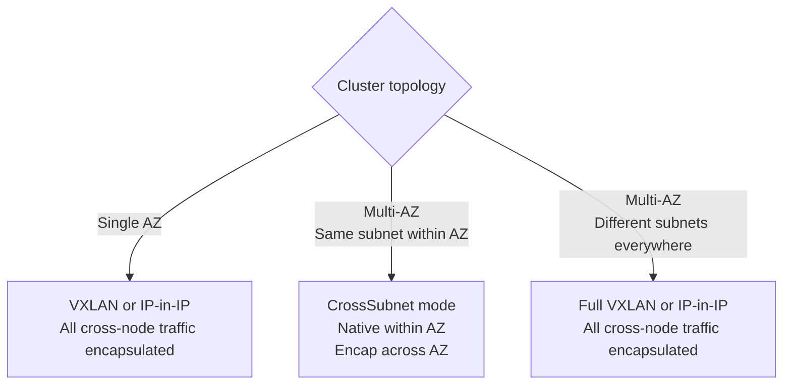

# How to Choose L2 Interconnect Fabric with Calico for Production

Author: [nawazdhandala](https://github.com/nawazdhandala)

Tags: Calico, Kubernetes, L2, Networking, VXLAN, IP-in-IP, Production, Decision Framework

Description: A decision framework for selecting the right L2 interconnect mode (VXLAN, IP-in-IP, CrossSubnet) for production Calico deployments.

---

## Introduction

For production Kubernetes clusters in cloud environments, the Calico encapsulation choice is between VXLAN and IP-in-IP, with either mode configured for all cross-node traffic or only cross-subnet traffic. The choice affects both performance (encapsulation overhead) and compatibility (whether your underlay network supports the required protocols).

Getting this decision wrong at cluster creation is expensive to fix - changing the encapsulation mode requires a brief period of traffic disruption and careful orchestration. This post provides a decision framework to get it right the first time.

## Prerequisites

- Knowledge of your cloud provider and VPC networking behavior
- Confirmation of whether IP protocol 4 is allowed in your security groups/firewall rules
- Node MTU known (commonly 1500 for many cloud VMs, 1460 for default GCE VPC networks, 9001 for AWS jumbo frames, and 9000 for many other jumbo-frame networks)
- Multi-AZ topology understanding (same subnet vs. cross-subnet nodes)

## Decision Factor 1: Cloud Provider Protocol Support

| Cloud Provider | IP-in-IP (proto 4) | VXLAN (UDP 4789) | Recommendation |
|---|---|---|---|
| AWS | Blocked by default unless security groups allow protocol 4 | Allowed when UDP 4789 is permitted | VXLAN CrossSubnet, or IP-in-IP CrossSubnet when protocol 4 is explicitly allowed |
| GCP | Allowed | Allowed | IP-in-IP (lower overhead) |
| Azure | Blocked by the Azure network fabric | Allowed | VXLAN |
| On-premises | Depends on firewall | Depends on firewall | Verify with network team |
| Bare metal | Typically allowed | Typically allowed | BGP (no overlay needed) |

Check your firewall and security group rules before choosing:
```bash
# Confirm basic node-to-node connectivity first.
ping -c 3 <other-node-ip>

# Then verify that your firewall rules allow the protocol your Calico pool will use:
# - IP-in-IP: IP protocol 4, bidirectional between nodes
# - VXLAN: UDP 4789, bidirectional between nodes
```

## Decision Factor 2: Cluster Topology (Multi-AZ)

For multi-AZ clusters:


```mermaid
graph TD
    TOPOLOGY{Cluster topology}
    TOPOLOGY -->|Single AZ| SIMPLEOVL[VXLAN or IP-in-IP\nAll cross-node traffic encapsulated]
    TOPOLOGY -->|Multi-AZ\nSame subnet within AZ| CS[CrossSubnet mode\nNative within AZ\nEncap across AZ]
    TOPOLOGY -->|Multi-AZ\nDifferent subnets everywhere| FULLENCAP[Full VXLAN or IP-in-IP\nAll cross-node traffic encapsulated]
```

CrossSubnet mode significantly reduces encapsulation overhead for large clusters where most cross-pod traffic is within the same AZ (which is typical for latency-sensitive microservices).

## Decision Factor 3: Network Performance Requirements

Encapsulation overhead impacts network throughput and latency:

| Mode | Per-Packet Overhead | Impact on 1500 MTU | Latency Impact |
|---|---|---|---|
| VXLAN (IPv4) | 50 bytes | Calico MTU: 1450 bytes | Workload- and platform-dependent |
| IP-in-IP (IPv4) | 20 bytes | Calico MTU: 1480 bytes | Workload- and platform-dependent |
| CrossSubnet (same subnet) | 0 bytes | Full path MTU available | No encapsulation overhead |
| BGP (no overlay) | 0 bytes | Full path MTU available | No encapsulation overhead |

For latency-sensitive workloads (trading systems, real-time APIs), avoiding encapsulation can matter. For typical microservices, the difference is often not noticeable unless the workload is network-intensive.

## Decision Factor 4: Jumbo Frames

If your infrastructure supports Jumbo frames (MTU 9000), VXLAN overhead becomes proportionally smaller:
- 9000 MTU with VXLAN: 8950 bytes payload (99.4% efficiency)
- 1500 MTU with VXLAN: 1450 bytes payload (96.7% efficiency)

Jumbo frame support reduces the practical impact of encapsulation overhead significantly.

## Production Recommendation Matrix

| Environment | Recommended Mode |
|---|---|
| AWS, single AZ | VXLAN |
| AWS, multi-AZ | VXLAN CrossSubnet |
| GCE with Calico overlay networking | IP-in-IP or IP-in-IP CrossSubnet |
| Bare metal with BGP fabric | BGP (no overlay) |
| Cloud with Jumbo frames | VXLAN (overhead less significant) |
| On-premises with unknown firewall rules | Verify first; VXLAN is often easier to permit than IP protocol 4 |

## Configuring the Chosen Mode

```yaml
# VXLAN with CrossSubnet for multi-AZ AWS
apiVersion: projectcalico.org/v3
kind: IPPool
metadata:
  name: default-ipv4-ippool
spec:
  cidr: 10.0.0.0/16
  vxlanMode: CrossSubnet
  natOutgoing: true
```

## Best Practices

- Validate your underlay protocol support in a lab before committing to a mode for production
- For multi-AZ deployments, always evaluate CrossSubnet to reduce intra-AZ encapsulation overhead
- Set or verify the Calico MTU explicitly for your environment; for operator installs, override it in the Installation resource if auto-detection does not match your path MTU
- Document your encapsulation mode, MTU setting, and the rationale in your cluster runbook

## Conclusion

Production Calico encapsulation mode selection is driven by cloud provider protocol support, cluster topology (single vs. multi-AZ), and performance requirements. VXLAN is the safest choice for many cloud environments because it uses UDP and is supported where IP-in-IP is not, such as Azure. CrossSubnet mode is the best optimization for multi-AZ clusters when same-subnet traffic can remain unencapsulated. BGP native routing (no overlay) is optimal for on-premises deployments with BGP-capable network infrastructure. Choose the mode that matches your constraints and validate MTU settings before production rollout.
