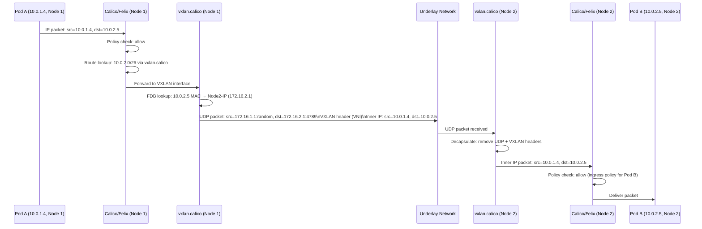
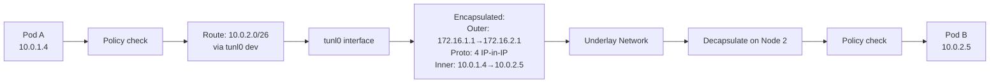

# How to Map L2 Interconnect Fabric with Calico to Real Kubernetes Traffic

Author: [nawazdhandala](https://github.com/nawazdhandala)

Tags: Calico, Kubernetes, L2, Networking, VXLAN, IP-in-IP, Traffic Flows, Packet Analysis

Description: A packet-level walkthrough of how Calico's VXLAN and IP-in-IP overlays handle real Kubernetes cross-node traffic, with observable artifacts at each encapsulation stage.

---

## Introduction

Understanding how L2 overlay encapsulation works at the packet level helps you debug cross-node connectivity issues and explain the networking behavior to your team. The observable artifacts — VXLAN interfaces, FDB entries, `tcpdump` captures — connect the conceptual model to reality.

This post traces the complete packet journey for cross-node pod-to-pod traffic in both VXLAN and IP-in-IP modes, showing what you can observe at each stage.

## Prerequisites

- A Calico cluster using VXLAN or IP-in-IP
- Node-level access for `tcpdump`, `ip`, and `bridge` commands
- Understanding of basic IP packet structure

## VXLAN Mode: Complete Packet Journey



**What you can observe at each stage**:

```bash
# Stage 1: Route table on Node 1 (programmed by Felix)
ip route show 10.0.2.0/26
# Expected: 10.0.2.0/26 dev vxlan.calico src 10.0.1.1 onlink

# Stage 2: VXLAN FDB entry for the remote pod's node
bridge fdb show dev vxlan.calico | grep <Node2-MAC>
# Expected: <MAC> dst 172.16.2.1 self permanent

# Stage 3: Capture encapsulated traffic on the underlay NIC
sudo tcpdump -i eth0 -n udp port 4789 -c 5
# Expected: UDP packets with outer Node IPs as src/dst

# Stage 4: Capture on VXLAN interface (after decapsulation on Node 2)
sudo tcpdump -i vxlan.calico -n -c 5
# Expected: Packets with pod IPs (inner packet after decap)
```

## IP-in-IP Mode: Packet Journey

IP-in-IP is simpler — no UDP header, just one IP header wrapping another:



**Observing IP-in-IP**:
```bash
# Check tunnel interface
ip link show tunl0
ip addr show tunl0

# Capture IP-in-IP traffic (protocol 4)
sudo tcpdump -i eth0 -n proto 4 -c 5
# Expected: Packets with outer node IPs and protocol 4 (not TCP/UDP)
```

## CrossSubnet Mode: Mixed Encapsulation

In CrossSubnet mode, same-subnet traffic uses direct routing and cross-subnet traffic uses encapsulation. Observe the difference:

```bash
# Same-subnet pod-to-pod: no encapsulation on vxlan.calico
POD_SAME_NODE_IP=<pod-on-same-node>
sudo tcpdump -i vxlan.calico -n -c 5 &
kubectl exec test-pod -- wget -qO- http://$POD_SAME_NODE_IP
# No VXLAN packets captured

# Cross-subnet pod-to-pod: encapsulated on vxlan.calico
POD_CROSS_AZ_IP=<pod-on-different-subnet-node>
kubectl exec test-pod -- wget -qO- http://$POD_CROSS_AZ_IP
# VXLAN packets captured
```

## Debugging with Layer-by-Layer tcpdump

The most effective debugging technique for overlay issues is capturing at multiple layers simultaneously:

```bash
# Terminal 1: Capture on pod veth (inner traffic)
sudo tcpdump -i cali<pod-iface> -n

# Terminal 2: Capture on VXLAN interface (inner packets after decap)
sudo tcpdump -i vxlan.calico -n

# Terminal 3: Capture on physical NIC (outer encapsulated packets)
sudo tcpdump -i eth0 -n udp port 4789

# Generate traffic
kubectl exec pod-a -- ping <pod-b-ip>
```

By comparing what appears at each layer, you can identify exactly where the packet path breaks.

## Best Practices

- Capture at the physical NIC level (`tcpdump -i eth0 udp port 4789`) to confirm encapsulated packets are being sent and received
- Use the FDB entry count as a health metric — it should equal the number of other nodes in the cluster
- When cross-node connectivity fails, always start with the physical NIC capture to confirm the underlay is working before investigating the overlay

## Conclusion

L2 overlay traffic in Calico follows a deterministic encapsulation path: Felix programs routes and FDB entries, packets traverse the VXLAN or IP-in-IP interface for encapsulation, the underlay network routes the outer packet, and the destination node decapsulates and delivers. Each stage has observable artifacts that enable systematic debugging when connectivity fails.
