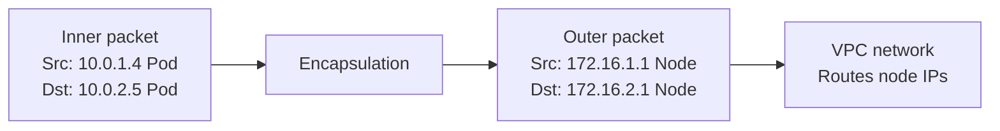

# How to Understand L2 Interconnect Fabric with Calico

Author: [nawazdhandala](https://github.com/nawazdhandala)

Tags: Calico, Kubernetes, L2, Networking, VXLAN, IP-in-IP, Overlay, CNI

Description: A comprehensive guide to Layer 2 networking with Calico, covering VXLAN overlay, IP-in-IP tunneling, and when L2 fabric is appropriate for Kubernetes cluster interconnect.

---

## Introduction

In Kubernetes networking, an L2 interconnect fabric refers to the mechanism by which pods on different nodes communicate — specifically, whether the interconnect uses Layer 2 (Ethernet) framing or overlay encapsulation to carry pod traffic across the underlying network.

Calico supports L2-based interconnect through two overlay modes: VXLAN (Virtual Extensible LAN) and IP-in-IP. Both modes create an overlay network that allows pod traffic to traverse underlay networks that don't know about pod IP addresses. This is the standard approach for cloud environments where you cannot control the underlying network routing.

Understanding L2 interconnect in the context of Calico means understanding when and why overlay encapsulation is necessary, how VXLAN and IP-in-IP differ, and what tradeoffs each imposes.

## Prerequisites

- Understanding of the OSI model (Layer 2 vs. Layer 3)
- Basic knowledge of Ethernet framing and IP routing
- Familiarity with Calico's IPPool resource

## Why Overlay Encapsulation Exists

Cloud VPC networks (AWS VPC, GCP VPC, Azure VNet) route traffic between VM instances based on the VM's IP address — they don't know about pod IPs. If a pod on Node 1 sends a packet to a pod IP on Node 2, the VPC router won't know where to send it.

Overlay encapsulation solves this by wrapping the pod packet (inner packet) inside a packet that uses node IPs as the outer source and destination:



The VPC sees the outer packet (node IPs) and routes it normally. On the destination node, the outer header is removed and the inner packet is delivered to the correct pod.

## VXLAN Mode

VXLAN (Virtual Extensible LAN) encapsulates Ethernet frames in UDP packets. Calico uses VXLAN over UDP port 4789.

**How it works**:
1. Calico creates a `vxlan.calico` virtual interface on each node
2. Felix programs the VXLAN FDB (Forwarding Database) with MAC→NodeIP mappings for each pod CIDR
3. When a packet to a remote pod arrives at `vxlan.calico`, the kernel VXLAN driver encapsulates it in UDP and sends to the remote node
4. The remote node's kernel VXLAN driver decapsulates and delivers to the pod

**Overhead**: ~50 bytes per packet (VXLAN header + UDP + outer IP)

**Use VXLAN when**: Your underlay network blocks non-TCP/UDP protocols (some cloud environments block protocol 4, which is IP-in-IP).

## IP-in-IP Mode

IP-in-IP (protocol number 4) encapsulates IP packets directly inside IP packets, without the Ethernet and UDP overhead of VXLAN.

**Overhead**: ~20 bytes per packet (only the outer IP header)

**Use IP-in-IP when**: Your underlay network allows IP protocol 4 and you want minimal encapsulation overhead.

## CrossSubnet Mode

The `CrossSubnet` encapsulation mode combines the benefits of both approaches:
- Pods on the same subnet communicate without any encapsulation (native routing)
- Pods on different subnets communicate using VXLAN or IP-in-IP

This is ideal for multi-AZ deployments where nodes in the same AZ share a subnet but nodes across AZs are on different subnets.

```yaml
apiVersion: projectcalico.org/v3
kind: IPPool
metadata:
  name: default-ipv4-ippool
spec:
  cidr: 10.0.0.0/16
  vxlanMode: CrossSubnet  # or ipipMode: CrossSubnet
```

## Comparing L2 Overlay Modes

| Mode | Protocol | Overhead | Requirement |
|---|---|---|---|
| VXLAN | UDP/4789 | ~50 bytes | No special protocol support |
| IP-in-IP | IP proto 4 | ~20 bytes | Protocol 4 allowed |
| CrossSubnet | Mixed | Variable | Depends on path |
| None (BGP) | None | 0 bytes | BGP-capable fabric |

## Best Practices

- Use VXLAN in cloud environments by default — it works in all cloud VPCs without special configuration
- Use IP-in-IP only after confirming your cloud security groups/firewall rules allow IP protocol 4
- Use CrossSubnet for multi-AZ clusters to reduce encapsulation overhead for same-AZ traffic
- Monitor MTU carefully with any overlay mode — set MTU to node MTU minus the encapsulation overhead

## Conclusion

L2 interconnect with Calico uses VXLAN or IP-in-IP overlays to transparently carry pod traffic across underlay networks that don't route pod IPs. VXLAN provides universal compatibility at higher overhead; IP-in-IP provides lower overhead where protocol 4 is permitted; CrossSubnet provides an optimal mix for multi-AZ deployments. Choose the mode that matches your underlay network constraints and then size your MTU accordingly.
