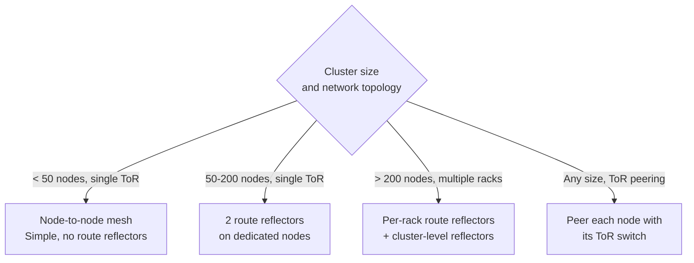

# How to Choose L3 Interconnect Fabric with Calico for Production

Author: [nawazdhandala](https://github.com/nawazdhandala)

Tags: Calico, Kubernetes, L3, BGP, Networking, Production, Decision Framework, Routing

Description: A decision framework for choosing Calico's L3 BGP routing for production, covering BGP topology, external peering, and when BGP is preferable to overlay.

---

## Introduction

Choosing L3 BGP routing for production Calico deployments is the right decision when your infrastructure supports it - it provides the lowest latency, highest throughput, and most transparent networking model. But it requires coordination with your network team and careful BGP topology design.

This post provides a production decision framework for L3 BGP: when to choose it, how to design the BGP topology, and what external peering decisions to make.

## Prerequisites

- Confirmation from your network team that BGP is supported on your fabric
- Knowledge of your network topology (how many ToR switches, which nodes connect to which switches)
- Understanding of your BGP AS number assignment
- Route reflector node candidates identified (typically 2-3 dedicated nodes)

## Decision 1: Is Your Infrastructure BGP-Ready?

L3 BGP native routing requires specific network capabilities:

| Requirement | Check |
|---|---|
| BGP-capable switches or routers | Ask your network team |
| TCP port 179 allowed between nodes | Test with `nc -zv <peer-ip> 179` |
| Pod CIDR routable externally (optional) | Network team can add static or BGP routes |
| Network team comfortable with Kubernetes BGP | Training or documentation needed |

If your infrastructure is cloud-only (AWS VPC, GCP VPC, Azure VNet), the VPC network is not BGP-capable for Kubernetes pods by default. Use overlay (VXLAN) instead unless your cloud provider offers BGP connectivity (AWS Direct Connect, GCP Interconnect, etc.).

## Decision 2: BGP Topology Design



## Decision 3: Internal vs. External BGP Topology

**Internal BGP (iBGP) - All nodes in same AS**:
- Simpler configuration
- Requires route reflectors to avoid iBGP split-horizon issues
- Suitable for clusters not peering with external infrastructure

**External BGP (eBGP) - Nodes peer with ToR as separate AS**:
- More complex configuration
- Natural support for ToR peering
- Enables pod routes to be advertised externally

For production on-premises clusters with physical switches, eBGP peering with ToR switches is the recommended approach.

## Decision 4: External Route Advertisement

Decide whether pod routes should be advertised beyond the cluster:

**Keep pod routes internal (default)**:
- Pods can reach external services (with SNAT)
- External services cannot directly reach pod IPs
- Simpler network design

**Advertise pod routes externally**:
- External services can reach pod IPs directly without NAT
- Pods become first-class network citizens
- Requires external firewalls/ACLs updated for pod CIDRs
- Eliminates SNAT for certain traffic flows

Configure external route advertisement:
```yaml
apiVersion: projectcalico.org/v3
kind: BGPConfiguration
metadata:
  name: default
spec:
  serviceExternalIPs:
  - cidr: 10.0.0.0/16  # Advertise pod CIDR externally
```

## Decision 5: Route Reflector Placement

Route reflectors should be:
- On dedicated nodes that are not evictable
- In pairs for HA (at least two, ideally three)
- With node anti-affinity to ensure they don't run on the same physical host
- Using fixed, stable IPs (avoid nodes with dynamic IPs)

Label route reflector nodes:
```bash
kubectl label node rr-node-1 calico-route-reflector=true
kubectl label node rr-node-2 calico-route-reflector=true
```

Configure BGP Peer for route reflectors:
```yaml
apiVersion: projectcalico.org/v3
kind: BGPPeer
metadata:
  name: peer-with-route-reflectors
spec:
  peerSelector: calico-route-reflector == 'true'
  asNumber: 64512
```

## Best Practices

- Always deploy route reflectors in HA pairs - a single route reflector is a SPOF for all routing
- Coordinate your BGP AS number with your network team to avoid conflicts with existing enterprise BGP infrastructure
- Document the full BGP topology (which nodes peer with which) in your cluster runbook
- Test BGP session recovery (simulate route reflector failure) before production rollout

## Conclusion

L3 BGP routing for production Calico requires BGP-capable infrastructure, careful topology design (mesh vs. route reflectors), explicit decisions on internal vs. external route advertisement, and HA route reflector placement. When these decisions are made correctly, BGP native routing provides the highest performance networking for your Kubernetes cluster with maximum transparency to your network team.
