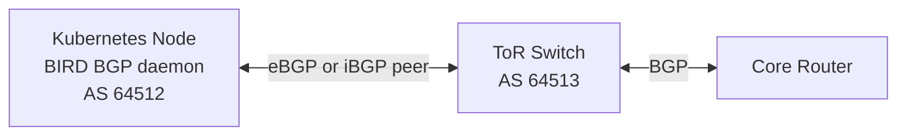

# How to Explain L3 Interconnect Fabric with Calico to Your Team

Author: [nawazdhandala](https://github.com/nawazdhandala)

Tags: Calico, Kubernetes, L3, BGP, Networking, Team Communication, Routing

Description: A practical guide for explaining Calico's L3 BGP routing fabric to engineering teams, covering BGP fundamentals, route advertisement, and the difference from overlay networking.

---

## Introduction

Explaining BGP and L3 routing to teams unfamiliar with network routing protocols is challenging. BGP has a reputation for complexity — and while full BGP configuration is indeed complex, the way Calico uses BGP is conceptually simple: each node advertises "I have pods in this IP range" and learns which other nodes have pods in other IP ranges.

This post gives you the explanations, analogies, and live commands to make Calico's BGP mode comprehensible to developers, SREs, and managers alike.

## Prerequisites

- A Calico cluster running in BGP mode (no overlay)
- `kubectl`, `calicoctl`, and `birdcl` access
- Basic networking background (IP routing concepts)

## The Phone Book Analogy for BGP

For any audience, start with this:

> "Imagine each node in your cluster publishes a page in a shared phone book: 'I'm Node 1 at IP 10.0.0.1, and I have pods with IPs starting with 10.0.1.' BGP is the protocol for sharing these phone book updates. When Node 1 wants to send a packet to a pod that starts with 10.0.2, it looks up 'who has 10.0.2 pods' in the phone book and sends the packet directly to that node."

Key distinctions from overlay:
- **No tunnel**: The packet travels directly from Node 1 to Node 2 with the pod IPs visible to every router on the path
- **Network awareness**: Your physical routers see and can optimize for pod-level routes
- **Native performance**: No encapsulation overhead

## Live Demonstration: Seeing BGP in Action

Show the team the BGP routing table on a node:

```bash
# View BGP sessions (who is this node peering with?)
kubectl exec -n calico-system -l k8s-app=calico-node -c calico-node \
  -- birdcl show protocols
# Expected: sessions to other nodes or route reflectors in "Established" state

# View routes learned via BGP
kubectl exec -n calico-system -l k8s-app=calico-node -c calico-node \
  -- birdcl show route
# Expected: Pod CIDRs from all other nodes, each with a BGP next hop

# View the Linux routing table programmed by Felix from BGP routes
ip route show | grep "proto bird"
# Expected: Routes for remote node pod CIDRs, via the remote node's IP
```

Show the routing table and say: "These routes are exactly the phone book entries I described. Each line says 'to reach pods in 10.0.2.0/26, send to Node 2 at 172.16.2.1.'"

## What to Tell Developers

Developers care about whether their application behavior changes. For BGP mode:

> "Your pods have the same IP addresses as in overlay mode. The difference is how traffic gets between nodes. In BGP mode, there's no extra wrapping — the packet goes directly from Node 1 to Node 2 with your pod's IP as the source. This means your application gets a few microseconds less latency, and large file transfers are faster because there's no overhead reducing the effective packet size."

The key developer benefit: lower latency and full MTU available for application payloads.

## What to Tell Network Engineers

Network engineers will want to understand the BGP integration:



Key points for network engineers:
- Calico uses BIRD as the BGP daemon
- Kubernetes nodes can be configured as BGP peers to physical switches
- Pod routes (`10.0.1.0/26`, `10.0.2.0/26`, etc.) are advertised as normal BGP routes
- The cluster AS number is configurable
- External services can reach pods directly without NAT if the pod CIDR is routable externally

## Explaining Route Reflectors

For SREs managing large clusters:

> "In a small cluster, every node tells every other node about its pods. In a large cluster, this creates too many connections — 100 nodes × 100 peers = 10,000 BGP sessions. Route reflectors solve this. A few dedicated nodes ('reflectors') collect route announcements from all other nodes and re-announce them to everyone. The reflector is like a postal sorting center — it receives all mail and redistributes it."

Identify route reflectors in the cluster:
```bash
calicoctl get node -o yaml | grep -i "route-reflector"
kubectl get nodes --show-labels | grep "route-reflector"
```

## Best Practices

- Use the `birdcl show protocols` and `birdcl show route` commands in your team training so everyone knows how to check BGP state
- Prepare a diagram showing the BGP peering topology specific to your cluster for the team wiki
- Explain that BGP mode requires your network team to be involved if you want to advertise pod routes to the external network

## Conclusion

Explaining Calico's L3 BGP fabric to your team is most effective when you use the phone book analogy for route advertisement, demonstrate the `birdcl show route` output to make routing information tangible, and clearly articulate the performance advantage (no encapsulation overhead) for different audience types. Teams that understand BGP mode can collaborate more effectively with network engineers and diagnose routing issues more accurately.
