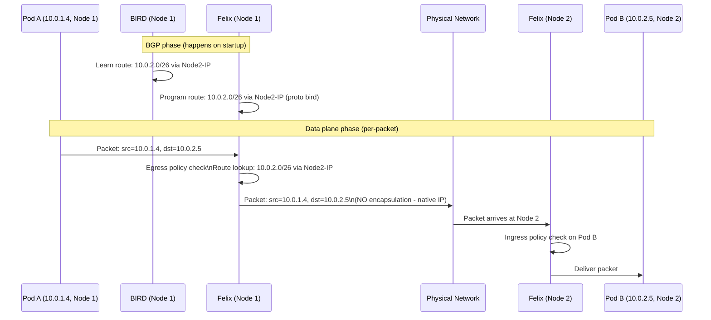
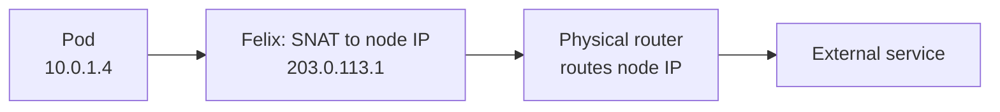
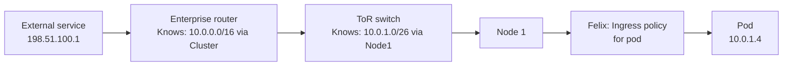

# How to Map L3 Interconnect Fabric with Calico to Real Kubernetes Traffic

Author: [nawazdhandala](https://github.com/nawazdhandala)

Tags: Calico, Kubernetes, L3, BGP, Networking, Traffic Flows, Routing, BIRD

Description: A packet-level walkthrough of how Calico's BGP routing fabric handles real Kubernetes cross-node and external traffic, with observable routing artifacts at each stage.

---

## Introduction

In L3 BGP mode, there is no overlay - pod packets travel through the network as native IP traffic. The routing information that makes this possible is distributed by BGP. Understanding the connection between BGP route advertisement and the resulting packet path gives you the mental model needed for debugging and for explaining the system to your team.

This post traces three real traffic scenarios through Calico's L3 BGP fabric: cross-node pod-to-pod, pod to external service, and external service to pod (with external BGP peering).

## Prerequisites

- A Calico cluster running in BGP mode
- Understanding of basic IP routing
- `birdcl`, `ip route`, and `tcpdump` available

## Scenario 1: Cross-Node Pod-to-Pod (Native Routing)



The critical difference from overlay: the packet on the physical network has **pod IPs as source and destination** - not node IPs. Every router between Node 1 and Node 2 routes the packet based on the pod IP.

**Verify the routing artifacts**:
```bash
# On Node 1: BGP-learned route in routing table
ip route show 10.0.2.0/26
# Expected: 10.0.2.0/26 via <Node2-IP> dev eth0 proto bird

# On physical switch (if accessible):
# show ip route 10.0.2.0 255.255.255.192
# Expected: route pointing to Node 2's IP
```

## Scenario 2: Pod to External Service (with SNAT)

Even in BGP mode, pods typically use the node IP for egress to external services (unless pod routes are advertised externally):



The BGP routing is not involved for egress to external destinations - the packet exits via the default route (physical uplink) with SNAT applied, exactly as in overlay mode.

## Scenario 3: External Service to Pod (External BGP Peering)

This is the unique capability of L3 BGP mode: when pod routes are advertised externally, external services can reach pod IPs directly:



BGP advertisements flow outward from BIRD (on each node) through the ToR switch to the enterprise router and beyond. External services reach pods via the BGP-advertised pod routes, with no NAT required.

**Verify external route advertisement**:
```bash
# On a ToR switch or router (if accessible):
# show bgp neighbors <node-ip> received-routes
# Expected: Pod CIDR routes received from each node

# From Felix's perspective:
kubectl exec -n calico-system -l k8s-app=calico-node -c calico-node \
  -- birdcl show route export <tor-peer-name>
# Expected: Pod CIDR routes being exported to the ToR peer
```

## Observing BGP Route Propagation

Watch BGP routes in real time when a new pod is created:

```bash
# Watch BIRD's route table update
kubectl exec -n calico-system -l k8s-app=calico-node -c calico-node \
  -- birdcl show route

# In another terminal, create a pod on the remote node
kubectl run new-pod --image=nginx --overrides='{"spec":{"nodeName":"worker-2"}}'

# Watch the new pod's IP appear in the route table
kubectl exec -n calico-system -l k8s-app=calico-node -c calico-node \
  -- birdcl show route | grep $(kubectl get pod new-pod -o jsonpath='{.status.podIP}')
```

BGP convergence in Calico is typically less than 1 second for new pod routes in small clusters.

## The BGP-to-Routing-Table Pipeline

The complete pipeline from BGP to packet routing:


Each hop in this pipeline can be verified with distinct commands, making the BGP routing system fully inspectable from top to bottom.

## Best Practices

- Use `ip route show proto bird` to see all Calico-managed BGP routes - any missing routes indicate a BGP session issue
- Capture on the physical NIC (`tcpdump -i eth0`) to confirm packets carry pod IPs (native routing) vs node IPs (overlay)
- For external BGP peering, capture BGP keepalives and route advertisements to verify the peering is active

## Conclusion

L3 BGP routing maps cleanly to observable artifacts at every stage: BIRD route tables, Linux routing table entries with `proto bird`, and native IP packets on the physical network. Cross-node traffic travels with pod IPs visible to every router - no encapsulation, full network transparency. When external BGP peering is configured, pod routes propagate to enterprise routers, enabling direct external-to-pod connectivity without NAT. This transparency and efficiency is why BGP native routing is the preferred mode for on-premises Kubernetes deployments with BGP-capable infrastructure.
