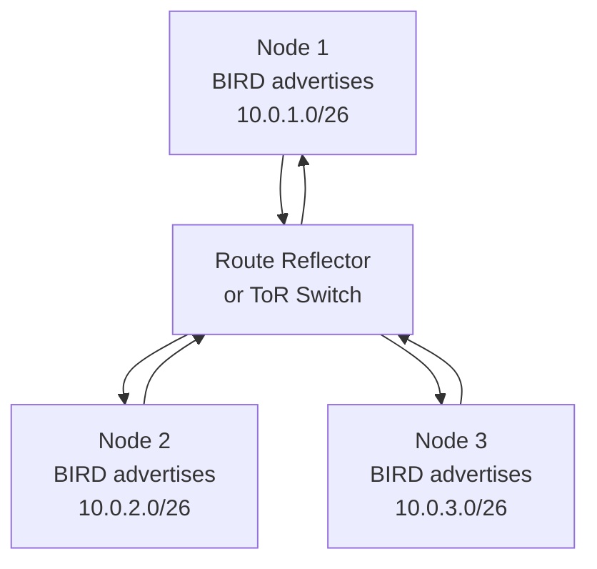
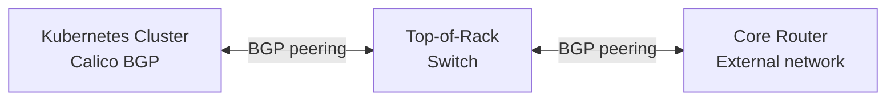

# How to Understand L3 Interconnect Fabric with Calico

Author: [nawazdhandala](https://github.com/nawazdhandala)

Tags: Calico, Kubernetes, L3, BGP, Networking, CNI, Routing, BIRD

Description: A comprehensive guide to Layer 3 networking with Calico using BGP, covering how Calico's BIRD daemon advertises pod routes and enables native routing without encapsulation.

---

## Introduction

Calico's L3 interconnect fabric uses BGP (Border Gateway Protocol) to distribute pod routing information across the cluster and, optionally, to the external network infrastructure. Unlike encapsulated overlay modes such as VXLAN or IP-in-IP, L3 BGP routing with no encapsulation routes pod packets natively through the network fabric, providing the lowest possible latency and overhead.

BGP is the routing protocol that powers the internet and enterprise wide-area networks. In Calico's context, BGP is used for distributing pod address routes between Kubernetes nodes and between the cluster and external BGP peers (typically top-of-rack switches or enterprise routers).

Understanding L3 BGP interconnect requires understanding BGP session establishment, route advertisement, and route reflector topology.

## Prerequisites

- Basic BGP knowledge (AS numbers, peers, route advertisement)
- Understanding of Kubernetes pod CIDR allocation
- A network fabric that supports BGP (bare metal or cloud provider with BGP support)

## Why L3 BGP Instead of Overlay

The fundamental advantage of L3 BGP over overlay encapsulation:

| Aspect | Overlay encapsulation | L3 BGP without encapsulation |
|---|---|---|
| Encapsulation overhead | 20 bytes/packet for IP-in-IP, 50 bytes/packet for VXLAN over IPv4 | 0 |
| Network visibility | Opaque to network | Full visibility to routers |
| Network requirements | Underlay IP connectivity that permits the chosen encapsulation, such as VXLAN UDP traffic or IP-in-IP | BGP-capable fabric |
| Troubleshooting | Additional encapsulation headers | Standard IP routing |
| MTU impact | Reduced by overhead | Full MTU available |

For on-premises deployments with BGP-capable ToR switches, L3 native routing is significantly more efficient than overlay.

## How Calico Distributes Routes via BGP

Calico's BIRD daemon on each node advertises routes for pod addresses on that node. With Calico IPAM, these are typically Calico IPAM blocks assigned to the node, such as the default `/26` IPv4 blocks:


```mermaid
graph TD
    Node1[Node 1\nBIRD advertises\n10.0.1.0/26] --> RR[Route Reflector\nor ToR Switch]
    Node2[Node 2\nBIRD advertises\n10.0.2.0/26] --> RR
    Node3[Node 3\nBIRD advertises\n10.0.3.0/26] --> RR
    RR --> Node1
    RR --> Node2
    RR --> Node3
```

After BGP convergence, every node has routes for pod address blocks on other nodes. When Node 1 wants to send a packet to a pod on Node 2, it looks up `10.0.2.0/26` in its routing table and finds a route with Node 2's IP as the next hop.

## BGP Configuration in Calico

Calico's BGP configuration is managed through `BGPConfiguration` and `BGPPeer` resources:

```yaml
apiVersion: projectcalico.org/v3
kind: BGPConfiguration
metadata:
  name: default
spec:
  logSeverityScreen: Info
  nodeToNodeMeshEnabled: true  # Enable for small clusters
  asNumber: 64512  # Your BGP AS number
```

For peering with external routers:

```yaml
apiVersion: projectcalico.org/v3
kind: BGPPeer
metadata:
  name: tor-switch-1
spec:
  peerIP: 192.168.1.1
  asNumber: 64513
  nodeSelector: rack == 'rack-1'  # Peer only from specific nodes
```

## Node-to-Node Mesh vs. Route Reflectors

**Node-to-node mesh**: Every node peers with every other node. Simple configuration, but O(n²) BGP sessions - Calico documentation describes full mesh as suitable for small and medium deployments of about 100 nodes or less, with route reflectors recommended at significantly larger scales.

**Route reflectors**: Designated nodes reflect routes to all other nodes. All nodes peer with the route reflector(s) instead of each other. Scales to thousands of nodes.

```bash
# Disable node-to-node mesh (use with route reflectors)

calicoctl patch bgpconfiguration default \
  -p '{"spec":{"nodeToNodeMeshEnabled":false}}'
```

## External BGP Peering

Calico can peer with physical network infrastructure, advertising pod routes to the broader network:


```mermaid
graph LR
    Cluster[Kubernetes Cluster\nCalico BGP] <-->|BGP peering| TOR[Top-of-Rack\nSwitch]
    TOR <-->|BGP peering| Core[Core Router\nExternal network]
```

This allows external systems to reach pod IPs directly without NAT - pods are first-class network citizens with routable IPs from the enterprise's perspective.

## Best Practices

- Use BGP native routing whenever your network fabric supports it - the performance advantage over overlay is significant
- Always deploy route reflectors in pairs for high availability when disabling node-to-node mesh
- Label nodes with rack/pod information and use `nodeSelector` on BGPPeer resources to peer with the appropriate ToR switch per rack
- Monitor BGP session state continuously - a lost session means routing information for those pods is stale

## Conclusion

Calico's L3 BGP interconnect fabric provides native, no-overhead routing for pod traffic in networks where BGP is supported. BIRD on each node advertises pod address routes, such as Calico IPAM blocks, and BGP peers (either other nodes or external switches) distribute routing information across the network. For on-premises and private cloud deployments with BGP-capable infrastructure, L3 BGP is the preferred Calico networking mode - delivering the lowest latency and most transparent networking model.
