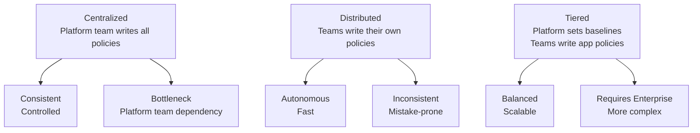

# How to Choose Network Policy Fundamentals in Calico for Production

Author: [nawazdhandala](https://github.com/nawazdhandala)

Tags: Calico, Kubernetes, Network Policy, CNI, Production, Zero Trust, Decision Framework

Description: A decision framework for selecting the right Calico network policy strategy for production environments, covering policy type selection, default posture, and implementation approach.

---

## Introduction

Choosing a network policy strategy for production requires decisions at multiple levels: which policy resources to use, what the default posture should be, how to organize policies across teams, and how aggressively to enforce zero-trust networking. Getting these decisions right at the start prevents policy sprawl and enforcement gaps later.

This post provides a structured framework for network policy strategy selection, from basic decisions (Kubernetes vs. Calico NetworkPolicy) to advanced organizational concerns (tiered policy for multi-team clusters).

## Prerequisites

- Documented workload communication requirements
- Understanding of team structure relative to Kubernetes namespaces
- Calico edition decision made (Open Source vs. Enterprise for tiers)
- Security and compliance requirements for inter-workload communication

## Decision 1: Kubernetes NetworkPolicy vs. Calico NetworkPolicy

| Situation | Use Kubernetes NetworkPolicy | Use Calico NetworkPolicy |
|---|---|---|
| Simple allow rules only | Yes | Either |
| Explicit deny actions needed | No | Yes |
| Policy ordering required | No | Yes |
| Global (cluster-wide) scope | No | Yes (GlobalNetworkPolicy) |
| ICMP matching | No | Yes |
| Service account selectors | No | Yes |
| CNI portability desired | Yes | No |

For most production environments, Calico NetworkPolicy is the better choice because of explicit deny actions and ordering. If you need CNI portability (ability to swap CNIs in future), use Kubernetes NetworkPolicy.

## Decision 2: Default Ingress and Egress Posture

| Posture | Ingress Default | Egress Default | Recommended For |
|---|---|---|---|
| Open | Allow all | Allow all | Development environments only |
| Ingress-closed | Deny all ingress | Allow all egress | Standard production baseline |
| Fully closed | Deny all ingress | Deny all egress | High-security/regulated workloads |

For regulated environments (PCI, HIPAA, FedRAMP), implement fully closed by default and require all communication to be explicitly authorized.

Apply the deny-all template to every namespace at creation time:

```yaml
# Apply with each new namespace
apiVersion: projectcalico.org/v3
kind: NetworkPolicy
metadata:
  name: default-deny
  namespace: {{ .Namespace }}
spec:
  selector: all()
  ingress:
  - action: Deny
  egress:
  - action: Deny
```

## Decision 3: Policy Authorship Model

How will policies be created and maintained?



For organizations with multiple application teams, the tiered model (requiring Calico Enterprise) is the most scalable. Platform team manages baseline tiers (security, compliance); application teams manage their own tiers.

## Decision 4: Policy Rollout Strategy

Never apply deny-all policies to production workloads without prior traffic observation. The rollout strategy:

1. **Observe**: Use Calico flow logs (Cloud/Enterprise) or network monitoring to map all inter-pod communication
2. **Document**: Create an inventory of all allowed communication paths
3. **Write**: Create allow rules for all documented paths
4. **Validate**: Test in staging with the same policies
5. **Enforce**: Apply deny-all default and allow rules together in production

## Decision 5: Policy as Code

Treat network policy like application code:

- Store all NetworkPolicy manifests in Git alongside deployment manifests
- Require code review for all policy changes
- Use CI/CD to validate policy syntax before deployment
- Tag each policy with the owning team, creation date, and purpose

## Best Practices

- Use GlobalNetworkPolicy for all cluster-wide baseline rules (health checks, DNS, known-bad CIDRs)
- Apply deny-all NetworkPolicy to each namespace at creation time
- For Enterprise, use tiers to separate platform baselines from application-layer policies
- Never apply policy changes directly to production - always test in staging first

## Conclusion

Production network policy strategy requires explicit decisions on policy resource type, default posture, authorship model, rollout strategy, and policy lifecycle management. The most effective approach combines Calico NetworkPolicy (for expressiveness), a deny-all default posture, and GitOps-based policy management with code review. For multi-team clusters, Calico Enterprise's tiered policy model provides the organizational structure needed to scale these practices without creating a platform team bottleneck.
