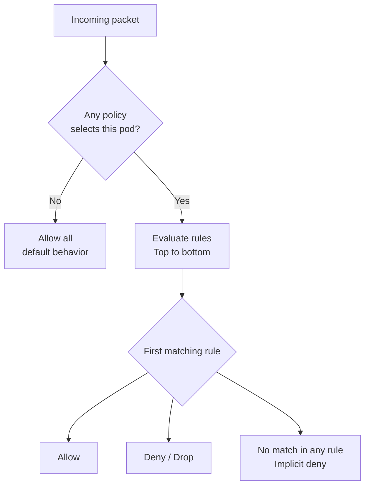

# How to Explain Network Policy Fundamentals in Calico to Your Team

Author: [nawazdhandala](https://github.com/nawazdhandala)

Tags: Calico, Kubernetes, Network Policy, CNI, Team Communication, Security, Zero Trust

Description: A practical guide for teaching Calico network policy concepts to engineering teams, using analogies and live demonstrations to make policy evaluation intuitive.

---

## Introduction

Network policy is the mechanism by which Kubernetes achieves zero-trust networking - where every communication must be explicitly authorized. Explaining this to developers who are used to traditional firewall rules (IP-based, perimeter-focused) requires helping them make the mental shift to identity-based, pod-level policy.

The most effective teaching approach combines a clear analogy for the policy model, a live demonstration of policy enforcement, and a hands-on exercise where team members write and test their own policies. This post provides all three.

## Prerequisites

- A working Calico cluster
- A simple two-tier application deployed (frontend and backend)
- `kubectl` and `calicoctl` access for demonstrations

## The Analogy: Pod Passports, Not Network Zones

Traditional network security thinks in terms of zones: "the DMZ can reach the backend, the internet cannot." This breaks down in Kubernetes where pods from different "zones" run on the same nodes and share network infrastructure.

Introduce Calico policy using the passport analogy:

> "Each pod has an identity - defined by its labels. Network policy is like a passport check at the pod's door: 'You can enter only if you have the right identity credentials (labels) and you're from the right namespace.' The check happens on every connection, for every pod, every time."

This reframes security from "which network segment is this from?" to "who is this pod and does it have permission to connect here?"

## Live Demo: The Three-Step Security Journey

Walk your team through three steps:

**Step 1: Show the open default**
```bash
# No policy applied - all pods can reach all pods
kubectl exec frontend-pod -- curl -s http://backend-svc
# Success - the "open door" default
```

**Step 2: Close the door**
```bash
kubectl apply -f deny-all-ingress.yaml
kubectl exec frontend-pod -- curl --max-time 5 -s http://backend-svc
# Timeout - door closed to everyone
```

**Step 3: Issue a passport**
```yaml
# allow-frontend-to-backend.yaml
apiVersion: projectcalico.org/v3
kind: NetworkPolicy
metadata:
  name: allow-frontend
  namespace: backend-ns
spec:
  selector: app == 'backend'
  ingress:
  - action: Allow
    source:
      selector: app == 'frontend'
```

```bash
kubectl apply -f allow-frontend-to-backend.yaml
kubectl exec frontend-pod -- curl -s http://backend-svc
# Success - frontend has a "passport" to enter
kubectl exec other-pod -- curl --max-time 5 -s http://backend-svc
# Timeout - other-pod doesn't have the right passport
```

The three steps make the policy model concrete and immediately comprehensible.

## Explaining Rule Evaluation

For developers who will write policies, explain the evaluation model clearly:



The "gotcha" moment: once any policy selects a pod, the default flips to deny-all. Every legitimate communication must be explicitly allowed.

## Common Team Questions

**Q: Do I have to write a policy for every service?**
A: You should write a policy for every service you want to restrict. Start with the most sensitive services (databases, secrets stores). You don't have to restrict everything on day one.

**Q: What if I write a policy wrong and break my service?**
A: Use a lab cluster first. Production policy changes should go through code review. We can also start in "log only" mode with Calico to observe what would be blocked before enforcing.

**Q: Can two policies conflict?**
A: Ingress rules from multiple policies that select the same pod are merged with OR logic - a packet is allowed if ANY policy allows it. This means a more permissive policy can unintentionally override a more restrictive one.

## Workshop Exercise

Have each team member write a NetworkPolicy for one service they own:
1. Start with a deny-all ingress for their service
2. Add allows for each legitimate caller
3. Test with both allowed and denied clients
4. Have a partner review their policy for unintended allows

## Best Practices

- Use Calico NetworkPolicy with explicit `action: Deny` for better auditability than Kubernetes NetworkPolicy's implicit deny
- Provide developers with policy templates for common patterns
- Start with observation (flow logs if using Cloud/Enterprise) before enforcement

## Conclusion

Teaching Calico network policy fundamentals is most effective with the passport analogy (identity-based access, not zone-based), the three-step demo (open, close, issue passport), and a hands-on workshop exercise. Once developers understand that the default flips to deny-all when any policy selects their pod, and that rules are evaluated top-to-bottom with first-match semantics, they can write and debug their own policies confidently.
