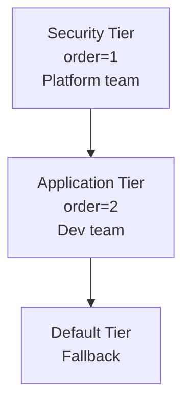

# How to Understand Network Policy Fundamentals in Calico

Author: [nawazdhandala](https://github.com/nawazdhandala)

Tags: Calico, Kubernetes, Network Policy, CNI, Security, GlobalNetworkPolicy, Tiers

Description: Core concepts of Calico network policies including policy types, rule evaluation order, selectors, tiers, and the relationship between Kubernetes and Calico policy resources.

---

## Introduction

Calico's network policy model is the most powerful and expressive part of the Calico feature set. It extends Kubernetes NetworkPolicy with additional capabilities: ordered rules, explicit deny actions, global scope, policy tiers, and service account selectors. Understanding the fundamentals — how policies are selected, how rules are evaluated, and in what order — is the foundation for all network security work with Calico.

This post covers the core concepts: the policy resource types, selector model, rule evaluation order, and tier model. Each concept is explained with practical examples that connect the theory to observable behavior.

## Prerequisites

- Basic understanding of Kubernetes label selectors
- Familiarity with the Kubernetes NetworkPolicy resource
- A running Calico cluster for verification

## Policy Resource Types

Calico provides three policy resource types:

| Resource | API Group | Scope | Notes |
|---|---|---|---|
| `NetworkPolicy` | `networking.k8s.io/v1` | Namespace | Standard Kubernetes policy |
| `NetworkPolicy` | `projectcalico.org/v3` | Namespace | Calico-extended policy |
| `GlobalNetworkPolicy` | `projectcalico.org/v3` | Cluster-wide | Applies to all namespaces |

The Calico NetworkPolicy and GlobalNetworkPolicy share the same structure and are stored in the Calico datastore. Both are evaluated by Felix.

## Selector Model

Policies select which pods they apply to using label selectors in the `selector` field (Calico) or `podSelector` (Kubernetes):

```yaml
# Calico NetworkPolicy selector (applies to pods with these labels)
spec:
  selector: app == 'frontend' && tier == 'web'
```

Calico uses its own selector expression syntax, which supports:
- `key == 'value'` (equality)
- `key != 'value'` (inequality)
- `has(key)` (key existence)
- `&&` and `||` operators

The `all()` selector matches all pods in scope (all namespaces for GlobalNetworkPolicy).

## Rule Structure

Each policy has `ingress` and `egress` rule lists. Rules are evaluated top-to-bottom; the first match wins:

```yaml
apiVersion: projectcalico.org/v3
kind: NetworkPolicy
metadata:
  name: example-policy
  namespace: production
spec:
  selector: app == 'api'
  ingress:
  - action: Allow
    source:
      selector: app == 'frontend'
    destination:
      ports:
      - 8080
  - action: Deny
  egress:
  - action: Allow
    destination:
      selector: app == 'database'
  - action: Deny
```

The `action` field accepts `Allow`, `Deny`, or `Pass` (pass to next tier without a decision).

## Policy Tiers (Enterprise)

Policy tiers are the most powerful Calico Enterprise feature. They create a hierarchy where platform-managed policies are evaluated before application team policies:



Policies in a higher-priority tier (lower order number) are evaluated first. If a policy in the security tier takes a `Deny` action, no lower-tier policy can override it.

```yaml
apiVersion: projectcalico.org/v3
kind: Tier
metadata:
  name: security
spec:
  order: 100
```

## The `Pass` Action

The `Pass` action is unique to Calico. When a rule matches with `Pass`, the packet is handed to the next tier for evaluation without a decision:

```yaml
ingress:
- action: Pass
  source:
    selector: trusted == 'true'
```

This allows platform teams to "skip" traffic they trust, letting application teams apply their own policy to it.

## Default Deny Semantics

When any Calico or Kubernetes NetworkPolicy selects a pod, the default behavior changes from allow-all to deny-all for the traffic directions covered by that policy. Calico respects both Kubernetes and Calico policies, merging them.

## Best Practices

- Use Calico NetworkPolicy (projectcalico.org/v3) instead of Kubernetes NetworkPolicy when you need explicit deny actions, ordering, or global scope
- Use GlobalNetworkPolicy for cluster-wide baseline rules: deny all known-bad CIDRs, allow health checks, allow cluster DNS
- For multi-team clusters, implement tiers to create policy authorship boundaries
- Always specify the `order` field on GlobalNetworkPolicies to ensure deterministic evaluation

## Conclusion

Calico's network policy fundamentals — resource types, selector model, rule evaluation, and tiers — form a comprehensive framework for implementing zero-trust networking in Kubernetes. The key insights are that rules are evaluated top-to-bottom within a policy, policies in the same tier are evaluated independently with union semantics, and tiers create a strict hierarchy where platform policies are always evaluated first. Mastering these fundamentals enables you to design and debug any Calico network security configuration.
