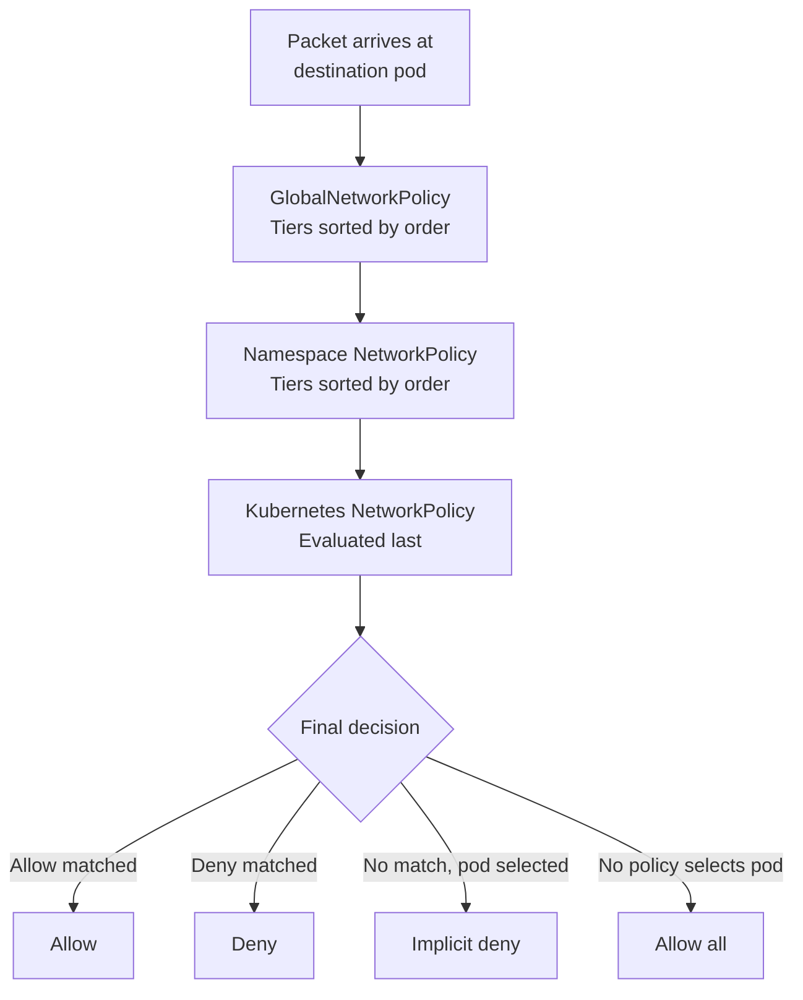

# How to Map Network Policy Fundamentals in Calico to Real Kubernetes Traffic

Author: [nawazdhandala](https://github.com/nawazdhandala)

Tags: Calico, Kubernetes, Network Policy, CNI, Traffic Flows, Networking, Security

Description: Apply Calico network policy concepts to real Kubernetes traffic scenarios, tracing how policies are matched and evaluated for actual inter-pod and external traffic.

---

## Introduction

Network policy concepts become meaningful when applied to real traffic. Understanding how Felix evaluates policies for a specific packet — which policies match, in what order, and what decision results — is the foundation for both debugging connectivity issues and writing correct policies.

This post maps four real traffic scenarios to their policy evaluation paths, showing which policies apply, how selectors match, and what the final allow/deny decision looks like.

## Prerequisites

- A Calico cluster with multiple NetworkPolicies applied
- `kubectl` and `calicoctl` access
- Understanding of Calico policy selectors and evaluation order

## How Felix Evaluates Policies

Felix evaluates policies for each packet in this order:



## Scenario 1: Microservice-to-Microservice (Standard Case)

A payment service pod communicates with a database pod. The database has a deny-all ingress policy with an explicit allow for the payment service.

**Active policies on the database pod**:
1. GlobalNetworkPolicy `security-baseline`: Pass (no match on payment service source)
2. CalicNetworkPolicy `allow-payment-service`: Allow from `app=payment-service`
3. CalicNetworkPolicy `deny-all`: Deny (catch-all)

**Evaluation for traffic from payment service**:
```
1. security-baseline: evaluates source selector - no match → Pass to next
2. allow-payment-service: source app=payment-service matches → Allow
3. Evaluation stops - first match wins
```

```bash
# Verify which Calico policies apply to the database pod
kubectl get pod db-pod -o jsonpath='{.metadata.labels}'
# Use labels to find matching policies:
calicoctl get networkpolicy -n database -o yaml | grep selector
```

## Scenario 2: Cross-Namespace Communication

An analytics pod in the `analytics` namespace tries to query the database in the `data` namespace. The database has a GlobalNetworkPolicy that allows only specific namespaces.

**Policy evaluation**:
```yaml
# GlobalNetworkPolicy applied:
apiVersion: projectcalico.org/v3
kind: GlobalNetworkPolicy
metadata:
  name: database-access
spec:
  selector: app == 'database'
  ingress:
  - action: Allow
    source:
      namespaceSelector: role == 'data-consumer'
  - action: Deny
```

If the `analytics` namespace has label `role: data-consumer`, the analytics pod is allowed. If not, it is denied by the explicit Deny rule.

```bash
# Check namespace labels
kubectl get namespace analytics --show-labels
# Add label if needed:
kubectl label namespace analytics role=data-consumer
```

## Scenario 3: External Traffic Through an Ingress Controller

External HTTP traffic arrives at the NGINX ingress controller and is proxied to a backend pod. The backend has a deny-all ingress policy. What allows the NGINX traffic?

The backend's NetworkPolicy must explicitly allow traffic from the ingress controller pod:

```yaml
ingress:
- from:
  - namespaceSelector:
      matchLabels:
        kubernetes.io/metadata.name: ingress-nginx
    podSelector:
      matchLabels:
        app.kubernetes.io/name: ingress-nginx
  ports:
  - port: 8080
```

Felix evaluates this when the packet arrives from the NGINX pod IP. The NGINX pod's labels and namespace labels must match the `from` selectors for the allow to trigger.

```bash
# Verify NGINX pod labels match the selector
kubectl get pod -n ingress-nginx -l app.kubernetes.io/name=ingress-nginx --show-labels
```

## Scenario 4: GlobalNetworkPolicy Blocking Known Bad CIDRs

A GlobalNetworkPolicy blocks traffic from a known malicious IP range:

```yaml
apiVersion: projectcalico.org/v3
kind: GlobalNetworkPolicy
metadata:
  name: block-bad-cidr
spec:
  order: 50  # Evaluated before app policies (order 100+)
  selector: all()
  ingress:
  - action: Deny
    source:
      nets:
      - 198.51.100.0/24
  - action: Pass
```

Any packet from `198.51.100.0/24` to any pod in the cluster is denied at order 50, before any application-level policy can allow it. The `Pass` action for non-matching traffic passes evaluation to lower-priority policies.

## Tracing Policy Evaluation with Felix Logs

Enable policy logging to see evaluation decisions in the kernel log:

```bash
# On a specific node
sudo journalctl -f | grep -i "cali.*policy"

# Or use Felix diagnostic output
kubectl exec -n calico-system -l k8s-app=calico-node -- \
  calico-node -felix-live-logging
```

## Best Practices

- Use the GlobalNetworkPolicy ordering field deliberately: security baselines at order 50, compliance at 75, app policies at 100+
- Test policy evaluation by tracing a specific pod pair: which policies select each pod, and do their rules match?
- Use `calicoctl get workloadendpoint <pod>` to see the full policy list applied to a specific pod

## Conclusion

Policy evaluation in Calico follows a deterministic path: GlobalNetworkPolicies by order, then namespace policies, then Kubernetes NetworkPolicy. For each packet, Felix finds all policies that select the destination pod, evaluates each policy's rules top-to-bottom, and applies the first matching rule's action. Tracing this path for a specific traffic scenario is the most reliable debugging approach for any connectivity issue.
