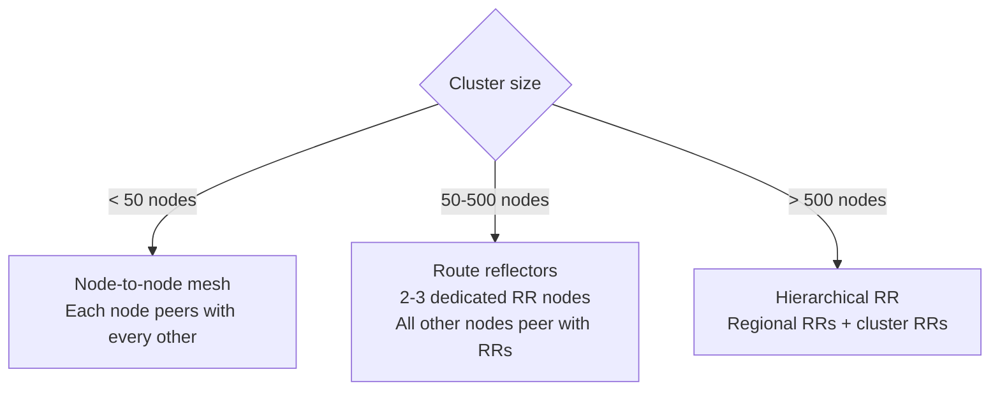

# How to Choose Calico Networking Architecture for Production

Author: [nawazdhandala](https://github.com/nawazdhandala)

Tags: Calico, Kubernetes, Architecture, CNI, Production, Typha, BGP, Decision Framework

Description: A decision framework for selecting the right Calico architectural configuration for production, covering Typha deployment, BGP topology, and dataplane selection.

---

## Introduction

Calico's architecture has several configurable aspects that significantly impact performance, scalability, and operational complexity: whether to deploy Typha, how to configure BGP peering, which dataplane to use, and how to size Felix's resource allocation. These architectural decisions must be made before or at cluster creation - changing them later is disruptive.

This post provides a production architecture decision framework organized by cluster scale and infrastructure type.

## Prerequisites

- Final decision on cluster scale (node count, pod density)
- Knowledge of your network fabric (cloud VPC, bare-metal with BGP, etc.)
- Decision on Linux kernel version for nodes (affects eBPF availability)

## Decision 1: Typha Deployment

Typha reduces load on the Kubernetes API server by acting as a proxy for Felix connections:

| Cluster Size | Typha Recommendation |
|---|---|
| < 50 nodes | Not needed (Felix connects directly to API server) |
| 50-200 nodes | Optional but recommended |
| > 200 nodes | Required |

Configure Typha replica count for high availability:

```yaml
apiVersion: operator.tigera.io/v1
kind: Installation
spec:
  typhaAffinity:
    nodeAffinity:
      requiredDuringSchedulingIgnoredDuringExecution:
        nodeSelectorTerms:
        - matchExpressions:
          - key: node-role.kubernetes.io/control-plane
            operator: Exists
  typhaPodAnnotations:
    cluster-autoscaler.kubernetes.io/safe-to-evict: 'false'
```

Typha should run on nodes that are not evictable - typically control plane nodes or dedicated infrastructure nodes.

## Decision 2: Felix Resource Sizing

Felix manages iptables or eBPF programs for all pods and policies on a node. Its resource requirements scale with pod count and policy count:

| Scale | Felix CPU Request | Felix Memory Request |
|---|---|---|
| Small (< 50 pods/node) | 250m | 128Mi |
| Medium (50-150 pods/node) | 500m | 256Mi |
| Large (> 150 pods/node) | 1000m | 512Mi |

Set these in the Calico Installation resource:

```yaml
spec:
  componentResources:
  - componentName: Node
    resourceRequirements:
      requests:
        cpu: 250m
        memory: 256Mi
      limits:
        cpu: 500m
        memory: 512Mi
```

## Decision 3: BGP Topology (for BGP routing mode)

For clusters using BGP (native routing without encapsulation):



For production, disable node-to-node mesh at scale and configure route reflectors:

```bash
# Disable mesh for large clusters
calicoctl patch bgpconfiguration default \
  -p '{"spec":{"nodeToNodeMeshEnabled":false,"asNumber":65000}}'
```

## Decision 4: Dataplane Selection

| Cluster Characteristics | Recommended Dataplane |
|---|---|
| Kernel < 5.3 | Standard Linux (iptables) |
| Windows nodes | Standard Linux (iptables) for Linux, HNS for Windows |
| High-performance, modern kernel | eBPF |
| Large cluster (> 200 services) | eBPF |
| Mixed kernel versions | Standard Linux (lowest common denominator) |

## Decision 5: High Availability for Calico Control Plane

For production clusters, ensure Calico control plane components are highly available:

- **calico-node**: DaemonSet - HA by default (one per node)
- **Typha**: Deploy 2+ replicas with pod anti-affinity
- **calico-kube-controllers**: Deploy on a node with a taint preventing eviction
- **Calico API server** (Enterprise): Deploy 2+ replicas

## Best Practices

- Size Typha conservatively - more replicas adds redundancy without significant cost
- Configure pod disruption budgets for Typha to prevent all replicas being evicted simultaneously
- Use node affinity to pin Typha to infrastructure nodes that are not subject to cluster autoscaler eviction
- Document your BGP ASN, peer configuration, and route reflector designations in your cluster runbook

## Conclusion

Production Calico architecture decisions center on four areas: Typha deployment for API server protection at scale, Felix resource sizing for pod and policy count, BGP topology for native routing clusters, and dataplane selection. Making these decisions explicitly before cluster creation and documenting them in a runbook ensures that the architecture supports your production scale requirements and that operators have the information they need during incidents.
