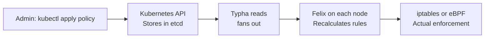

# How to Explain Calico Networking Architecture to Your Team

Author: [nawazdhandala](https://github.com/nawazdhandala)

Tags: Calico, Kubernetes, Architecture, CNI, Team Communication, Felix, BIRD, Typha

Description: A practical guide for explaining Calico's component architecture to engineering teams, using analogies and visual diagrams to make the system comprehensible.

---

## Introduction

Explaining Calico's architecture to a team is challenging because the components (Felix, BIRD, confd, Typha) have non-obvious names and non-obvious relationships. Most teams who run Calico can use it without understanding the architecture — until something breaks and they need to know where to look.

The goal of this session is not to make everyone a Calico expert. It is to give team members enough understanding to answer: "Which component is responsible for this?" and "Where should I look when this breaks?" This post provides the narrative and visual framework to accomplish that.

## Prerequisites

- Team familiarity with Kubernetes DaemonSets and pod concepts
- 30-60 minute team session with a whiteboard or shared diagram tool
- A running Calico cluster for optional live exploration

## The Control Plane vs. Data Plane Mental Model

Start with the fundamental architecture split:

> "Calico has two layers: the control plane, which decides what should happen, and the data plane, which makes it happen. Felix is the bridge between the two — it translates control plane decisions (network policies, routes) into data plane rules (iptables, eBPF programs, route table entries)."

This mental model helps teams understand why a "config change" (control plane) takes a moment to be "enforced" (data plane) — Felix must reconcile the new state.

## Explain Each Component with a Job Title

Use job title analogies that map to team mental models:

| Component | Job Title | Responsibility |
|---|---|---|
| Felix | Site Reliability Engineer | "Makes sure every node's network configuration matches the desired state" |
| BIRD | Border Router | "Advertises our pod routes to the outside world via BGP" |
| confd | Config Manager | "Keeps BIRD's configuration files in sync with our policy data" |
| Typha | Message Broker | "Fans out configuration changes from one API server to all Felix instances" |
| CNI Plugin | Onboarding Agent | "Configures the network for each new pod when it starts" |

## Visual: The Configuration Flow

Draw this diagram on a whiteboard:



Walk through: "When you apply a NetworkPolicy, Kubernetes stores it. Typha reads it and sends it to Felix on every node. Felix calculates the new iptables rules and updates them. Now the policy is enforced."

This sequence makes the "latency" between policy application and enforcement visible — it's the Typha-to-Felix propagation delay (typically sub-second).

## Explain Failure Modes

Give each component a failure mode that the team can recognize:

- **Felix fails**: Policy stops being enforced. New pods don't get routes. Existing connections keep working (kernel routes and iptables rules persist until changed).
- **BIRD fails**: BGP session drops. Remote nodes lose routes to pods on this node. Cross-node traffic fails. Same-node traffic continues.
- **Typha fails**: Felix stops receiving updates. Policy changes stop propagating. Everything continues working until the next policy change — then it silently doesn't apply.
- **confd fails**: BIRD's config stops updating. BGP peer changes don't take effect. Existing BGP sessions continue.

Knowing these failure modes helps the team answer "what is still working if X fails?"

## Connecting Architecture to Monitoring

Map each component to what you should monitor:

```bash
# Felix health
kubectl get pods -n calico-system -l k8s-app=calico-node
kubectl logs -n calico-system -l k8s-app=calico-node -c calico-node | grep -i "error\|warn"

# Typha health
kubectl get pods -n calico-system -l k8s-app=calico-typha

# BIRD BGP sessions
kubectl exec -n calico-system -l k8s-app=calico-node -c calico-node \
  -- birdcl show protocols
```

## Best Practices

- Record the architecture explanation session and make it available to new team members
- Include the component diagram in your cluster runbook alongside the relevant `kubectl` diagnostic commands
- Do a "game day" exercise where you simulate Felix failure and have the team diagnose and recover it

## Conclusion

Explaining Calico's architecture is most effective when you use job title analogies for each component, walk through the configuration flow as a sequence of events, and map each component to its failure mode. Teams don't need to understand the implementation details — they need to understand which component to look at when something goes wrong and what "healthy" looks like for each component.
