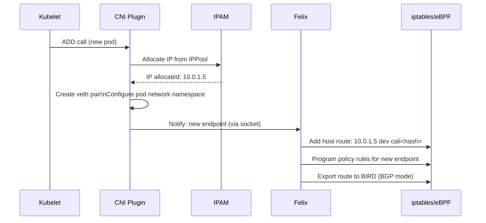
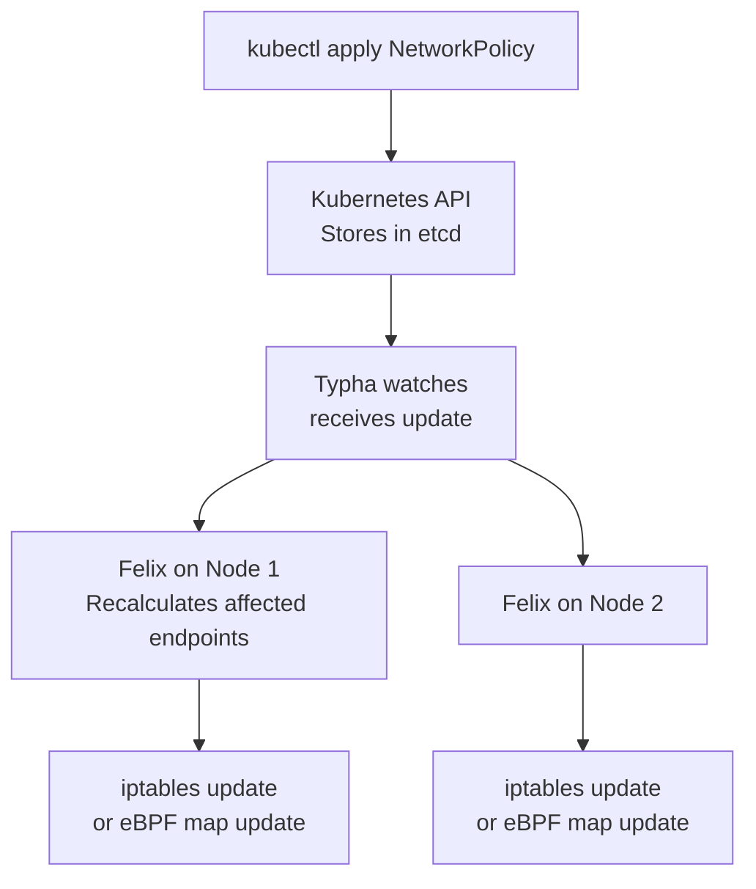
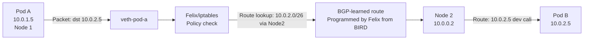
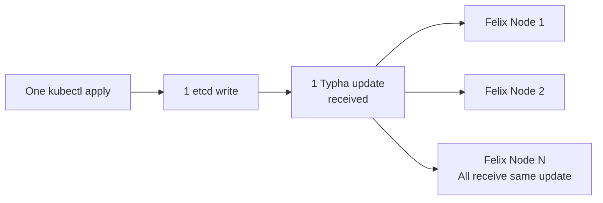

# How to Map Calico Networking Architecture to Real Kubernetes Traffic

Author: [nawazdhandala](https://github.com/nawazdhandala)

Tags: Calico, Kubernetes, Architecture, CNI, Traffic Flows, Felix, BIRD, Networking

Description: A walkthrough of how Calico's architectural components — Felix, BIRD, Typha, and the CNI plugin — interact for real Kubernetes traffic scenarios.

---

## Introduction

Understanding Calico's architecture in the abstract is useful — but seeing how Felix, BIRD, Typha, and the CNI plugin interact for a specific traffic event makes the architecture concrete. This post traces three real events through the architecture: a new pod being created, a network policy being applied, and a cross-node packet being routed.

## Prerequisites

- Understanding of Calico's component roles (Felix, BIRD, Typha, confd, CNI)
- A running Calico cluster for optional live verification

## Event 1: New Pod Creation

This is the most complete architecture walkthrough — it involves every component:



**Verifiable artifacts after pod creation**:
```bash
# Host route added by Felix
ip route show | grep <pod-ip>
# Expected: <pod-ip> dev cali<hash> scope link

# WorkloadEndpoint created in datastore
calicoctl get workloadendpoint --all-namespaces | grep <pod-name>

# BGP route advertised (BGP mode)
kubectl exec -n calico-system -l k8s-app=calico-node -c calico-node \
  -- birdcl show route | grep <pod-ip>
```

## Event 2: Network Policy Update

When a NetworkPolicy is applied, the change flows through the architecture:



The propagation chain: kubectl → etcd → Typha → Felix → dataplane. Each arrow introduces a small latency. Total policy propagation time in a healthy cluster is typically less than 500ms.

**Observe the propagation**:
```bash
# Watch Felix receive and apply the policy
kubectl logs -n calico-system -l k8s-app=calico-node -c calico-node -f | \
  grep "policy"

# Verify the iptables rule appeared
time kubectl apply -f new-policy.yaml && \
  kubectl exec test-pod -- curl --max-time 5 http://target
# Measure time from apply to enforcement
```

## Event 3: Cross-Node Packet Routing (BGP mode)

For a packet traveling from a pod on Node 1 to a pod on Node 2 in BGP mode:



The BGP route on Node 1 was learned from BIRD, which received it from Node 2's BIRD (or a route reflector). Felix programmed the route into the Linux routing table when BIRD received it.

**Verify the BGP route chain**:
```bash
# On Node 1: check the route was programmed
ip route show 10.0.2.0/26
# Expected: 10.0.2.0/26 via 10.0.0.2 dev <interface>

# Source: BIRD received this from the BGP peer
kubectl exec -n calico-system -l k8s-app=calico-node -c calico-node \
  -- birdcl show route 10.0.2.0/26
```

## Event 4: Typha Fanout During Mass Policy Update

When you apply a cluster-wide policy change, Typha's role becomes critical:



Without Typha, the single etcd write would generate N simultaneous API server watch events (one per Felix). With Typha, it generates one event that Typha fans out.

## Best Practices

- Use Felix metrics to monitor propagation lag: `felix_calc_graph_update_time_seconds` histogram
- After any cluster-wide policy change, wait for all Felix instances to report "in sync" before testing enforcement
- Use Typha metrics to monitor connection count and fanout latency

## Conclusion

Calico's architecture processes real traffic events through a well-defined component pipeline: CNI plugin for pod setup, Typha+Felix for policy propagation, BIRD+Felix for BGP route distribution. Each event has observable artifacts — host routes, iptables rules, WorkloadEndpoints, BGP routes — that confirm the architecture is functioning correctly. Tracing these artifacts during normal operation builds the intuition needed to diagnose anomalies during incidents.
