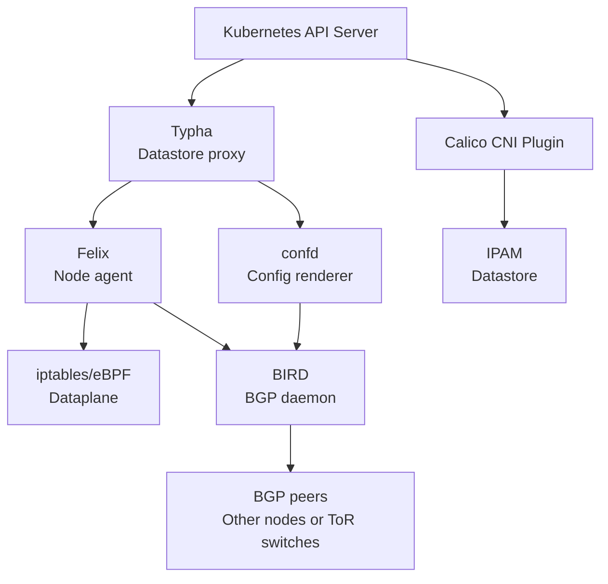
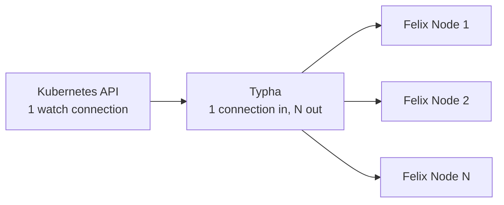

# How to Understand Calico Networking Architecture

Author: [nawazdhandala](https://github.com/nawazdhandala)

Tags: Calico, Kubernetes, Architecture, CNI, Felix, BIRD, Typha, confd

Description: A deep dive into Calico's architectural components — Felix, BIRD, confd, Typha, and the Calico API server — and how they work together to implement Kubernetes networking.

---

## Introduction

Calico is not a single binary — it is a system of cooperating components, each with a specific role in the networking architecture. Understanding what each component does, how they communicate, and what happens when one fails is essential for operating Calico in production and diagnosing networking incidents effectively.

The core Calico components are Felix (the node agent), BIRD (the BGP daemon), confd (the configuration renderer), Typha (the fanout proxy for the datastore), and the CNI plugin. Each runs in a specific context and has specific failure modes.

## Prerequisites

- Basic familiarity with Kubernetes DaemonSets and system components
- Understanding of what a CNI plugin does
- Awareness of BGP routing concepts (for BIRD sections)

## Component Overview



## Felix: The Node Agent

Felix is the heart of Calico. It runs as a DaemonSet on every node and is responsible for:

- **Policy enforcement**: Translating Calico NetworkPolicy into iptables rules or eBPF programs
- **Route programming**: Adding host routes for pod IPs on the local node
- **Endpoint management**: Creating and managing WorkloadEndpoints in the datastore as pods are created
- **Health reporting**: Reporting node readiness status

Felix watches the Calico datastore (via Typha) for changes to policies, endpoints, and IP pools, then reconciles the local node's network state.

```bash
# Check Felix health
kubectl get pods -n calico-system -l k8s-app=calico-node
kubectl logs -n calico-system -l k8s-app=calico-node -c calico-node | grep "Felix"
```

## BIRD: The BGP Daemon

BIRD (Bird Internet Routing Daemon) handles BGP routing in Calico. It runs inside the `calico-node` pod and:

- Advertises pod CIDR routes to BGP peers (other nodes or top-of-rack switches)
- Learns routes from peers and makes them available for Felix to program
- Maintains BGP session state with all configured peers

BIRD is optional — it is only required when using BGP routing mode. In VXLAN or IP-in-IP mode, BIRD is not involved in pod routing.

```bash
# Check BIRD status via Felix
kubectl exec -n calico-system -l k8s-app=calico-node \
  -c calico-node -- birdcl show protocols
```

## confd: The Configuration Renderer

confd watches the Calico datastore and renders BGP configuration files for BIRD. When BGP peer configuration changes (new peers added, old ones removed), confd re-renders the BIRD configuration and signals BIRD to reload.

confd is the bridge between Calico's data model (stored in Kubernetes CRDs) and BIRD's configuration format (a proprietary config file syntax).

## Typha: The Datastore Fanout Proxy

In large clusters, every Felix instance watching the Kubernetes API server directly creates excessive load on the API server. Typha solves this by acting as a proxy:

- Typha maintains a single watch on the Calico CRDs in the Kubernetes API server
- Felix connects to Typha, not the API server directly
- Typha fans out updates to all connected Felix instances



Typha is enabled automatically in large clusters. In small clusters (< 200 nodes), Felix connects directly to the API server.

## The CNI Plugin

The Calico CNI plugin is invoked by kubelet for each new pod. It:
1. Calls Calico IPAM to allocate a pod IP
2. Creates the veth pair and configures the pod's network namespace
3. Notifies Felix via a socket that a new endpoint exists

The CNI plugin runs as a binary on each node, not as a pod.

## Best Practices

- Monitor all Calico components via Prometheus metrics — Felix, Typha, and BIRD each expose metrics
- Enable Typha when your cluster exceeds 100 nodes to reduce API server load
- Set appropriate resource limits on calico-node pods — Felix and BIRD are sensitive to CPU and memory constraints during policy churn

## Conclusion

Calico's architecture distributes responsibility across Felix (policy enforcement and routing), BIRD (BGP routing), confd (configuration rendering), Typha (API server fanout), and the CNI plugin (pod network setup). Understanding each component's role and failure modes lets you diagnose incidents accurately and design monitoring that covers the full networking stack.
