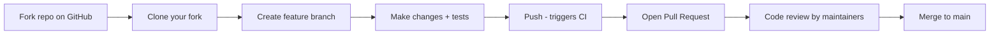

# How to Understand Calico Open Source Community Workflows

Author: [nawazdhandala](https://github.com/nawazdhandala)

Tags: Calico, Kubernetes, Open Source, Community, Contributing

Description: A guide to contributing to and working with the Calico open source community, covering the project structure, contribution workflows, issue reporting, and community resources.

---

## Introduction

Calico Open Source is one of the most widely deployed Kubernetes CNI plugins and has an active open source community. Whether you want to file a bug report, contribute a feature, or simply stay current with the project's development, understanding the community workflows helps you engage effectively.

The Calico project is maintained by Tigera and the open source community on GitHub. It has specific conventions for issue reporting, pull requests, code review, and release management that reflect the project's scale and the operational impact of networking changes.

## Prerequisites

- GitHub account
- Basic familiarity with Git and pull requests
- Understanding of the Calico codebase area you want to contribute to
- Ability to run a local Kubernetes cluster for testing

## Project Structure

The Calico project is organized as a monorepo at `github.com/projectcalico/calico`:

```plaintext
calico/
├── felix/          # The Felix agent (Go)
├── node/           # calico/node container (Felix + BIRD + confd)
├── cni-plugin/     # Calico CNI plugin (Go)
├── kube-controllers/ # Kubernetes controller (Go)
├── typha/          # Typha proxy (Go)
├── calicoctl/      # CLI tool (Go)
├── api/            # Calico API types (Go)
├── libcalico-go/   # Shared Go library
└── manifests/      # Install manifests
```

Understanding where to look for the code that implements a specific feature is the first step to contributing.

## Filing Issues

The Calico issue tracker is at `github.com/projectcalico/calico/issues`. For effective bug reports:

1. **Search first**: Many issues are duplicates. Search before filing.
2. **Provide version information**:
   ```bash
   kubectl get pods -n calico-system -l k8s-app=calico-node \
     -o jsonpath='{.items[0].spec.containers[0].image}'
   kubectl version --short
   uname -r  # Kernel version
   ```
3. **Provide minimal reproduction steps**: A script that reproduces the issue on a fresh cluster is ideal
4. **Include relevant logs**:
   ```bash
   kubectl logs -n calico-system -l k8s-app=calico-node -c calico-node | \
     grep -i "error\|warn" | tail -50
   ```

## Setting Up a Development Environment

```bash
# Fork and clone the repository
git clone git@github.com:<your-github>/calico.git
cd calico

# Set up Go environment (Calico requires Go 1.21+)
go version

# Build a specific component
cd felix
make build

# Run unit tests
make ut

# Build the calico-node container
make calico/node
```

Calico uses `make` as its primary build tool. Each sub-directory has its own `Makefile` with targets for building, testing, and packaging.

## Running Integration Tests

Integration tests require a local Kubernetes cluster:

```bash
# Use kind for integration testing
kind create cluster --config=test/kind.yaml

# Run integration tests for the CNI plugin
cd cni-plugin
make st  # System tests
```

## Contribution Workflow



Key conventions:
- Branch names: `feature/<description>` or `fix/<issue-number>-<description>`
- Commit messages: Follow the conventional commits format: `feat: add X` or `fix: resolve Y`
- Tests required: Every functional change should include a unit test
- Signed commits: `git commit -s` for Developer Certificate of Origin (DCO) sign-off

## Community Resources

| Resource | Purpose |
|---|---|
| GitHub Issues | Bug reports and feature requests |
| GitHub Discussions | Architecture questions and roadmap discussions |
| Calico Users Slack | Community support (#calico-users) |
| Tigera Community Forum | Official support forum |
| Project Calico YouTube | Talks, webinars, and tutorials |
| `docs.tigera.io` | Official documentation |

## Security Vulnerability Reporting

Do NOT file security vulnerabilities as public GitHub issues. Report them privately:

- Email: `security@tigera.io`
- GitHub Security Advisories: `github.com/projectcalico/calico/security/advisories/new`

Security reports are acknowledged within 24 hours and coordinated disclosure is used for all CVEs.

## Understanding the Release Cycle

Calico releases follow a regular cadence:
- Minor releases (3.27, 3.28): Monthly to quarterly
- Patch releases (3.27.1, 3.27.2): As needed for bug fixes and security patches
- N-1 support: The previous minor version continues to receive patches

Roadmap discussions happen in GitHub Issues with the `roadmap` label and in community calls.

## Best Practices

- Join the Calico Slack community before filing your first issue - many questions are answered faster in Slack
- Reproduce the issue on the latest Calico release before filing - the bug may already be fixed
- For large features, open a design issue first to discuss the approach before writing code
- Read the contribution guide at `github.com/projectcalico/calico/blob/master/CONTRIBUTING.md` before your first PR

## Conclusion

The Calico open source community follows standard GitHub-based workflows with specific conventions around DCO sign-off, testing requirements, and secure vulnerability reporting. Engaging effectively means searching issues before filing, providing complete version information and reproduction steps, and participating in design discussions before writing large features. The community is active and responsive - contributing to Calico is an effective way to influence the direction of one of Kubernetes' most widely-used CNI plugins.
