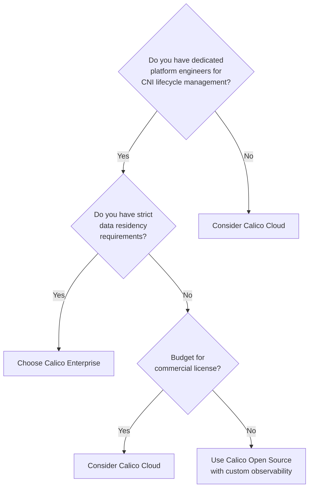

# How to Choose Calico Product Editions for Production

Author: [nawazdhandala](https://github.com/nawazdhandala)

Tags: Calico, Kubernetes, CNI, Production, Decision Framework, Calico Cloud, Calico Enterprise

Description: A decision framework for selecting the right Calico edition — Open Source, Cloud, or Enterprise — for production Kubernetes workloads based on compliance, team size, and operational requirements.

---

## Introduction

Selecting a Calico edition for production is not a purely technical decision — it involves operational capacity, compliance obligations, budget, and long-term support requirements. Making the wrong call means either paying for features you don't use or discovering a critical compliance capability is missing during an audit.

Production selection requires a structured evaluation process. This post provides a decision framework with concrete criteria for each edition so you can make and defend the choice with your organization's stakeholders.

The framework covers four primary dimensions: compliance requirements, team operational capacity, data residency constraints, and feature requirements. Each dimension maps to specific edition attributes.

## Prerequisites

- Documented compliance requirements (PCI-DSS, SOC2, HIPAA, FedRAMP, or internal policy)
- Understanding of your team's current Kubernetes operational maturity
- Budget authority or ability to engage finance for licensing discussions
- Knowledge of your cloud provider or on-premises infrastructure constraints

## Decision Dimension 1: Compliance Requirements

Start with compliance — it is usually the most constrained dimension.

| Requirement | Open Source | Cloud | Enterprise |
|---|---|---|---|
| Automated audit reports | No | Yes | Yes |
| Data stays on-premises | Yes | No (SaaS) | Yes |
| FedRAMP authorized | No | No | Consult Tigera |
| FQDN egress control | No | Yes | Yes |

If you are subject to PCI-DSS or SOC2 and need automated compliance evidence, Calico Open Source alone is insufficient.

## Decision Dimension 2: Team Operational Capacity

Small teams (fewer than three platform engineers) benefit significantly from Calico Cloud's managed control plane. The time saved on Calico upgrades, troubleshooting, and observability tooling usually justifies the subscription cost.

## Decision Dimension 3: Feature Requirements

List your non-negotiable features and map them to editions:

- **Pod networking and standard Kubernetes NetworkPolicy**: Open Source
- **DNS/FQDN-based egress control**: Cloud or Enterprise
- **Real-time threat detection and anomaly alerts**: Cloud or Enterprise
- **Hierarchical policy tiers with RBAC**: Enterprise
- **On-premises flow log storage**: Enterprise
- **Multi-cluster federated network policy**: Cloud or Enterprise

If your list contains only the first item, Open Source is the right choice. If your list includes items two through six, you need a commercial edition.

## Decision Dimension 4: Total Cost of Ownership

Open Source is not free — it requires engineering time for installation, upgrades, observability tooling, and debugging. A realistic TCO calculation for Open Source includes:

- CNI upgrade time per cluster per quarter (~2–4 hours)
- Building and maintaining Prometheus/Grafana dashboards for network metrics
- Manually generating compliance evidence for auditors

Commercial editions consolidate these costs into a predictable subscription but add per-node licensing fees. For clusters with more than 50 nodes and active compliance requirements, commercial editions are often cost-neutral or cheaper than the engineering time equivalent.

## Best Practices

- Do not choose an edition based solely on initial installation simplicity — evaluate the full two-year lifecycle cost
- Lock in a 90-day trial of Cloud or Enterprise before signing a contract so you can validate the specific compliance features you need
- Confirm your cloud provider managed Kubernetes service (EKS, GKE, AKS) is supported before purchasing Enterprise
- Plan for the upgrade path: Open Source → Cloud/Enterprise migrations are supported without re-installing the CNI

## Conclusion

Choosing the right Calico edition for production requires systematically evaluating compliance requirements, team capacity, feature needs, and total cost of ownership. Open Source serves teams with strong platform engineering capacity and simple policy requirements. Calico Cloud or Enterprise becomes necessary as compliance obligations grow or team capacity shrinks. Use the framework above to make the decision explicit and defensible.
