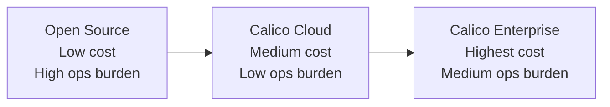

# How to Explain Calico Product Editions to Your Team

Author: [nawazdhandala](https://github.com/nawazdhandala)

Tags: Calico, Kubernetes, CNI, Networking, Team Communication, Calico Cloud, Calico Enterprise

Description: A practical guide for explaining the differences between Calico Open Source, Calico Cloud, and Calico Enterprise to non-technical stakeholders and engineering teams.

---

## Introduction

When you understand the Calico product landscape, the next challenge is communicating those differences to colleagues who may not have a networking background. Product managers, security leads, and engineering managers all need to understand the tradeoffs — but they don't need to know how BGP peering works to make a good decision.

Explaining CNI editions to a mixed audience requires translating technical capabilities into business outcomes: cost, operational burden, security posture, and compliance coverage. This post gives you the framing and analogies you need to run that conversation effectively.

The goal is not to oversimplify — it's to give each audience the right level of detail so they can participate meaningfully in the decision.

## Prerequisites

- Familiarity with Calico's three editions (Open Source, Cloud, Enterprise)
- Understanding of your organization's compliance requirements
- Basic knowledge of who manages your Kubernetes infrastructure

## Frame the Conversation Around Operational Ownership

The single most useful axis for non-technical stakeholders is: **who operates it?**

- **Calico Open Source**: Your team installs, upgrades, and debugs everything. Full control, no licensing cost.
- **Calico Cloud**: Tigera operates the management plane. Your team manages the workloads and policies.
- **Calico Enterprise**: Your team operates everything on-premises, with Tigera providing commercial support.

A useful analogy is email hosting. Open Source is like running your own mail server. Calico Cloud is like using Gmail. Calico Enterprise is like running Exchange on-premises with a Microsoft support contract.

## What Security Teams Need to Hear

Security stakeholders care about visibility and control. Frame it this way:

| Concern | Open Source | Cloud | Enterprise |
|---|---|---|---|
| Who sees my traffic metadata? | Only you | Tigera (SaaS) | Only you |
| Can I do FQDN-based egress policy? | No | Yes | Yes |
| Compliance reports (PCI, SOC2)? | Manual | Automated | Automated |
| Threat detection? | No | Yes | Yes |

Security teams in regulated industries (finance, healthcare, government) typically need Enterprise or at minimum Cloud-level observability to pass audits.

## What Engineering Managers Need to Hear

For engineering managers, frame the tradeoff as operational cost vs. capability cost:

Open Source is free but requires your team to handle upgrades, troubleshoot networking bugs, and build your own observability. Calico Cloud and Enterprise shift some of that work to Tigera in exchange for a subscription fee.

## What Platform Engineers Need to Hear

Platform engineers want to know about API compatibility, upgrade paths, and operational complexity. Key points:

- All three editions share the same core Calico data model and CRDs
- Migrating from Open Source to Cloud or Enterprise does **not** require reinstalling the CNI or re-IPing nodes
- Enterprise adds CRD-based resources (`GlobalThreatFeed`, `PacketCapture`, `PolicyRecommendation`) that are not available in Open Source
- Calico Cloud connects via a lightweight agent that reports to Tigera's SaaS — no inbound connectivity required from Tigera

## Best Practices

- Prepare a one-page decision matrix tailored to your organization before the meeting
- Anchor the discussion on a concrete use case: "We need to prove to auditors that no pod can call external APIs without approval — which edition supports that?"
- Avoid leading with pricing until you have established which features are actually required
- Use a lab cluster to demonstrate the UI and policy capabilities of Cloud or Enterprise before committing

## Conclusion

Explaining Calico editions to your team is most effective when you map capabilities to stakeholder concerns rather than listing features. Frame the conversation around operational ownership, security visibility, and compliance coverage. With the right framing, even non-technical stakeholders can participate in a meaningful edition selection decision.
