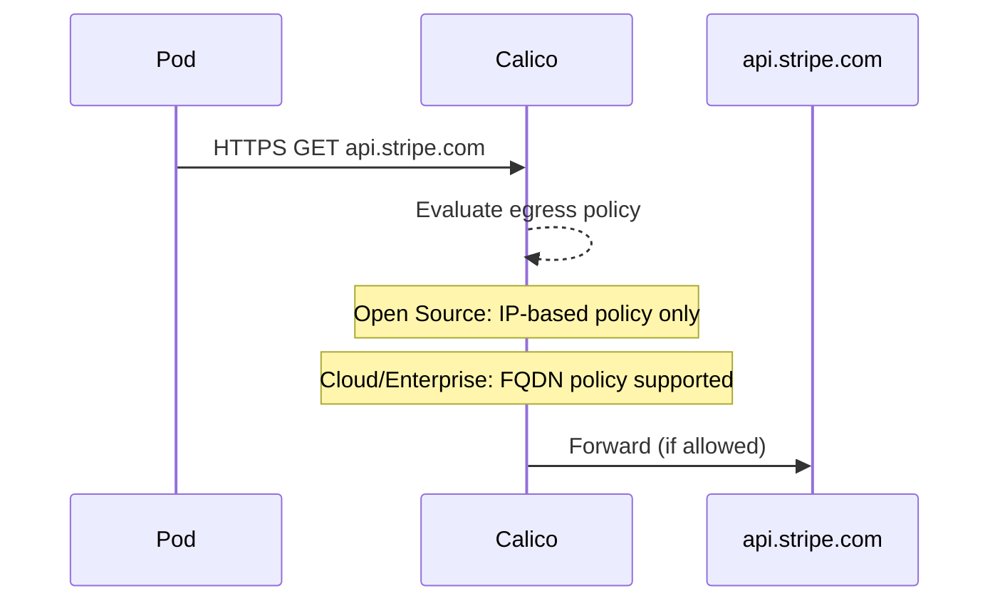
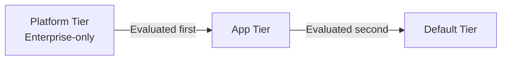

# How to Map Calico Product Editions to Real Kubernetes Traffic

Author: [nawazdhandala](https://github.com/nawazdhandala)

Tags: Calico, Kubernetes, CNI, Networking, Traffic Flows, Network Policy, eBPF

Description: Apply your knowledge of Calico editions to real Kubernetes traffic scenarios, understanding what each edition can observe, control, and report on for actual cluster traffic flows.

---

## Introduction

Understanding Calico editions at an abstract level is useful, but the real test is mapping edition capabilities to the actual traffic flows in your cluster. What can Open Source see? What can Enterprise report on? What does Calico Cloud block that Open Source cannot?

This post walks through three representative Kubernetes traffic scenarios and shows how each Calico edition handles them - from visibility to enforcement. The goal is to connect the theoretical edition comparison to the operational reality of running workloads.

Each scenario represents a class of traffic you will encounter in any production cluster: internal pod-to-pod, external egress, and service mesh interaction.

## Prerequisites

- Understanding of Kubernetes pod networking and services
- Familiarity with Calico network policies
- Basic knowledge of the three Calico editions

## Scenario 1: Pod-to-Pod Traffic in the Same Namespace

A frontend pod sends HTTP traffic to a backend pod in the same namespace. All three editions can:
- Route the traffic via the configured dataplane (iptables, eBPF, VXLAN)
- Enforce `NetworkPolicy` or `CalicNetworkPolicy` to allow or deny the connection
- Log denied connections to the kernel audit log

Only Cloud and Enterprise can:
- Show this flow in a graphical traffic visualization dashboard
- Alert on anomalous flow volume or pattern changes
- Include the flow in an automated compliance report

For Open Source, your only visibility into allowed flows is through custom Prometheus metrics from Felix or manual `conntrack` inspection on the node.

## Scenario 2: Pod Egress to an External API

A workload pod initiates HTTPS to `api.stripe.com:443`. This is one of the most important traffic scenarios from a security perspective.



**Open Source limitation**: You can only write egress policy using IP CIDRs. Since `api.stripe.com` resolves to multiple dynamic IPs, maintaining a static CIDR list is operationally fragile.

**Cloud/Enterprise capability**: You can write a `GlobalNetworkPolicy` with `domains` selector to allow traffic specifically to `api.stripe.com` by DNS name, regardless of the underlying IP address changes.

```yaml
apiVersion: projectcalico.org/v3
kind: GlobalNetworkPolicy
metadata:
  name: allow-stripe-egress
spec:
  selector: app == 'payment-service'
  egress:
  - action: Allow
    destination:
      domains:
      - api.stripe.com
  - action: Deny
```

## Scenario 3: Traffic Between Workloads in Different Namespaces

A data processing pod in the `analytics` namespace queries a database pod in the `data` namespace. Open Source and all editions support cross-namespace policy using `namespaceSelector`. Enterprise additionally supports policy tiers, so a platform team can enforce a baseline tier that prevents analytics from ever reaching the `kube-system` namespace, while the application team manages their own tier without being able to override the baseline.



In Open Source, all policies are evaluated in a single flat namespace - there is no enforcement of policy authorship boundaries between teams.

## Best Practices

- Map your most critical traffic flows to edition capabilities before making a purchase decision
- For each flow, document whether you need enforcement only (Open Source) or visibility + compliance (Cloud/Enterprise)
- Use FQDN policy (Cloud/Enterprise) for all external API egress - IP-based allowlists for external APIs are operationally unmaintainable
- Test each scenario in the lab before assuming feature availability in production

## Conclusion

Mapping Calico editions to real traffic flows reveals where Open Source is sufficient and where commercial editions add material security value. Pod-to-pod internal traffic is well-served by all editions. External egress and cross-team policy governance are the key scenarios where Cloud and Enterprise provide capabilities that Open Source cannot replicate without significant custom tooling.
