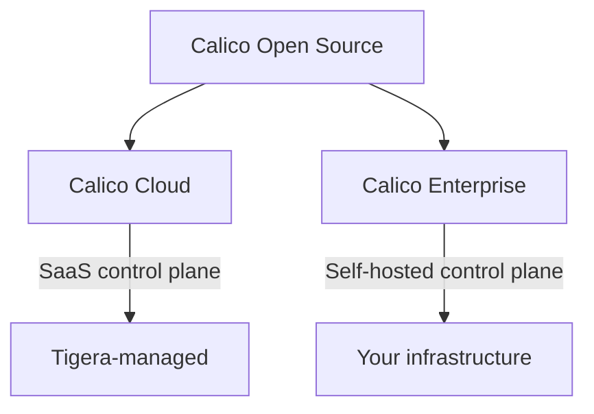

# How to Understand Calico Product Editions

Author: [nawazdhandala](https://github.com/nawazdhandala)

Tags: Calico, Kubernetes, CNI, Networking, Open Source, Calico Cloud, Calico Enterprise

Description: A comprehensive overview of Calico's three product editions — Open Source, Calico Cloud, and Calico Enterprise — and what each offers for Kubernetes networking.

---

## Introduction

Calico is one of the most widely adopted CNI (Container Network Interface) plugins for Kubernetes, powering networking and network security for millions of workloads. What many practitioners don't realize is that Calico comes in three distinct editions, each designed for different operational contexts and organizational needs.

Understanding the differences between Calico Open Source, Calico Cloud, and Calico Enterprise is essential before you design your Kubernetes networking strategy. Choosing the wrong edition can mean missing critical security features in production or paying for capabilities you don't actually need.

This post breaks down each edition, its target use case, and the key capabilities that differentiate them so you can make an informed decision for your environment.

## Prerequisites

- Basic familiarity with Kubernetes concepts (pods, namespaces, services)
- Understanding of what a CNI plugin does
- Awareness of Kubernetes network policies

## Calico Open Source

Calico Open Source is the community-driven, free-to-use edition maintained under the Apache 2.0 license. It is the foundation on which all other editions are built.

Key capabilities include:
- **Pod networking**: IP-in-IP, VXLAN, or native routing via BGP
- **Kubernetes NetworkPolicy**: Full support for the standard Kubernetes NetworkPolicy spec
- **Calico NetworkPolicy**: Extended policy model with ordered rules, action `Pass`, DNS policies, and global policies
- **eBPF dataplane**: Optional high-performance packet processing
- **Multiple dataplanes**: Standard Linux (iptables), eBPF, or Windows HNS

Calico Open Source is appropriate for teams comfortable managing their own CNI lifecycle. It integrates with kubeadm, EKS, GKE, AKS, RKE2, and most other Kubernetes distributions.

## Calico Cloud

Calico Cloud is a SaaS-managed offering that adds a control plane, observability, and compliance tooling on top of Calico Open Source. It is operated by Tigera (the creators of Calico) and connects to your existing cluster via an agent.

Additional capabilities over Open Source include:
- **Flow logs and visualizations**: Kibana-based dashboards showing traffic between workloads
- **Threat detection**: Anomaly detection and threat feeds integration
- **DNS policy with FQDN**: Fine-grained egress control by fully qualified domain name
- **Compliance reports**: Automated CIS benchmarks and PCI/SOC2 compliance reports
- **Multi-cluster networking**: Federated endpoint identity across clusters

Calico Cloud uses a per-node pricing model and is suitable for teams that want enterprise features without running their own management plane.

## Calico Enterprise

Calico Enterprise is the self-hosted, fully-featured edition aimed at large organizations with strict data residency, air-gap, or customization requirements.

It includes everything in Calico Cloud plus:
- **On-premises management plane**: All components run inside your own infrastructure
- **RBAC for Calico resources**: Fine-grained access control on who can create or modify policies
- **Hierarchical policy tiers**: Organize policies by team or application with enforced ordering
- **Advanced threat defense**: Integration with SIEM and external threat intelligence platforms
- **Support SLAs**: Enterprise support with guaranteed response times

Calico Enterprise requires a commercial license from Tigera and is deployed via a standard Helm chart or operator.

## Edition Comparison at a Glance

## Best Practices

- Start with Calico Open Source in non-production clusters to learn the data model before evaluating commercial editions
- Use Calico Cloud for teams without dedicated platform engineering capacity for networking
- Choose Calico Enterprise when you have air-gap requirements, strict data sovereignty rules, or need on-premises compliance reporting
- Validate that your Kubernetes distribution is certified for the Calico edition you choose before purchasing

## Conclusion

Calico's three editions share the same networking foundation but differ significantly in operational model, observability depth, and compliance tooling. Open Source gives you a powerful, free CNI. Calico Cloud adds managed observability. Calico Enterprise brings it all on-premises with enterprise support. Matching your edition to your operational maturity and compliance requirements will save significant rework later.
