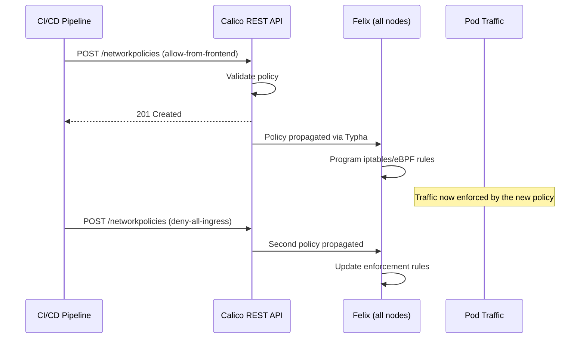
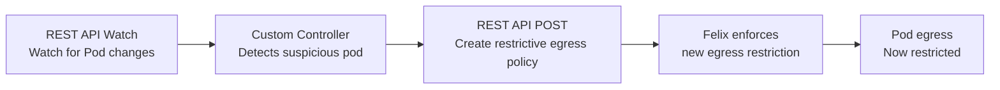
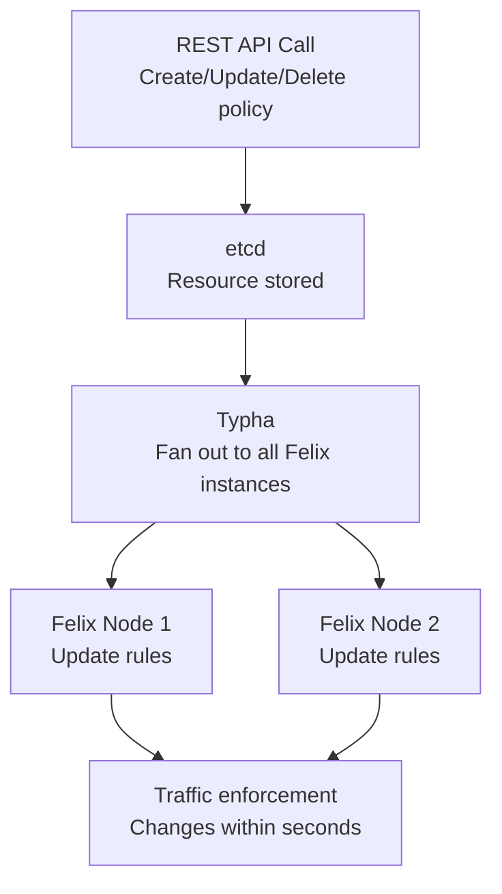

# How to Map the Calico REST API to Real Kubernetes Traffic

Author: [nawazdhandala](https://github.com/nawazdhandala)

Tags: Calico, Kubernetes, REST API, CNI, Traffic Flows

Description: How Calico REST API calls map to real Kubernetes traffic scenarios - from CI/CD policy management to dynamic policy enforcement in response to cluster events.

---

## Introduction

The Calico REST API's impact on real Kubernetes traffic is indirect - REST API calls manage configuration, and that configuration determines how traffic flows. Mapping REST API interactions to traffic scenarios helps you understand the chain from "API call made" to "traffic allowed or blocked."

This post traces four real scenarios where REST API calls directly affect traffic behavior.

## Prerequisites

- Understanding of the Calico REST API basics
- Familiarity with how Calico enforces network policy
- A running Calico cluster with API server deployed

## Scenario 1: CI/CD Pipeline Deploys a Service with Network Policy

A CI/CD pipeline deploys a new microservice and simultaneously creates its network policy via the REST API:



The pipeline's REST API calls affect what traffic reaches the new service within seconds of deployment.

**Example pipeline script**:
```bash
# Deploy the service, then immediately apply policy
kubectl apply -f new-service-deployment.yaml

# Apply deny-all policy via REST API
TOKEN=$(kubectl create token pipeline-sa --duration=30m)
curl -s -X POST \
  -H "Authorization: Bearer $TOKEN" \
  -H "Content-Type: application/json" \
  -d "$(cat deny-all-policy.json)" \
  $APISERVER/apis/projectcalico.org/v3/namespaces/production/networkpolicies

# Apply allow-from-frontend policy
curl -s -X POST \
  -H "Authorization: Bearer $TOKEN" \
  -H "Content-Type: application/json" \
  -d "$(cat allow-frontend-policy.json)" \
  $APISERVER/apis/projectcalico.org/v3/namespaces/production/networkpolicies
```

## Scenario 2: Custom Controller Responds to Security Event

A custom security controller watches for pods with specific labels and automatically restricts their egress when they are flagged as suspicious:



```python
# Controller using Kubernetes Python client
from kubernetes import client, config, watch

config.load_incluster_config()
custom_api = client.CustomObjectsApi()
core_api = client.CoreV1Api()
w = watch.Watch()

# Watch for pod events
for event in w.stream(core_api.list_namespaced_pod, namespace="production"):
    pod = event['object']
    if event['type'] == 'MODIFIED' and pod.metadata.labels.get('security-flag') == 'suspicious':
        # Apply restrictive egress policy via REST API
        policy = {
            "apiVersion": "projectcalico.org/v3",
            "kind": "NetworkPolicy",
            "metadata": {
                "name": f"restrict-{pod.metadata.name}",
                "namespace": "production"
            },
            "spec": {
                "selector": f"app == '{pod.metadata.labels.get('app')}'",
                "egress": [{"action": "Deny"}]
            }
        }
        custom_api.create_namespaced_custom_object(
            group="projectcalico.org", version="v3",
            namespace="production", plural="networkpolicies",
            body=policy
        )
```

## Scenario 3: Dynamic IP Pool Management

An automation script monitors IP pool utilization and adds a new pool when utilization exceeds a threshold:

```bash
# Check utilization via calicoctl (not available in REST API directly)
UTILIZATION=$(calicoctl ipam show | grep "utilization" | awk '{print $2}')

if [ $(echo "$UTILIZATION > 80" | bc) -eq 1 ]; then
  # Add new IP pool via REST API
  curl -s -X POST \
    -H "Authorization: Bearer $TOKEN" \
    -H "Content-Type: application/json" \
    -d '{
      "apiVersion": "projectcalico.org/v3",
      "kind": "IPPool",
      "metadata": {"name": "expansion-pool"},
      "spec": {
        "cidr": "10.200.0.0/16",
        "ipipMode": "Always",
        "natOutgoing": true
      }
    }' \
    $APISERVER/apis/projectcalico.org/v3/ippools

  echo "New IP pool added - new pods will now use the expansion pool"
fi
```

The traffic impact: new pods created after the pool addition receive IPs from the new CIDR, which Felix immediately programs routes for.

## Scenario 4: Watching Policy Changes for Audit

A security monitoring system watches for policy changes and alerts on unexpected modifications:

```bash
# Watch for GlobalNetworkPolicy changes
curl -s -k -H "Authorization: Bearer $TOKEN" \
  "$APISERVER/apis/projectcalico.org/v3/globalnetworkpolicies?watch=true" | \
  while read -r event; do
    TYPE=$(echo "$event" | jq -r '.type')
    NAME=$(echo "$event" | jq -r '.object.metadata.name')
    USER=$(echo "$event" | jq -r '.object.metadata.annotations["kubectl.kubernetes.io/last-applied-configuration"] | fromjson | .metadata.annotations["kubectl.kubernetes.io/last-applied-configuration"]' 2>/dev/null || echo "unknown")
    
    if [ "$TYPE" = "DELETED" ]; then
      echo "ALERT: GlobalNetworkPolicy $NAME was DELETED"
      # Send alert to SIEM/Slack
    fi
  done
```

## The REST API Impact Chain



Every REST API resource management call affects real traffic within seconds through the Typha→Felix→dataplane chain.

## Best Practices

- Add correlation IDs to REST API calls so you can trace them in the Kubernetes audit log and Felix logs
- Test the traffic impact of REST API-driven policy changes in a lab before enabling automation in production
- Monitor the time between REST API call and traffic enforcement (Felix sync lag) to set appropriate timeouts in automation

## Conclusion

REST API calls map to real traffic changes through the Typha→Felix→dataplane propagation chain. Automation that manages policies via the REST API has immediate (sub-second) traffic impact. Understanding this chain - and the fact that automation failures can leave policies in a partially-applied state - motivates proper error handling, idempotency, and rollback capabilities in any production Calico automation built on the REST API.
