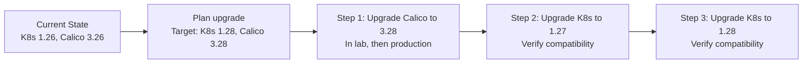

# How to Choose Calico Component Version Compatibility for Production

Author: [nawazdhandala](https://github.com/nawazdhandala)

Tags: Calico, Kubernetes, Version Compatibility, CNI, Production, Upgrade Strategy, Lifecycle

Description: A decision framework for selecting Calico versions and planning upgrade sequences for production Kubernetes environments to maintain version compatibility.

---

## Introduction

Choosing a version strategy for production Calico involves more than picking the latest release. You need to balance stability (avoid bleeding edge), security (don't run critically vulnerable versions), and compatibility (stay within the supported Kubernetes version matrix). The decisions you make here determine your operational risk and maintenance burden.

This post provides a framework for production version selection and upgrade sequencing.

## Prerequisites

- Knowledge of your Kubernetes upgrade cadence
- Security advisory subscription (Tigera announcements)
- Change management process for production infrastructure changes

## Decision 1: Version Selection Strategy

Three common strategies, each with different tradeoffs:

| Strategy | Description | Best For |
|---|---|---|
| N (latest) | Always run the latest Calico release | Teams with strong upgrade automation |
| N-1 (one behind latest) | Run one minor version behind the latest | Most production environments |
| LTS pinning | Run a specific version for extended periods | Conservative/regulated environments |

The N-1 strategy is recommended for most production environments: it avoids bleeding-edge issues while staying within the security advisory window. Calico minor releases typically get patch updates for security fixes, so N-1 still receives security patches.

## Decision 2: Upgrade Cadence

How frequently should you plan Calico upgrades?

- **Patch versions** (3.27.0 → 3.27.1): Apply immediately for security fixes; schedule within 2 weeks for bug fixes
- **Minor versions** (3.26 → 3.27): Plan as part of your quarterly platform maintenance window
- **Major versions**: Rare for Calico (currently all v3.x); follow vendor guidance

Align Calico minor upgrades with Kubernetes minor upgrades since they often need to happen together due to the compatibility matrix.

## Decision 3: Kubernetes Upgrade Sequence

When Kubernetes requires a Calico upgrade for compatibility:



Never skip minor versions in Kubernetes upgrades — go 1.26 → 1.27 → 1.28, not 1.26 → 1.28. Calico must support each intermediate version in the sequence.

## Decision 4: Handling Out-of-Cycle Security Updates

When Tigera publishes a security advisory requiring an immediate Calico upgrade:

1. **Assess severity**: Critical CVEs require immediate action; high severity requires action within 2 weeks
2. **Check patch availability**: Security fixes are usually backported to the N-1 minor version
3. **Emergency upgrade procedure**: Have a documented runbook for emergency Calico patch upgrades that bypasses the normal change management timeline

Subscribe to security advisories:
- Tigera security announcement list: security@tigera.io
- GitHub security advisories: `github.com/projectcalico/calico/security/advisories`

## Decision 5: Version Pinning in Infrastructure-as-Code

Production version management requires explicit pinning:

```yaml
# Helm values for Calico operator
tigeraOperator:
  image: quay.io/tigera/operator
  version: v1.30.5  # Pin to specific patch version

# Installation resource
spec:
  calicoNetwork:
    # ... configuration
  # Version is controlled by the operator image
```

Never use `latest` tags in production — they make rollbacks difficult and hide what version is actually running.

## Version Compatibility Quick Reference

```bash
# Script to check compatibility status
K8S_MINOR=$(kubectl version -o json 2>/dev/null | jq -r '.serverVersion.minor' | tr -d '+')
CALICO_VERSION=$(kubectl get pods -n calico-system -l k8s-app=calico-node \
  -o jsonpath='{.items[0].spec.containers[0].image}' 2>/dev/null | grep -o 'v[0-9]*\.[0-9]*\.[0-9]*')

echo "Kubernetes minor: 1.$K8S_MINOR"
echo "Calico version: $CALICO_VERSION"
echo "Check compatibility at: https://docs.tigera.io/calico/latest/getting-started/kubernetes/requirements"
```

## Best Practices

- Subscribe to Tigera security announcements and have an emergency upgrade procedure ready
- Never allow more than 2 minor Kubernetes versions of skew without a corresponding Calico upgrade
- Pin all component versions explicitly in infrastructure-as-code
- Validate each upgrade in a lab environment that mirrors production before applying to production

## Conclusion

Production Calico version strategy requires explicit decisions on version selection (N-1 for stability), upgrade cadence (align minor upgrades with Kubernetes maintenance windows), Kubernetes upgrade sequencing (no version skipping), emergency patch procedures, and version pinning in IaC. The N-1 strategy with quarterly minor upgrades and immediate patch application for security advisories strikes the right balance between stability and security for most production environments.
