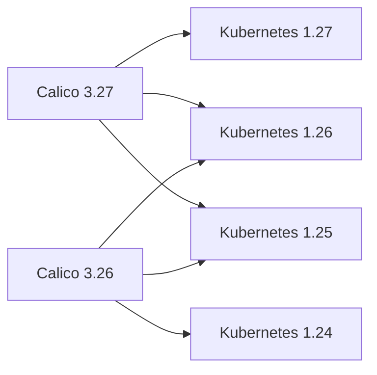

# How to Understand Calico Component Version Compatibility

Author: [nawazdhandala](https://github.com/nawazdhandala)

Tags: Calico, Kubernetes, Version Compatibility, CNI, Upgrade

Description: A guide to understanding version compatibility between Calico components and Kubernetes releases, including how to check compatibility and plan upgrades safely.

---

## Introduction

Calico's version compatibility matrix defines which Calico versions work with which Kubernetes versions. Running incompatible versions causes subtle failures - API deprecation errors, missing features, or outright crashes - that are difficult to diagnose if you don't know the version compatibility context.

Understanding version compatibility means knowing the supported ranges, how to check your current versions, and how to plan Kubernetes and Calico upgrades without creating compatibility gaps.

## Prerequisites

- Access to your cluster's current Calico and Kubernetes versions
- `kubectl` and `calicoctl` configured
- Awareness of your organization's upgrade cadence for Kubernetes

## The Version Compatibility Model

Calico follows a N-2 compatibility policy with Kubernetes: each Calico release supports the current Kubernetes version and the two previous minor versions. For example, Calico 3.27 supports Kubernetes 1.27, 1.26, and 1.25.



This means: if you are running Kubernetes 1.28, you need Calico 3.28 or later.

## Checking Current Versions

```bash
# Check Calico version
kubectl get pods -n calico-system -l k8s-app=calico-node \
  -o jsonpath='{.items[0].spec.containers[0].image}'
# Expected: calico/node:v3.27.0 (or similar)

# Check via calicoctl
calicoctl version
# Expected: Client version, and if API server is available, Server version

# Check Kubernetes version
kubectl version --short
# Expected: Client and Server versions

# Check if versions are compatible
# Cross-reference at: docs.tigera.io/calico/latest/getting-started/kubernetes/requirements
```

## Component Versioning

Calico uses a unified versioning model - all components in a release share the same version number:

| Component | Expected Version |
|---|---|
| calico/node (Felix + BIRD + confd) | v3.27.x |
| calico/cni | v3.27.x |
| calico/kube-controllers | v3.27.x |
| calico/typha | v3.27.x |
| calicoctl | v3.27.x |

Mismatched component versions (e.g., calico/node v3.27 with calico/cni v3.26) are not supported and can cause unexpected behavior.

## The Calico Operator and Version Management

When using the Calico operator (the recommended installation method), the operator manages component versioning:

```bash
# Check the operator version
kubectl get deployment tigera-operator -n tigera-operator \
  -o jsonpath='{.spec.template.spec.containers[0].image}'

# Check the Installation resource for the configured Calico version
kubectl get installation default -o jsonpath='{.spec.variant}'
```

The operator ensures all components are updated together when you change the version, preventing version skew between components.

## Upgrade Order

When upgrading both Kubernetes and Calico:

1. **Check compatibility matrix**: Verify the new Kubernetes version is supported by either current or new Calico version
2. **Upgrade Calico first** if the new Kubernetes version requires a newer Calico version
3. **Upgrade Kubernetes**: The cluster will run with the new Kubernetes version and updated Calico
4. **Verify**: Run health checks after each upgrade

Alternatively, if your current Calico version supports both the old and new Kubernetes versions, you can upgrade Kubernetes first without a Calico upgrade.

## calicoctl Version Compatibility

`calicoctl` must match the Calico API server version. Using a mismatched `calicoctl` version causes API calls to fail or return incorrect results:

```bash
# Check calicoctl version
calicoctl version
# Expected: Version matching your calico-node version

# If mismatched, download the matching version
curl -L -o calicoctl https://github.com/projectcalico/calico/releases/download/v3.27.0/calicoctl-linux-amd64
chmod +x calicoctl
```

## Best Practices

- Pin your Calico version in your infrastructure-as-code and update it deliberately rather than using `latest`
- Always check the compatibility matrix before upgrading Kubernetes - it may require a Calico upgrade first
- Keep `calicoctl` version in sync with the cluster's Calico version
- Monitor Calico release announcements for security advisories that require out-of-cycle upgrades

## Conclusion

Calico's N-2 Kubernetes compatibility model means you must upgrade Calico before upgrading to Kubernetes versions that fall outside the supported range. All Calico components share the same version number and must be upgraded together. Using the Calico operator simplifies version management by updating all components atomically. Maintaining version compatibility is the most important operational practice for avoiding unexpected Calico failures after Kubernetes upgrades.
