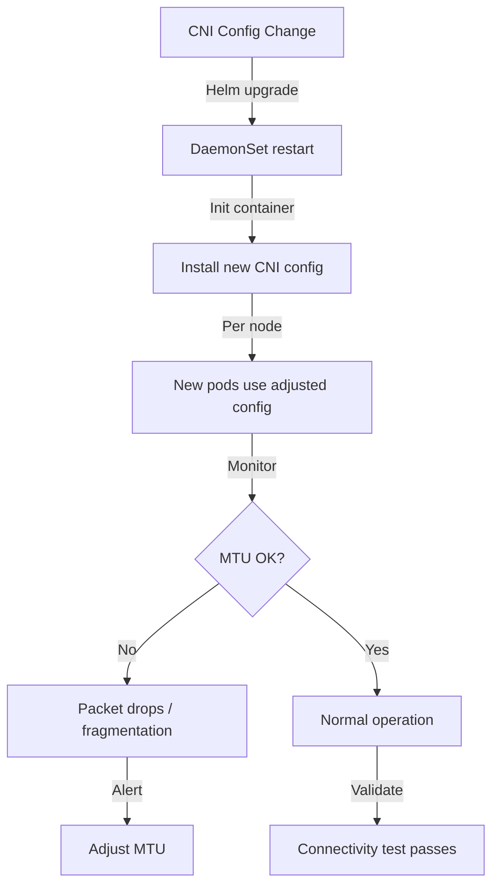

# Adjusting Cilium CNI Configuration: Configure, Troubleshoot, Validate, and Monitor

Author: [nawazdhandala](https://github.com/nawazdhandala)

Tags: Cilium, Kubernetes, CNI, Configuration, Tuning

Description: Learn how to safely adjust Cilium's CNI configuration for different deployment scenarios including chaining mode, custom paths, MTU settings, and runtime tuning without disrupting existing workloads.

---

## Introduction

Once Cilium is deployed, you will inevitably need to adjust its CNI configuration to accommodate changes in your cluster environment. These adjustments might include enabling CNI chaining to work alongside other plugins, changing MTU settings to avoid packet fragmentation, adjusting the CNI configuration file ordering to ensure Cilium takes priority, or migrating from one CNI configuration format to another during upgrades.

CNI configuration changes are particularly sensitive because they affect the low-level networking setup of every new pod. A mistake in CNI configuration can cause all new pods to fail network initialization while existing pods remain unaffected (since their networks are already configured). This asymmetry makes CNI configuration issues insidious — the cluster appears healthy until you try to create new pods.

This guide covers the procedures for safely adjusting CNI configuration, troubleshooting adjustment-related failures, validating changes don't break pod networking, and monitoring the impact of CNI changes.

## Prerequisites

- Cilium deployed via Helm in your Kubernetes cluster
- `kubectl` with cluster admin access
- Node access via `kubectl debug` or SSH
- Current CNI configuration backed up

## Configure CNI Adjustments

Adjust MTU for your network environment:

```bash
# Check current MTU setting
kubectl -n kube-system exec ds/cilium -- cilium config view | grep mtu

# Adjust MTU for VXLAN overlay (VXLAN header = 50 bytes overhead)
# Physical NIC MTU = 1500 -> Pod MTU = 1450
helm upgrade cilium cilium/cilium \
  --namespace kube-system \
  --reuse-values \
  --set MTU=1450

# For Jumbo frames environment (9000 MTU physical)
helm upgrade cilium cilium/cilium \
  --namespace kube-system \
  --reuse-values \
  --set MTU=8950  # With VXLAN overlay
```

Configure CNI chaining with other plugins:

```bash
# Chain Cilium with portmap (for hostPort support)
helm upgrade cilium cilium/cilium \
  --namespace kube-system \
  --reuse-values \
  --set cni.chainingMode=portmap

# The resulting chained CNI config:
cat /etc/cni/net.d/05-cilium.conf
```

```json
{
  "cniVersion": "0.3.1",
  "name": "portmap-chain",
  "plugins": [
    {
      "type": "cilium-cni",
      "enable-debug": false
    },
    {
      "type": "portmap",
      "capabilities": {"portMappings": true}
    }
  ]
}
```

```bash
# Adjust CNI config file naming for priority
# Lower number = higher priority
# Rename to ensure Cilium is the first CNI
kubectl debug node/<node-name> -it --image=ubuntu -- \
  mv /etc/cni/net.d/10-cilium.conf /etc/cni/net.d/05-cilium.conf
```

## Troubleshoot CNI Adjustment Issues

Diagnose problems after CNI configuration changes:

```bash
# New pods failing after CNI change
kubectl get pods -A | grep -v Running | grep ContainerCreating

# Check if change was applied to all nodes
for node in $(kubectl get nodes -o jsonpath='{.items[*].metadata.name}'); do
  CONFIG=$(kubectl debug node/$node --image=ubuntu -q -- \
    cat /etc/cni/net.d/05-cilium.conf 2>/dev/null | jq -c '.type // .plugins[0].type')
  echo "$node: $CONFIG"
done

# Check CNI log for adjustment errors
kubectl -n kube-system exec ds/cilium -- \
  tail -100 /var/run/cilium/cilium-cni.log | grep -i "error\|failed"

# Verify MTU change is reflected in pod interfaces
kubectl exec -it <test-pod> -- ip link show eth0
# Should show mtu matching your configured MTU
```

Fix CNI adjustment failures:

```bash
# Issue: MTU mismatch causing packet drops
# Diagnose by checking for IP fragmentation
kubectl -n kube-system exec ds/cilium -- cilium monitor --type drop | grep -i frag

# Fix by setting appropriate MTU
kubectl -n kube-system exec ds/cilium -- cilium config view | grep mtu
helm upgrade cilium cilium/cilium --namespace kube-system --reuse-values --set MTU=1400

# Issue: Chained CNI not loading second plugin
cat /etc/cni/net.d/05-cilium.conf | jq '.plugins[1].type'
# Verify the second plugin binary exists
ls /opt/cni/bin/portmap

# Issue: CNI config not propagated to new node
# DaemonSet install-cni init container should handle this
kubectl -n kube-system describe pod <cilium-pod-on-new-node> | grep install-cni
```

## Validate CNI Adjustments

Verify CNI configuration changes are correctly applied:

```bash
# Validate MTU is consistent across all nodes
for node in $(kubectl get nodes -o jsonpath='{.items[*].metadata.name}'); do
  MTU=$(kubectl debug node/$node --image=ubuntu -q -- \
    ip link show | grep mtu | head -1 | grep -oP "mtu \K\d+" 2>/dev/null)
  echo "$node NIC MTU: $MTU"
done

# Test pod-to-pod connectivity after adjustment
kubectl run mtu-test-1 --image=nicolaka/netshoot --restart=Never
kubectl run mtu-test-2 --image=nicolaka/netshoot --restart=Never -- sleep 3600
kubectl wait pod/mtu-test-1 pod/mtu-test-2 --for=condition=Ready

TEST2_IP=$(kubectl get pod mtu-test-2 -o jsonpath='{.status.podIP}')
kubectl exec mtu-test-1 -- ping -M do -s 1400 -c 3 $TEST2_IP
# Should succeed without fragmentation

kubectl delete pod mtu-test-1 mtu-test-2

# Run full connectivity test after adjustments
cilium connectivity test
```

## Monitor CNI Post-Adjustment



Monitor for CNI adjustment side effects:

```bash
# Monitor packet drops after MTU changes
kubectl -n kube-system exec ds/cilium -- \
  cilium monitor --type drop -f | grep -i mtu

# Check pod creation success rate after CNI change
watch -n10 "kubectl get pods -A | grep -c Running && kubectl get pods -A | grep -c ContainerCreating"

# Monitor CNI binary invocations
kubectl -n kube-system exec ds/cilium -- \
  cat /var/run/cilium/cilium-cni.log | tail -f | grep -v "^$"

# Alert on increased pod creation failure rate
# Compare before and after change
kubectl get events -A --field-selector reason=Failed | grep -i cni
```

## Conclusion

Adjusting Cilium's CNI configuration requires careful planning and validation, as changes affect the network initialization of all subsequently created pods. MTU tuning is particularly impactful in overlay networks where encapsulation overhead reduces the effective payload size. Always validate changes by creating test pods and confirming connectivity before rolling changes to production nodes. The Cilium connectivity test suite is your primary validation tool after any CNI configuration change, and pod creation monitoring catches any regressions in the critical path of pod networking setup.
