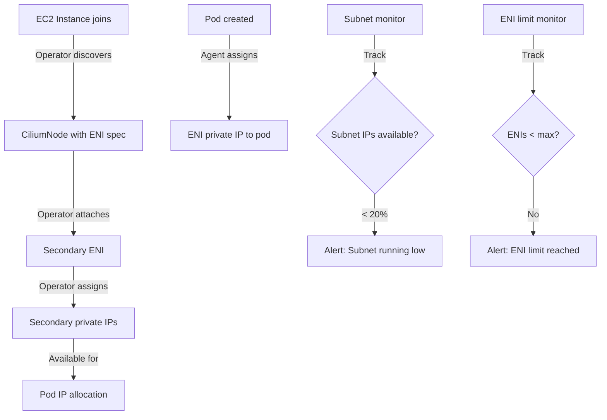

# Cilium AWS ENI IPAM: Configure, Troubleshoot, and Monitor

Author: [nawazdhandala](https://github.com/nawazdhandala)

Tags: Cilium, Kubernetes, Networking, EBPF, IPAM

Description: Learn how to configure Cilium's AWS Elastic Network Interface (ENI) IPAM mode on Amazon EKS and self-managed Kubernetes on EC2, enabling native VPC routing without overlay encapsulation overhead.

---

## Introduction

Cilium's AWS ENI IPAM mode leverages Amazon Elastic Network Interfaces to assign pod IP addresses directly from your VPC's CIDR space. Unlike overlay-based IPAM modes that add encapsulation overhead, ENI IPAM enables pods to communicate using native VPC routing - pods get IP addresses that are routable within the VPC without any tunneling. This improves performance, enables direct integration with AWS security groups, and allows pods to be accessed directly via their VPC IPs from other AWS services.

In ENI IPAM mode, the Cilium Operator manages ENI lifecycle: it attaches secondary network interfaces to EC2 instances and pre-assigns secondary private IP addresses to those ENIs. When a pod is created, the Cilium Agent assigns one of the pre-allocated ENI IPs to the pod. AWS prefix delegation can dramatically increase the number of IPs available per ENI - a single /28 prefix provides 16 IPs from a single ENI attachment, enabling higher pod density on EC2 instances.

This guide covers configuring Cilium's ENI IPAM mode, troubleshooting AWS-specific ENI allocation issues, and monitoring ENI utilization.

## Prerequisites

- Kubernetes cluster on Amazon EKS or EC2 with Cilium
- IAM permissions for ENI management (see below)
- `kubectl` with cluster admin access
- AWS CLI configured with appropriate permissions
- Helm 3.x

## Configure AWS ENI IPAM

Set up required IAM permissions:

```json
{
  "Version": "2012-10-17",
  "Statement": [
    {
      "Effect": "Allow",
      "Action": [
        "ec2:DescribeNetworkInterfaces",
        "ec2:DescribeSubnets",
        "ec2:DescribeVpcs",
        "ec2:DescribeSecurityGroups",
        "ec2:DescribeInstances",
        "ec2:DescribeInstanceTypes",
        "ec2:AttachNetworkInterface",
        "ec2:DetachNetworkInterface",
        "ec2:DeleteNetworkInterface",
        "ec2:CreateNetworkInterface",
        "ec2:ModifyNetworkInterfaceAttribute",
        "ec2:AssignPrivateIpAddresses",
        "ec2:UnassignPrivateIpAddresses",
        "ec2:AssignIpv6Addresses",
        "ec2:UnassignIpv6Addresses"
      ],
      "Resource": "*"
    }
  ]
}
```

Install Cilium with ENI IPAM:

```bash
# Install Cilium with AWS ENI IPAM
helm install cilium cilium/cilium \
  --version 1.15.6 \
  --namespace kube-system \
  --set ipam.mode=eni \
  --set eni.enabled=true \
  --set tunnel=disabled \
  --set autoDirectNodeRoutes=false \
  --set kubeProxyReplacement=true \
  --set k8sServiceHost=<api-server-endpoint> \
  --set k8sServicePort=443

# Enable prefix delegation for more IPs per ENI
helm upgrade cilium cilium/cilium \
  --namespace kube-system \
  --reuse-values \
  --set eni.awsEnablePrefixDelegation=true \
  --set ipam.operator.eniMinAllocate=8 \
  --set ipam.operator.eniMaxAllocate=32

# Configure ENI tags for filtering
helm upgrade cilium cilium/cilium \
  --namespace kube-system \
  --reuse-values \
  --set "eni.tags.cilium=true" \
  --set "eni.tags.Environment=production"
```

View ENI allocation state:

```bash
# Check CiliumNode ENI status
kubectl get ciliumnodes -o json | \
  jq '.items[] | {
    node: .metadata.name,
    instance_id: .spec.eni.instance_id,
    eni_count: (.status.eni | length),
    ips: [.status.eni[] | .addresses[].ip] | length
  }'

# Check available ENI IPs
kubectl get ciliumnode <node-name> -o json | \
  jq '.status.ipam.available | length'
```

## Troubleshoot AWS ENI IPAM Issues

Diagnose ENI-specific problems:

```bash
# Check Operator ENI allocation logs
kubectl -n kube-system logs -l name=cilium-operator | grep -i "eni\|aws\|attach\|alloc"

# Check IAM permission errors
kubectl -n kube-system logs -l name=cilium-operator | grep -i "unauthorized\|denied\|access"

# Check ENI attachment limits
# Each EC2 instance type has a limit on ENI count and IPs per ENI
aws ec2 describe-instance-types \
  --filters Name=instance-type,Values=<instance-type> \
  --query 'InstanceTypes[0].NetworkInfo'

# Check if subnet has available IPs
aws ec2 describe-subnets \
  --subnet-ids <subnet-id> \
  --query 'Subnets[0].AvailableIpAddressCount'

# Check CiliumNode ENI errors
kubectl get ciliumnodes -o json | \
  jq '.items[] | select(.status.eni != null) | {
    node: .metadata.name,
    eni_errors: [.status.eni[] | select(.tags == null) | .id]
  }'
```

Fix common ENI issues:

```bash
# Issue: Insufficient IAM permissions
# Check CloudTrail for AccessDenied events
aws cloudtrail lookup-events \
  --lookup-attributes AttributeKey=EventName,AttributeValue=AttachNetworkInterface \
  --query 'Events[?ErrorCode==`AccessDenied`]'

# Issue: Subnet IP exhaustion
# Check subnet utilization across AZs
aws ec2 describe-subnets \
  --filters "Name=vpc-id,Values=<vpc-id>" \
  --query 'Subnets[*].{ID:SubnetId, AZ:AvailabilityZone, Available:AvailableIpAddressCount}'

# Issue: ENI attachment limit reached
# Increase limit or use prefix delegation
helm upgrade cilium cilium/cilium \
  --namespace kube-system \
  --reuse-values \
  --set eni.awsEnablePrefixDelegation=true

# Issue: Security groups not allowing pod traffic
aws ec2 describe-security-groups --group-ids <sg-id>
# Verify inbound rules allow traffic from other pod CIDRs
```

## Monitor AWS ENI IPAM



Monitor ENI IPAM utilization:

```bash
# Monitor ENI utilization per node
kubectl get ciliumnodes -o json | jq '[.items[] | {
  node: .metadata.name,
  eni_count: (.status.eni | length),
  total_ips: ([.status.eni[] | .addresses | length] | add // 0),
  used_ips: (.status.ipam.used | length),
  available_ips: (.status.ipam.available | length)
}]'

# Key Prometheus metrics for ENI IPAM
# cilium_ipam_available_ips - Available IPs per node
# cilium_ipam_allocated_ips - Allocated IPs per node

# Monitor subnet IP utilization via AWS CloudWatch
# MetricName: AvailableIpAddressCount
# Namespace: AWS/EC2

# Alert on subnet running low
kubectl apply -f - <<EOF
apiVersion: monitoring.coreos.com/v1
kind: PrometheusRule
metadata:
  name: cilium-eni-alerts
  namespace: kube-system
spec:
  groups:
  - name: eni-ipam
    rules:
    - alert: CiliumENIIPsLow
      expr: cilium_ipam_available_ips < 10
      for: 5m
      labels:
        severity: warning
      annotations:
        summary: "Cilium ENI IPAM available IPs are running low on {{ \$labels.instance }}"
EOF
```

## Conclusion

Cilium's AWS ENI IPAM mode provides native VPC routing for Kubernetes pods, eliminating overlay encapsulation overhead and enabling direct integration with AWS networking primitives. The key operational considerations are: ensuring correct IAM permissions for ENI management, monitoring subnet IP utilization across availability zones, using prefix delegation for higher pod density, and tracking ENI attachment limits per instance type. The Cilium Operator handles ENI lifecycle management automatically, making ENI IPAM operationally simple once correctly configured and permissioned.
