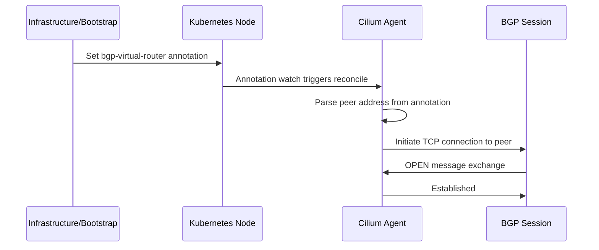

# Auto-Discovery in Cilium BGP Control Plane

Author: [nawazdhandala](https://github.com/nawazdhandala)

Tags: Cilium, Kubernetes, Networking, BGP, eBPF

Description: Use Cilium's BGP auto-discovery features to automatically detect peers and configure BGP sessions without manual per-node peer address configuration.

---

## Introduction

Manual BGP peer configuration becomes a scaling bottleneck in dynamic Kubernetes environments where nodes are frequently added and removed. Cilium's BGP auto-discovery addresses this by allowing nodes to discover their BGP peers from the network topology rather than requiring static IP addresses in every peering policy.

Auto-discovery in Cilium BGP can work in several ways: nodes can discover peers from annotations set by the infrastructure provider, from Kubernetes node labels that encode router IP addresses, or via the newer BGP unnumbered approach that uses link-local IPv6 addresses. This is especially valuable in cloud environments where router IPs may not be known until instance launch, and in environments using dynamic underlay provisioning.

This guide covers the auto-discovery mechanisms available in Cilium BGP, how to configure them, and how to validate that discovery is working correctly before depending on it for production routing.

## Prerequisites

- Cilium v1.15+ with `bgpControlPlane.enabled=true`
- Nodes with appropriate annotations or labels set by your infrastructure
- `cilium` CLI installed
- `kubectl` installed

## Step 1: Node Annotation-Based Peer Discovery

Annotate nodes with their local router IP for auto-discovery:

```bash
# Annotate each node with its upstream router IP
kubectl annotate node worker-0 \
  "cilium.io/bgp-virtual-router.65100"='{"local-port":179,"peer-address":"10.0.0.1","peer-asn":65000}'

kubectl annotate node worker-1 \
  "cilium.io/bgp-virtual-router.65100"='{"local-port":179,"peer-address":"10.0.1.1","peer-asn":65000}'
```

## Step 2: CiliumBGPPeeringPolicy with Node Annotation Discovery

Create a policy that reads peer info from node annotations:

```yaml
apiVersion: cilium.io/v2alpha1
kind: CiliumBGPPeeringPolicy
metadata:
  name: auto-discover-peers
spec:
  nodeSelector:
    matchExpressions:
      - key: node-role.kubernetes.io/worker
        operator: Exists
  virtualRouters:
    - localASN: 65100
      exportPodCIDR: true
      # Peers discovered from node annotations at runtime
      neighbors: []
```

## Step 3: Verify Discovery via Node Annotations

```bash
# Check node annotations
kubectl get node worker-0 -o jsonpath='{.metadata.annotations}' | jq

# Verify discovered peers
cilium bgp peers

# Check BGP session state per node
kubectl get ciliumbgpnodeconfig -o yaml
```

## Step 4: Infrastructure Automation for Auto-Discovery

In bare-metal environments, use a bootstrap script to set the router annotation:

```bash
#!/bin/bash
# Run on each node at boot - discovers gateway from ARP or network config
ROUTER_IP=$(ip route show default | awk '{print $3}')
NODE_NAME=$(hostname)

kubectl annotate node "${NODE_NAME}" \
  "cilium.io/bgp-virtual-router.65100"="{\"peer-address\":\"${ROUTER_IP}\",\"peer-asn\":65000}" \
  --overwrite
```

## Step 5: Monitor Discovery Events

```bash
# Watch for BGP events in Cilium agent logs
kubectl logs -n kube-system -l k8s-app=cilium --since=5m | grep -i bgp

# Check Cilium agent status for BGP state
cilium status --all-addresses
```

## Auto-Discovery Flow



## Conclusion

BGP auto-discovery in Cilium removes the operational burden of managing static peer address lists as your cluster scales. Node annotations provide a clean integration point between your infrastructure provisioning layer and Cilium's BGP configuration. Combined with automated node bootstrap scripts or cloud-init, you can build a fully hands-off BGP deployment where every new node automatically discovers its router and establishes a BGP session without any manual intervention.
