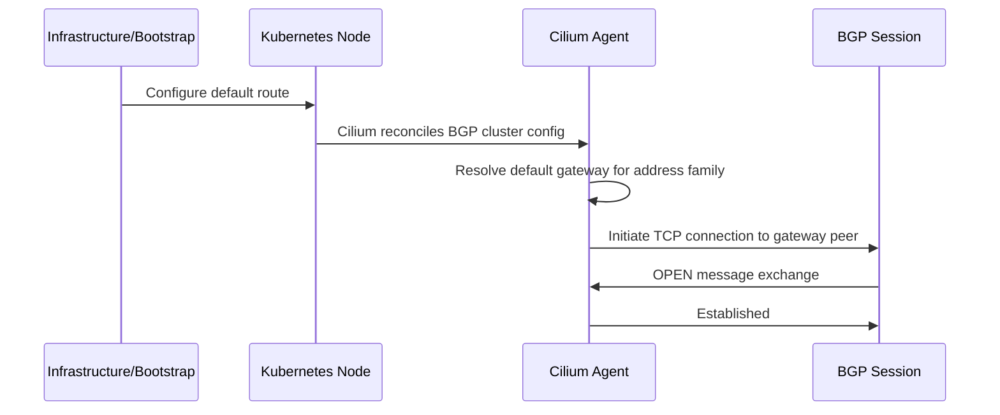

# Auto-Discovery in Cilium BGP Control Plane

Author: [nawazdhandala](https://github.com/nawazdhandala)

Tags: Cilium, Kubernetes, Networking, BGP, eBPF

Description: Use Cilium's BGP auto-discovery features to automatically detect peers and configure BGP sessions without manual per-node peer address configuration.

---

## Introduction

Manual BGP peer configuration becomes a scaling bottleneck in dynamic Kubernetes environments where nodes are frequently added and removed. Cilium's BGP default gateway auto-discovery addresses this by allowing nodes to discover their BGP peer from the node's default route rather than requiring static peer IP addresses in every cluster configuration.

Cilium BGP Control Plane currently supports `DefaultGateway` mode for peer auto-discovery. In this mode, each node discovers the gateway for the configured address family and establishes a BGP session with that address. This is especially valuable in environments where router IPs may not be known until instance launch, and in environments using dynamic underlay provisioning.

This guide covers default gateway auto-discovery in Cilium BGP, how to configure it, and how to validate that discovery is working correctly before depending on it for production routing.

## Prerequisites

- A Cilium version with `cilium.io/v2` BGP resources and `bgpControlPlane.enabled=true`
- Nodes with a configured default route for the address family used for peering
- BGP-capable routers at the default gateways, configured to accept dynamic neighbors from the Cilium nodes
- `cilium` CLI installed
- `kubectl` installed

## Step 1: Verify Default Gateway Discovery Inputs

Confirm each node has the expected default gateway:

```bash
# Check the IPv4 default gateway on a node
kubectl debug node/worker-0 -it --image=busybox -- ip route show default

# Expected output:
# default via 10.0.0.1 dev eth0
```

## Step 2: CiliumBGPClusterConfig with Default Gateway Discovery

Create a peer configuration and cluster configuration that use `autoDiscovery.mode: DefaultGateway`:

```yaml
apiVersion: cilium.io/v2
kind: CiliumBGPPeerConfig
metadata:
  name: gateway-peer
spec:
  timers:
    holdTimeSeconds: 90
    keepAliveTimeSeconds: 30
  families:
    - afi: ipv4
      safi: unicast
      advertisements:
        matchLabels:
          advertise: bgp
---
apiVersion: cilium.io/v2
kind: CiliumBGPAdvertisement
metadata:
  name: pod-cidr-advertisement
  labels:
    advertise: bgp
spec:
  advertisements:
    - advertisementType: "PodCIDR"
---
apiVersion: cilium.io/v2
kind: CiliumBGPClusterConfig
metadata:
  name: auto-discover-peers
spec:
  nodeSelector:
    matchExpressions:
      - key: node-role.kubernetes.io/worker
        operator: Exists
  bgpInstances:
    - name: instance-65100
      localASN: 65100
      peers:
        - name: default-gateway
          peerASN: 65000
          autoDiscovery:
            mode: "DefaultGateway"
            defaultGateway:
              addressFamily: ipv4
          peerConfigRef:
            name: gateway-peer
```

## Step 3: Verify Default Gateway Discovery

```bash
# Check the node's selected default route
kubectl debug node/worker-0 -it --image=busybox -- ip route show default

# Verify discovered peers and session state
cilium bgp peers

# Check BGP node configuration generated by Cilium
kubectl get ciliumbgpnodeconfig worker-0 -o yaml
```

## Step 4: Infrastructure Automation for Auto-Discovery

In bare-metal environments, use node bootstrap automation to verify the default route before Cilium starts:

```bash
#!/bin/bash
# Run on each node at boot - confirms the gateway from the network config
ROUTER_IP=$(ip route show default | awk '{print $3}')

if [ -z "${ROUTER_IP}" ]; then
  echo "No default gateway found; Cilium BGP auto-discovery cannot establish a peer"
  exit 1
fi

echo "Default gateway for BGP auto-discovery: ${ROUTER_IP}"
```

## Step 5: Monitor Discovery Events

```bash
# Watch for BGP events in Cilium agent logs
kubectl logs -n kube-system -l k8s-app=cilium --since=5m | grep -i bgp

# Confirm advertised routes after the peer is established
cilium bgp routes advertised ipv4 unicast
```

## Auto-Discovery Flow


```mermaid
sequenceDiagram
    participant Infra as Infrastructure/Bootstrap
    participant Node as Kubernetes Node
    participant Cilium as Cilium Agent
    participant BGP as BGP Session

    Infra->>Node: Configure default route
    Node->>Cilium: Cilium reconciles BGP cluster config
    Cilium->>Cilium: Resolve default gateway for address family
    Cilium->>BGP: Initiate TCP connection to gateway peer
    BGP->>Cilium: OPEN message exchange
    Cilium->>BGP: Established
```

## Conclusion

BGP auto-discovery in Cilium removes the operational burden of managing static peer address lists as your cluster scales. Default gateway discovery provides a clean integration point between your infrastructure routing layer and Cilium's BGP configuration. Combined with automated node bootstrap scripts or cloud-init that ensure the default route is correct, you can build a hands-off BGP deployment where every new node automatically discovers its router and establishes a BGP session without manual per-node peer addresses.
