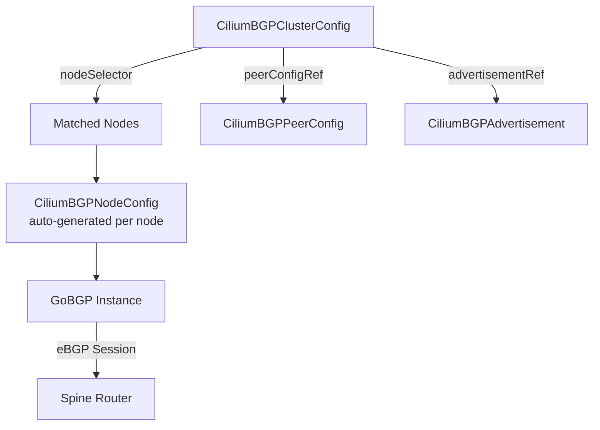

# Cilium BGP Cluster Configuration

Author: [nawazdhandala](https://github.com/nawazdhandala)

Tags: Cilium, Kubernetes, Networking, BGP, eBPF

Description: Configure Cilium's cluster-wide BGP settings using CiliumBGPClusterConfig to define BGP instances, peer references, and advertisement policies at scale.

---

## Introduction

Cilium v1.16 introduced `CiliumBGPClusterConfig`, a cluster-scoped resource that provides a more scalable and modular approach to BGP configuration compared to the original `CiliumBGPPeeringPolicy`. Instead of embedding peer configuration directly in the peering policy, the new model separates cluster topology (which nodes peer with which routers) from peer parameters (timers, authentication, address families), enabling reuse across hundreds of nodes.

The `CiliumBGPClusterConfig` resource defines BGP instances at the cluster level and references `CiliumBGPNodeConfig` (auto-generated per node) and `CiliumBGPPeerConfig` objects. This separation follows the same principle as Kubernetes Ingress controllers - the cluster admin defines the policy, and the operator handles instance-level details. For large clusters with many nodes and peers, this dramatically reduces configuration duplication.

This guide walks through a complete BGP cluster configuration using the newer API, from defining the cluster config to validating per-node BGP instance state.

## Prerequisites

- Cilium v1.16+ with `bgpControlPlane.enabled=true`
- `kubectl` with Cilium CRDs registered
- Upstream router ASN and address information
- `cilium` CLI installed

## Step 1: Create CiliumBGPPeerConfig

Define reusable peer parameters:

```yaml
apiVersion: cilium.io/v2alpha1
kind: CiliumBGPPeerConfig
metadata:
  name: standard-peer
spec:
  transport:
    peerPort: 179
  timers:
    holdTimeSeconds: 90
    keepAliveTimeSeconds: 30
    connectRetryTimeSeconds: 120
  gracefulRestart:
    enabled: true
    restartTimeSeconds: 120
  families:
    - afi: ipv4
      safi: unicast
      advertisements:
        matchLabels:
          advertise: "bgp"
```

## Step 2: Create CiliumBGPAdvertisement

Define what to advertise:

```yaml
apiVersion: cilium.io/v2alpha1
kind: CiliumBGPAdvertisement
metadata:
  name: bgp-advertisements
  labels:
    advertise: "bgp"
spec:
  advertisements:
    - advertisementType: "PodCIDR"
    - advertisementType: "Service"
      service:
        addresses:
          - LoadBalancerIP
        selector:
          matchLabels:
            bgp-announce: "true"
```

## Step 3: Create CiliumBGPClusterConfig

```yaml
apiVersion: cilium.io/v2alpha1
kind: CiliumBGPClusterConfig
metadata:
  name: cilium-bgp-cluster
spec:
  nodeSelector:
    matchLabels:
      bgp-speaker: "true"
  bgpInstances:
    - name: bgp-65100
      localASN: 65100
      peers:
        - name: spine-1
          peerASN: 65000
          peerAddress: "10.0.0.1"
          peerConfigRef:
            name: standard-peer
        - name: spine-2
          peerASN: 65000
          peerAddress: "10.0.0.2"
          peerConfigRef:
            name: standard-peer
```

## Step 4: Label Nodes

```bash
kubectl label nodes worker-0 worker-1 worker-2 bgp-speaker=true
```

## Step 5: Verify Auto-Generated Node Configs

```bash
# CiliumBGPNodeConfig is auto-generated per node
kubectl get ciliumbgpnodeconfig

# Check cluster config status
kubectl describe ciliumbgpclusterconfig cilium-bgp-cluster

# Verify BGP sessions
cilium bgp peers
```

## Architecture



## Conclusion

The `CiliumBGPClusterConfig` API brings a Kubernetes-native, modular approach to cluster BGP configuration. By separating peer parameters into `CiliumBGPPeerConfig` and advertisement rules into `CiliumBGPAdvertisement`, you eliminate duplication and make large-scale BGP deployments manageable. Pair this with node labels to control exactly which nodes participate in BGP, giving you per-rack or per-zone routing topology control.
