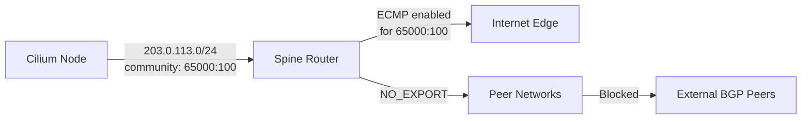

# Configuring BGP Communities in Cilium

Author: [nawazdhandala](https://github.com/nawazdhandala)

Tags: Cilium, Kubernetes, Networking, BGP, eBPF

Description: Attach BGP communities to routes advertised by Cilium to control routing policy and traffic engineering decisions in your upstream network fabric.

---

## Introduction

BGP communities are a powerful signaling mechanism that allows routers to make policy decisions based on tags attached to routes rather than just the prefix itself. In Cilium's BGP Control Plane, you can attach standard communities, large communities, and well-known communities to the routes your cluster advertises, enabling sophisticated traffic engineering without requiring changes to upstream router ACLs for every new service.

Common use cases include marking routes for geographic preference, signaling traffic weight for ECMP load balancing, setting local preference on upstream routers, and blackholing specific prefixes by attaching the NO_EXPORT or BLACKHOLE community. Cilium exposes community configuration through the `CiliumBGPPeeringPolicy` virtualRouter advertisement settings.

This guide shows how to configure BGP communities in Cilium, verify they are attached to advertised routes, and design a community-based routing policy.

## Prerequisites

- Cilium v1.14+ with `bgpControlPlane.enabled=true`
- Upstream router configured to honor BGP communities
- `cilium` CLI installed
- Existing `CiliumBGPPeeringPolicy` in place

## Step 1: Configure Standard BGP Communities

Attach standard 2-octet communities (format `AS:value`) to all advertised service routes:

```yaml
apiVersion: cilium.io/v2alpha1
kind: CiliumBGPPeeringPolicy
metadata:
  name: bgp-with-communities
spec:
  nodeSelector:
    matchLabels:
      rack: rack0
  virtualRouters:
    - localASN: 65001
      exportPodCIDR: true
      serviceSelector:
        matchExpressions:
          - key: somekey
            operator: NotIn
            values: ["never-a-value"]
      neighbors:
        - peerAddress: "10.0.0.1/32"
          peerASN: 65000
          advertisements:
            service:
              communities:
                standard:
                  - "65000:100"    # Mark as datacenter-internal
                  - "65000:200"    # Enable ECMP on upstream
```

## Step 2: Configure Large BGP Communities (RFC 8092)

Large communities use a 3-part format `ASN:datapart1:datapart2` for more expressive policy:

```yaml
neighbors:
  - peerAddress: "10.0.0.1/32"
    peerASN: 65000
    advertisements:
      service:
        communities:
          large:
            - "65000:1:100"   # Region: US-East, Tier: 100
            - "65000:2:50"    # Priority: normal
```

## Step 3: Attach Well-Known Communities

Use IANA-defined communities for standard behaviors:

```yaml
neighbors:
  - peerAddress: "10.0.0.1/32"
    peerASN: 65000
    advertisements:
      service:
        communities:
          wellKnown:
            - "no-export"           # Do not export beyond eBGP boundary
            # - "no-advertise"      # Do not advertise to any peer
            # - "blackhole"         # Trigger RTBH on upstream routers
```

## Step 4: Verify Community Attachment

Check that routes are being advertised with the configured communities:

```bash
# View advertised routes with communities
cilium bgp routes advertised ipv4 unicast

# Check BGP peer state
cilium bgp peers

# Verify on the upstream router (FRR example)
# vtysh -c "show bgp ipv4 unicast 203.0.113.0/24"
```

## Community-Based Traffic Engineering



## Step 5: Per-Service Community Assignment

For fine-grained control, use service annotations (requires Cilium v1.15+):

```yaml
apiVersion: v1
kind: Service
metadata:
  name: web-frontend
  annotations:
    # Future feature - check Cilium release notes
    # cilium.io/bgp-communities: "65000:100,65000:200"
spec:
  type: LoadBalancer
```

## Conclusion

BGP communities in Cilium give your network team the signaling hooks they need to apply routing policy without requiring per-service router configuration. Standard communities work with any BGP implementation, while large communities provide a richer 96-bit signaling space for modern networks. Start with a simple community scheme tied to environment labels and expand to per-service communities as your routing policy matures.
