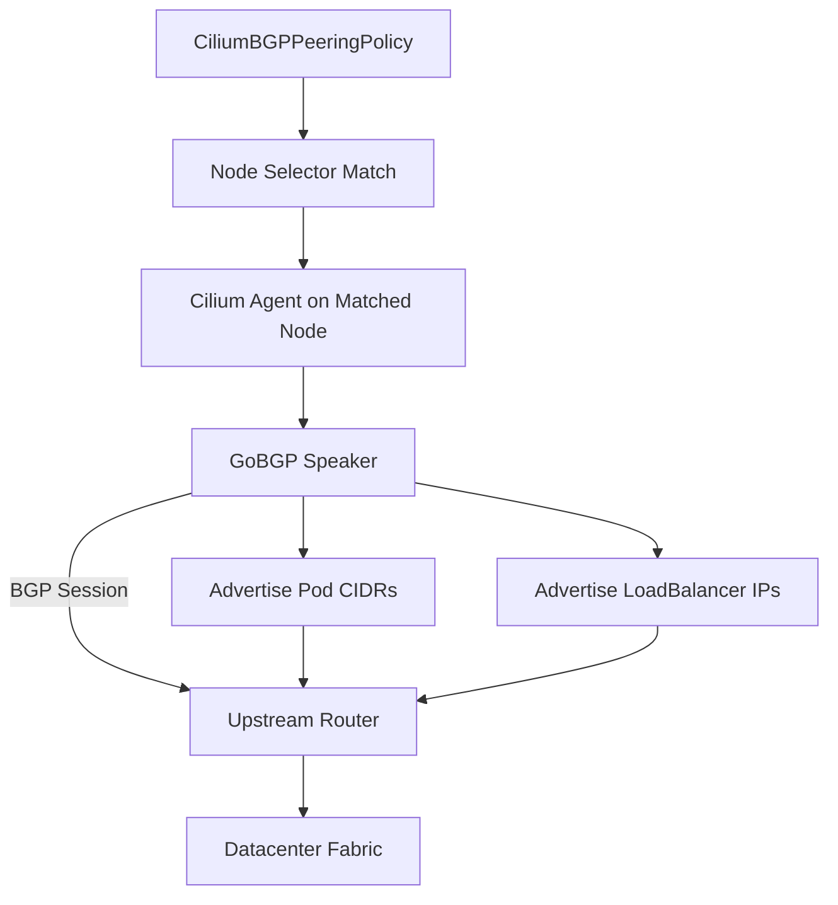

# Configuring Cilium BGP Control Plane

Author: [nawazdhandala](https://github.com/nawazdhandala)

Tags: Cilium, Kubernetes, Networking, BGP, EBPF

Description: Configure Cilium's BGP Control Plane to advertise Kubernetes service IPs and pod CIDRs to upstream routers using the CiliumBGPPeeringPolicy CRD.

---

## Introduction

Cilium's BGP Control Plane enables Kubernetes clusters to participate in BGP routing, allowing service IP addresses and pod CIDRs to be advertised to upstream routers without the need for additional tools like MetalLB. Built on top of GoBGP, Cilium's native BGP integration runs directly inside the Cilium agent, giving you a single control plane for both networking and routing policy.

Unlike traditional approaches that required a separate BGP speaker deployment, Cilium handles route advertisement natively. The `CiliumBGPPeeringPolicy` CRD defines which nodes participate in BGP sessions, what prefixes are advertised, and how peers are configured. This tight integration with eBPF means you get consistent policy enforcement from Layer 3 BGP routing all the way up to Layer 7 application policies.

This guide walks through a complete BGP Control Plane configuration, from installing Cilium with BGP support enabled to verifying route advertisement with a real upstream router peer.

## Prerequisites

- Kubernetes cluster with Cilium v1.13+ installed
- BGP-capable upstream router or software router (e.g., FRR, Bird)
- `cilium` CLI installed
- `kubectl` installed
- Node ASN and router IP information from your network team

## Step 1: Enable BGP Control Plane in Cilium

Install or upgrade Cilium with BGP Control Plane enabled:

```bash
helm upgrade --install cilium cilium/cilium \
  --namespace kube-system \
  --set bgpControlPlane.enabled=true \
  --set k8s.requireIPv4PodCIDR=true
```

Verify the feature flag is active:

```bash
cilium config view | grep bgp
```

## Step 2: Create a CiliumBGPPeeringPolicy

The `CiliumBGPPeeringPolicy` resource binds BGP configuration to nodes via a `nodeSelector`:

```yaml
apiVersion: "cilium.io/v2alpha1"
kind: CiliumBGPPeeringPolicy
metadata:
  name: rack0-bgp-peering
spec:
  nodeSelector:
    matchLabels:
      rack: rack0
  virtualRouters:
    - localASN: 65001
      exportPodCIDR: true
      serviceSelector:
        matchExpressions:
          - key: somekey
            operator: NotIn
            values: ["never-a-value"]
      neighbors:
        - peerAddress: "192.168.1.1/32"
          peerASN: 65000
          eBGPMultihopTTL: 10
          connectRetryTimeSeconds: 120
          holdTimeSeconds: 90
          keepAliveTimeSeconds: 30
```

Apply the policy:

```bash
kubectl apply -f bgp-peering.yaml
```

## Step 3: Label Nodes for BGP Participation

```bash
kubectl label node worker-0 rack=rack0
kubectl label node worker-1 rack=rack0
```

## Step 4: Verify BGP Session State

```bash
cilium bgp peers
```

Expected output showing an established session:

```plaintext
Node          Local ASN   Peer ASN   Peer Address    Session State   ...
worker-0      65001       65000      192.168.1.1     established
worker-1      65001       65000      192.168.1.1     established
```

## Step 5: Check Advertised Routes

```bash
cilium bgp routes advertised ipv4 unicast
```

## BGP Control Plane Architecture



## Conclusion

Cilium's BGP Control Plane turns your Kubernetes nodes into first-class BGP speakers, advertising both pod CIDRs and service IPs to your network fabric without any additional tooling. The `CiliumBGPPeeringPolicy` CRD gives you declarative control over which nodes peer with which routers and what they advertise. From here you can layer on BGP communities, route filtering, and multi-hop configurations to integrate with the most demanding datacenter network designs.
