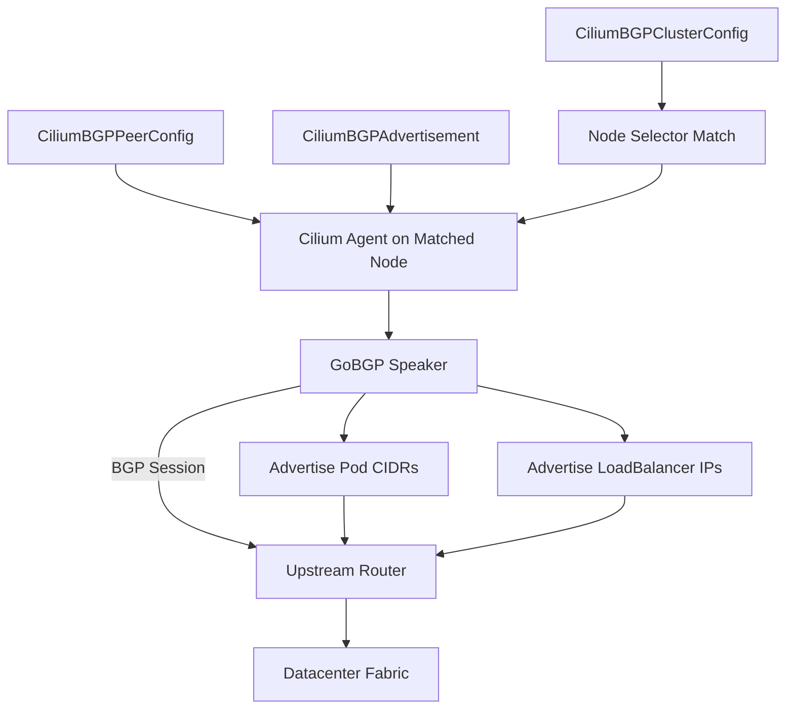

# Configuring Cilium BGP Control Plane

Author: [nawazdhandala](https://github.com/nawazdhandala)

Tags: Cilium, Kubernetes, Networking, BGP, eBPF

Description: Configure Cilium's BGP Control Plane to advertise Kubernetes service IPs and pod CIDRs to upstream routers using the CiliumBGPPeeringPolicy CRD.

---

## Introduction

Cilium's BGP Control Plane enables Kubernetes clusters to participate in BGP routing, allowing service IP addresses and pod CIDRs to be advertised to upstream routers without the need for additional tools like MetalLB. Cilium's native BGP integration runs directly inside the Cilium agent, giving you a single control plane for both networking and route advertisement.

Unlike traditional approaches that required a separate BGP speaker deployment, Cilium handles route advertisement natively. The `CiliumBGPClusterConfig`, `CiliumBGPPeerConfig`, and `CiliumBGPAdvertisement` CRDs define which nodes participate in BGP sessions, how peers are configured, and what prefixes are advertised. The BGP control plane does not program the datapath itself; Cilium's eBPF datapath continues to enforce networking and security policy.

This guide walks through a complete BGP Control Plane configuration, from installing Cilium with BGP support enabled to verifying route advertisement with a real upstream router peer.

## Prerequisites

- Kubernetes cluster with Cilium v1.19+ installed
- BGP-capable upstream router or software router (e.g., FRR, Bird)
- `cilium` CLI installed
- `kubectl` installed
- Node ASN and router IP information from your network team

## Step 1: Enable BGP Control Plane in Cilium

Install or upgrade Cilium with BGP Control Plane enabled:

```bash
helm upgrade --install cilium cilium/cilium \
  --namespace kube-system \
  --set bgpControlPlane.enabled=true \
  --set k8s.requireIPv4PodCIDR=true
```

Verify the feature flag is active:

```bash
cilium config view | grep bgp
```

## Step 2: Create Cilium BGP Resources

The `CiliumBGPClusterConfig` resource binds BGP configuration to nodes via a `nodeSelector`, `CiliumBGPPeerConfig` defines peer settings, and `CiliumBGPAdvertisement` selects the prefixes to advertise:

```yaml
apiVersion: cilium.io/v2
kind: CiliumBGPClusterConfig
metadata:
  name: rack0-bgp
spec:
  nodeSelector:
    matchLabels:
      rack: rack0
  bgpInstances:
    - name: "rack0-instance"
      localASN: 65001
      peers:
        - name: "rack0-router"
          peerASN: 65000
          peerAddress: "192.168.1.1"
          peerConfigRef:
            name: "rack0-peer-config"
---
apiVersion: cilium.io/v2
kind: CiliumBGPPeerConfig
metadata:
  name: rack0-peer-config
spec:
  timers:
    connectRetryTimeSeconds: 120
    holdTimeSeconds: 90
    keepAliveTimeSeconds: 30
  ebgpMultihop: 10
  families:
    - afi: ipv4
      safi: unicast
      advertisements:
        matchLabels:
          advertise: "bgp"
---
apiVersion: cilium.io/v2
kind: CiliumBGPAdvertisement
metadata:
  name: rack0-advertisements
  labels:
    advertise: bgp
spec:
  advertisements:
    - advertisementType: "PodCIDR"
    - advertisementType: "Service"
      service:
        addresses:
          - LoadBalancerIP
      selector:
        matchExpressions:
          - key: somekey
            operator: NotIn
            values: ["never-a-value"]
```

Apply the configuration:

```bash
kubectl apply -f bgp-peering.yaml
```

## Step 3: Label Nodes for BGP Participation

```bash
kubectl label node worker-0 rack=rack0
kubectl label node worker-1 rack=rack0
```

## Step 4: Verify BGP Session State

```bash
cilium bgp peers
```

Expected output showing an established session:

```plaintext
Node          Local AS    Peer AS    Peer Address    Session State   ...
worker-0      65001       65000      192.168.1.1     established
worker-1      65001       65000      192.168.1.1     established
```

## Step 5: Check Advertised Routes

```bash
cilium bgp routes advertised ipv4 unicast
```

## BGP Control Plane Architecture


```mermaid
flowchart TD
    A[CiliumBGPClusterConfig] --> B[Node Selector Match]
    P[CiliumBGPPeerConfig] --> C
    R[CiliumBGPAdvertisement] --> C
    B --> C[Cilium Agent on Matched Node]
    C --> D[GoBGP Speaker]
    D -->|BGP Session| E[Upstream Router]
    D --> F[Advertise Pod CIDRs]
    D --> G[Advertise LoadBalancer IPs]
    F --> E
    G --> E
    E --> H[Datacenter Fabric]
```

## Conclusion

Cilium's BGP Control Plane turns your Kubernetes nodes into first-class BGP speakers, advertising both pod CIDRs and service IPs to your network fabric without any additional tooling. The BGP control plane CRDs give you declarative control over which nodes peer with which routers and what they advertise. From here you can layer on BGP communities, route filtering, and multi-hop configurations to integrate with the most demanding datacenter network designs.
