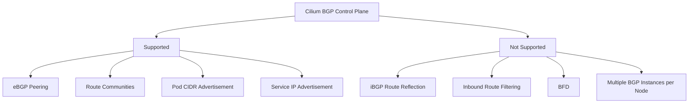

# Limitations in Cilium BGP Control Plane

Author: [nawazdhandala](https://github.com/nawazdhandala)

Tags: Cilium, Kubernetes, Networking, BGP, EBPF

Description: Understand the current limitations of Cilium's BGP Control Plane including unsupported BGP features, scalability considerations, and known edge cases to plan around.

---

## Introduction

Cilium's BGP Control Plane is a powerful native integration, but like any evolving feature, it carries limitations that operators must understand before committing to a production deployment. Being aware of these constraints upfront prevents architecture mistakes that are costly to unwind later.

The limitations fall into three categories: protocol-level features that GoBGP (the underlying BGP library) does not expose through Cilium's API, Kubernetes-specific constraints around IP assignment and service types, and operational gaps in monitoring and troubleshooting tooling. Most of these are documented in the Cilium roadmap and are actively being addressed, but they matter today.

This guide documents known limitations, explains their impact, and describes workarounds where they exist.

## Prerequisites

- Cilium v1.13+ with BGP Control Plane enabled
- Understanding of BGP routing concepts
- Familiarity with CiliumBGPPeeringPolicy

## Limitation 1: No Route Filtering on Inbound Prefixes

Cilium BGP Control Plane does not support inbound route filtering. Routes received from peers are accepted unconditionally:

```bash
# Verify what routes are being received - no filtering possible
cilium bgp routes available ipv4 unicast
```

Workaround: Apply inbound route filtering on the upstream router side rather than on the Cilium node.

## Limitation 2: No BGP Route Reflector Mode

Cilium nodes can only act as BGP speakers, not as route reflectors. You cannot use Cilium to build an iBGP route reflection topology:

```yaml
# This is NOT supported - Cilium cannot act as a route reflector
# You must use a dedicated route reflector (e.g., BIRD, FRR)
spec:
  virtualRouters:
    - localASN: 65100
      # routeReflectorClusterID: "1.2.3.4"  # Not available
```

## Limitation 3: IPv6 BGP Support is Limited

Full IPv6 BGP (IPv6 unicast AFI/SAFI) support was added incrementally. Verify your specific version supports the features you need:

```bash
cilium version
# Cross-reference with Cilium changelog for IPv6 BGP status
```

## Limitation 4: Single BGP Instance Per Node

Each Cilium node runs a single GoBGP instance. You cannot run multiple BGP instances with different ASNs on the same node, which limits multi-tenant BGP designs:

```bash
# Only one policy applies per node - verify with:
kubectl get ciliumbgppeeringpolicy -o wide
```

## Limitation 5: Service Type Constraints

Only `LoadBalancer` type services are advertised via BGP by default. `ClusterIP` and `NodePort` services require additional configuration:

```yaml
apiVersion: cilium.io/v2alpha1
kind: CiliumBGPPeeringPolicy
spec:
  virtualRouters:
    - localASN: 65100
      serviceSelector:
        matchExpressions:
          # Only LoadBalancer services with an allocated external IP are advertised
          - key: "somekey"
            operator: NotIn
            values: ["never-a-value"]
```

## Limitation 6: No BFD Support

Bidirectional Forwarding Detection (BFD) for fast link-failure detection is not supported:

```bash
# BFD status - not available in Cilium BGP Control Plane
# Use BGP hold timers as the failure detection mechanism instead
```

## Known Limitations Summary



## Conclusion

Cilium's BGP Control Plane covers the most common datacenter BGP use cases well but is not a full-featured BGP stack. The most impactful limitations are the lack of inbound route filtering (push filtering to upstream routers), no route reflector mode (use dedicated RR infrastructure), and single-instance-per-node design. Check the Cilium release notes for each version as many of these limitations are being actively addressed in newer releases.
