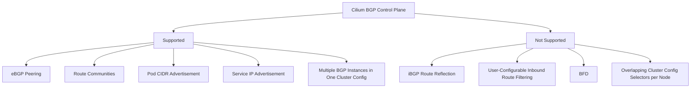

# Limitations in Cilium BGP Control Plane

Author: [nawazdhandala](https://github.com/nawazdhandala)

Tags: Cilium, Kubernetes, Networking, BGP, eBPF

Description: Understand the current limitations of Cilium's BGP Control Plane including unsupported BGP features, scalability considerations, and known edge cases to plan around.

---

## Introduction

Cilium's BGP Control Plane is a powerful native integration, but like any evolving feature, it carries limitations that operators must understand before committing to a production deployment. Being aware of these constraints upfront prevents architecture mistakes that are costly to unwind later.

The limitations fall into three categories: protocol-level features that GoBGP (the underlying BGP library) does not expose through Cilium's API, Kubernetes-specific constraints around IP assignment and service types, and operational gaps in monitoring and troubleshooting tooling. Most of these are documented in the Cilium roadmap and are actively being addressed, but they matter today.

This guide documents known limitations, explains their impact, and describes workarounds where they exist.

## Prerequisites

- Cilium with BGP Control Plane enabled
- Understanding of BGP routing concepts
- Familiarity with `CiliumBGPClusterConfig`, `CiliumBGPPeerConfig`, and `CiliumBGPAdvertisement`

## Limitation 1: No Route Filtering on Inbound Prefixes

Cilium BGP Control Plane does not expose user-configurable inbound route filtering. Routes received from peers can be inspected, but import policy is not a public configuration surface:

```bash
# Verify what routes are being received - no filtering possible

cilium bgp routes available ipv4 unicast
```

Workaround: Apply inbound route filtering on the upstream router side rather than on the Cilium node.

## Limitation 2: No BGP Route Reflector Mode

Cilium nodes can only act as BGP speakers, not as route reflectors. You cannot use Cilium to build an iBGP route reflection topology:

```yaml
# This is NOT supported - Cilium cannot act as a route reflector
# You must use a dedicated route reflector (e.g., BIRD, FRR)
spec:
  bgpInstances:
    - name: "instance-65100"
      localASN: 65100
      # routeReflectorClusterID: "1.2.3.4"  # Not available
```

## Limitation 3: Address Family Support Depends on Cilium Configuration

Cilium supports IPv4 and IPv6 unicast address families, but the BGP Control Plane can only advertise address families that the Cilium agent is configured to use. You cannot advertise IPv4 routes from an IPv6-only Cilium deployment, or IPv6 routes from an IPv4-only deployment:

```bash
cilium version
# Cross-reference with your Cilium networking mode and BGP address-family configuration
```

## Limitation 4: Overlapping Cluster Configs Per Node Are Rejected

Cilium can define multiple BGP instances in one `CiliumBGPClusterConfig`, but multiple `CiliumBGPClusterConfig` resources cannot select the same node with their `nodeSelector`. If they do, the operator rejects the additional configuration for that node:

```bash
# Check for conflicting CiliumBGPClusterConfig status conditions:
kubectl get ciliumbgpclusterconfigs -o wide
```

## Limitation 5: Service Type Constraints

No Service VIPs are advertised until a matching `CiliumBGPAdvertisement` is selected by a peer's address-family configuration. Cilium can advertise `LoadBalancerIP`, `ClusterIP`, and `ExternalIP` service addresses; `NodePort` is not advertised as a separate Service VIP:

```yaml
apiVersion: cilium.io/v2
kind: CiliumBGPAdvertisement
metadata:
  name: bgp-advertisements
  labels:
    advertise: bgp
spec:
  advertisements:
    - advertisementType: "Service"
      service:
        addresses:
          - LoadBalancerIP
          - ClusterIP
          - ExternalIP
      selector:
        matchExpressions:
          # Select all services; use labels to narrow this in production.
          - {key: somekey, operator: NotIn, values: ["never-used-value"]}
```

## Limitation 6: No BFD Support

Bidirectional Forwarding Detection (BFD) for fast link-failure detection is not supported:

```bash
# BFD status - not available in Cilium BGP Control Plane
# Use BGP hold timers as the failure detection mechanism instead
```

## Known Limitations Summary


```mermaid
flowchart TD
    A[Cilium BGP Control Plane] --> B[Supported]
    A --> C[Not Supported]
    B --> D[eBGP Peering]
    B --> E[Route Communities]
    B --> F[Pod CIDR Advertisement]
    B --> G[Service IP Advertisement]
    B --> L[Multiple BGP Instances in One Cluster Config]
    C --> H[iBGP Route Reflection]
    C --> I[User-Configurable Inbound Route Filtering]
    C --> J[BFD]
    C --> K[Overlapping Cluster Config Selectors per Node]
```

## Conclusion

Cilium's BGP Control Plane covers the most common datacenter BGP use cases well but is not a full-featured BGP stack. The most impactful limitations are the lack of user-configurable inbound route filtering (push filtering to upstream routers), no route reflector mode (use dedicated RR infrastructure), and the restriction that overlapping `CiliumBGPClusterConfig` selectors cannot target the same node. Check the Cilium release notes for each version as many of these limitations are being actively addressed in newer releases.
