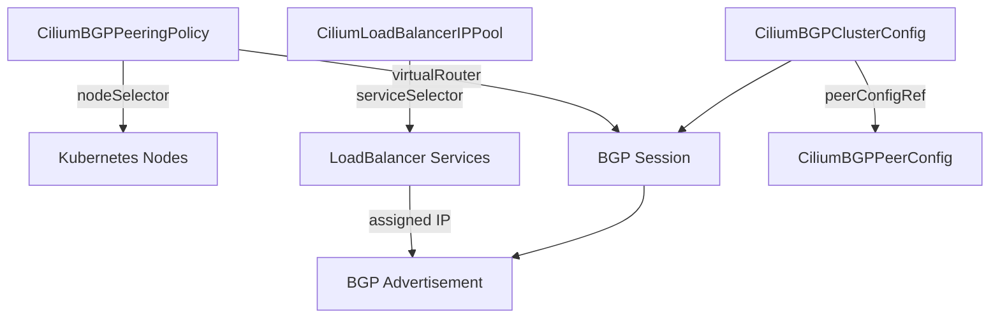

# Cilium BGP Control Plane Resources

Author: [nawazdhandala](https://github.com/nawazdhandala)

Tags: Cilium, Kubernetes, Networking, BGP, eBPF

Description: Understand the CRDs and Kubernetes resources that power Cilium's BGP Control Plane, including CiliumBGPPeeringPolicy, CiliumLoadBalancerIPPool, and node annotations.

---

## Introduction

Cilium's BGP Control Plane is driven by a set of Kubernetes-native resources that define routing policy, IP allocation, and peer configuration. Understanding these resources is essential for designing a production BGP deployment. Unlike older BGP integrations that relied on external configuration files, Cilium uses CRDs that integrate with kubectl, GitOps workflows, and Kubernetes RBAC.

The primary resource is `CiliumBGPPeeringPolicy`, but it works in concert with `CiliumLoadBalancerIPPool` to allocate external IPs for LoadBalancer services, and with standard Kubernetes annotations on nodes and services to influence routing behavior. Together these resources form a complete declarative API for datacenter-grade BGP routing from within Kubernetes.

This guide catalogs every BGP-related resource in Cilium, explains their relationships, and shows practical examples of each.

## Prerequisites

- Cilium v1.13+ with `bgpControlPlane.enabled=true`
- `kubectl` with Cilium CRDs registered
- Basic understanding of BGP concepts (ASN, peers, prefixes)

## CiliumBGPPeeringPolicy

The core resource that assigns BGP configuration to nodes:

```yaml
apiVersion: cilium.io/v2alpha1
kind: CiliumBGPPeeringPolicy
metadata:
  name: spine-peering
spec:
  nodeSelector:
    matchLabels:
      kubernetes.io/os: linux
  virtualRouters:
    - localASN: 65100
      exportPodCIDR: true
      neighbors:
        - peerAddress: "10.0.0.1/32"
          peerASN: 65000
```

## CiliumLoadBalancerIPPool

Allocates IP ranges for LoadBalancer-type services that BGP will advertise:

```yaml
apiVersion: cilium.io/v2alpha1
kind: CiliumLoadBalancerIPPool
metadata:
  name: external-pool
spec:
  cidrs:
    - cidr: "203.0.113.0/24"
  serviceSelector:
    matchLabels:
      environment: production
```

## CiliumBGPClusterConfig (v1.16+)

The newer cluster-scoped configuration resource:

```yaml
apiVersion: cilium.io/v2alpha1
kind: CiliumBGPClusterConfig
metadata:
  name: cilium-bgp
spec:
  bgpInstances:
    - name: instance-65100
      localASN: 65100
      peers:
        - name: upstream-router
          peerASN: 65000
          peerAddress: "10.0.0.1"
          peerConfigRef:
            name: upstream-peer-config
```

## CiliumBGPPeerConfig (v1.16+)

Separates peer configuration from cluster topology:

```yaml
apiVersion: cilium.io/v2alpha1
kind: CiliumBGPPeerConfig
metadata:
  name: upstream-peer-config
spec:
  transport:
    peerPort: 179
  timers:
    holdTimeSeconds: 90
    keepAliveTimeSeconds: 30
  authSecretRef: bgp-auth-secret
  families:
    - afi: ipv4
      safi: unicast
      advertisements:
        matchLabels:
          advertise: bgp
```

## Checking Resource Status

```bash
# List all BGP peering policies
kubectl get ciliumbgppeeringpolicies

# Check IP pool allocations
kubectl get ciliumbgpclusterconfig

# Inspect a specific policy
kubectl describe ciliumbgppeeringpolicy spine-peering
```

## Resource Relationships



## Conclusion

Cilium's BGP resource model is fully declarative and Kubernetes-native. The `CiliumBGPPeeringPolicy` handles node-to-router sessions, `CiliumLoadBalancerIPPool` provides the IP inventory for service advertisement, and the newer `CiliumBGPClusterConfig` / `CiliumBGPPeerConfig` split enables reusable peer templates. Mastering these resources gives you complete programmatic control over your cluster's position in the datacenter routing fabric.
