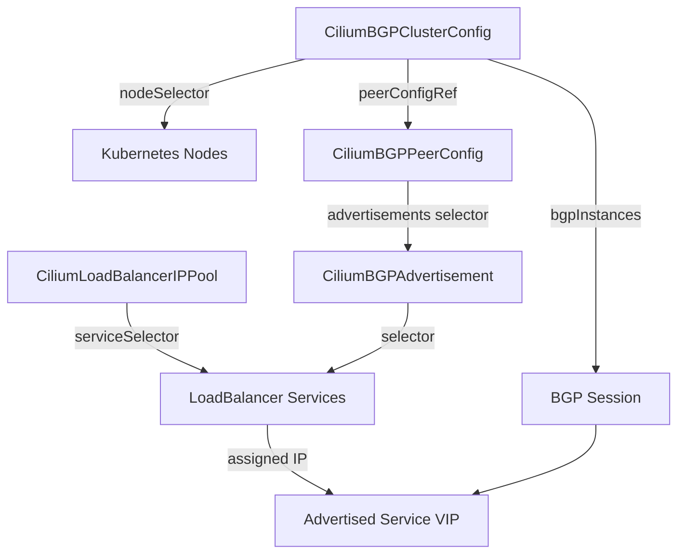

# Cilium BGP Control Plane Resources

Author: [nawazdhandala](https://github.com/nawazdhandala)

Tags: Cilium, Kubernetes, Networking, BGP, eBPF

Description: Understand the CRDs and Kubernetes resources that power Cilium's BGP Control Plane, including CiliumBGPPeeringPolicy, CiliumLoadBalancerIPPool, and node annotations.

---

## Introduction

Cilium's BGP Control Plane is driven by a set of Kubernetes-native resources that define routing policy, IP allocation, and peer configuration. Understanding these resources is essential for designing a production BGP deployment. Unlike older BGP integrations that relied on external configuration files, Cilium uses CRDs that integrate with kubectl, GitOps workflows, and Kubernetes RBAC.

The primary resource in current Cilium releases is `CiliumBGPClusterConfig`, but it works in concert with `CiliumBGPPeerConfig` for reusable peer settings, `CiliumBGPAdvertisement` for route advertisements, and `CiliumLoadBalancerIPPool` to allocate external IPs for LoadBalancer services. Together these resources form a complete declarative API for datacenter-grade BGP routing from within Kubernetes.

This guide catalogs the key BGP-related resources in Cilium, explains their relationships, and shows practical examples of each.

## Prerequisites

- Cilium v1.18+ with `bgpControlPlane.enabled=true`
- `kubectl` with Cilium CRDs registered
- Basic understanding of BGP concepts (ASN, peers, prefixes)

## CiliumBGPClusterConfig

The core resource that assigns BGP configuration to nodes:

```yaml
apiVersion: cilium.io/v2
kind: CiliumBGPClusterConfig
metadata:
  name: cilium-bgp
spec:
  nodeSelector:
    matchLabels:
      kubernetes.io/os: linux
  bgpInstances:
    - name: instance-65100
      localASN: 65100
      peers:
        - name: upstream-router
          peerASN: 65000
          peerAddress: "10.0.0.1"
          peerConfigRef:
            name: upstream-peer-config
```

## CiliumLoadBalancerIPPool

Allocates IP ranges for LoadBalancer-type services that BGP can advertise:

```yaml
apiVersion: cilium.io/v2
kind: CiliumLoadBalancerIPPool
metadata:
  name: external-pool
spec:
  blocks:
    - cidr: "203.0.113.0/24"
  serviceSelector:
    matchLabels:
      environment: production
```

## CiliumBGPAdvertisement

Defines which prefixes are advertised by peers whose `CiliumBGPPeerConfig` selects this resource:

```yaml
apiVersion: cilium.io/v2
kind: CiliumBGPAdvertisement
metadata:
  name: service-advertisements
  labels:
    advertise: bgp
spec:
  advertisements:
    - advertisementType: "Service"
      service:
        addresses:
          - LoadBalancerIP
      selector:
        matchLabels:
          environment: production
```

## CiliumBGPPeerConfig

Separates peer configuration from cluster topology:

```yaml
apiVersion: cilium.io/v2
kind: CiliumBGPPeerConfig
metadata:
  name: upstream-peer-config
spec:
  transport:
    peerPort: 179
  timers:
    holdTimeSeconds: 90
    keepAliveTimeSeconds: 30
  authSecretRef: bgp-auth-secret
  families:
    - afi: ipv4
      safi: unicast
      advertisements:
        matchLabels:
          advertise: bgp
```

## CiliumBGPPeeringPolicy (legacy)

The older BGPv1 resource assigned BGP configuration to nodes. It was deprecated in favor of the newer BGP resources and removed in Cilium 1.19:

```yaml
apiVersion: cilium.io/v2alpha1
kind: CiliumBGPPeeringPolicy
metadata:
  name: spine-peering
spec:
  nodeSelector:
    matchLabels:
      kubernetes.io/os: linux
  virtualRouters:
    - localASN: 65100
      exportPodCIDR: true
      neighbors:
        - peerAddress: "10.0.0.1/32"
          peerASN: 65000
```

## Checking Resource Status

```bash
# List BGP cluster configs
kubectl get ciliumbgpclusterconfigs

# Check IP pool allocations
kubectl get ciliumloadbalancerippools

# Inspect a specific BGP cluster config
kubectl describe ciliumbgpclusterconfig cilium-bgp
```

Resource Relationships


```mermaid
flowchart TD
    A[CiliumBGPClusterConfig] -->|nodeSelector| B[Kubernetes Nodes]
    A -->|bgpInstances| C[BGP Session]
    D[CiliumLoadBalancerIPPool] -->|serviceSelector| E[LoadBalancer Services]
    I[CiliumBGPAdvertisement] -->|selector| E
    E -->|assigned IP| F[Advertised Service VIP]
    C --> F
    A -->|peerConfigRef| H[CiliumBGPPeerConfig]
    H -->|advertisements selector| I
```

## Conclusion

Cilium's BGP resource model is fully declarative and Kubernetes-native. The `CiliumBGPClusterConfig` handles node-to-router sessions, `CiliumBGPPeerConfig` provides reusable peer settings, `CiliumBGPAdvertisement` defines which routes are advertised, and `CiliumLoadBalancerIPPool` provides the IP inventory for LoadBalancer service addresses. Mastering these resources gives you complete programmatic control over your cluster's position in the datacenter routing fabric.
