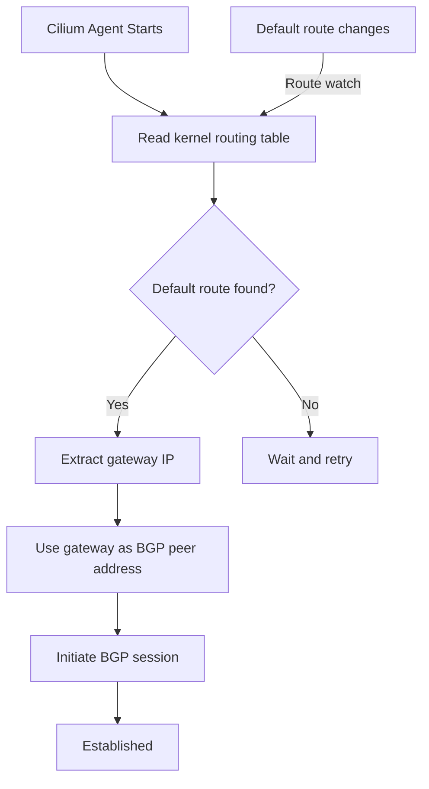

# Default Gateway Auto-Discovery in Cilium BGP

Author: [nawazdhandala](https://github.com/nawazdhandala)

Tags: Cilium, Kubernetes, Networking, BGP, EBPF

Description: Configure Cilium BGP Control Plane to automatically discover the default gateway as a BGP peer, simplifying bare-metal and cloud deployments where router IPs are dynamic.

---

## Introduction

In many Kubernetes deployments, especially on bare metal or in cloud VMs, the BGP peer for each node is simply the default gateway of that node's network interface. Hardcoding these gateway IPs in a `CiliumBGPPeeringPolicy` is fragile - IP addresses can change during maintenance, and new nodes may get different gateways in multi-rack designs.

Cilium's default gateway auto-discovery solves this by detecting the node's default route and automatically configuring that gateway as the BGP peer. This works by reading the kernel routing table at startup and deriving the peer address from `ip route show default`. The feature is particularly useful in cloud provider environments where the gateway is always the first IP of the subnet, in rack-based designs where each rack has a top-of-rack router, and in any environment where per-node router IPs are difficult to predict in advance.

This guide explains how to enable and validate default gateway auto-discovery in Cilium BGP, including the Helm configuration, policy setup, and verification steps.

## Prerequisites

- Cilium v1.15+ with `bgpControlPlane.enabled=true`
- Nodes with a configured default route
- `cilium` CLI installed
- BGP-capable router at each node's default gateway

## Step 1: Verify Default Gateway on Nodes

Before configuring auto-discovery, confirm your nodes have the expected default route:

```bash
# Check default gateway on a node
kubectl debug node/worker-0 -it --image=busybox -- ip route show default

# Expected output:
# default via 10.0.0.1 dev eth0
```

## Step 2: Enable Gateway Auto-Discovery in Helm

```bash
helm upgrade cilium cilium/cilium \
  --namespace kube-system \
  --reuse-values \
  --set bgpControlPlane.enabled=true \
  --set bgpControlPlane.defaultGatewayAutoDiscovery=true
```

## Step 3: Create Policy Using Auto-Discovered Peer

With auto-discovery enabled, use a wildcard or empty peer list and let Cilium populate the peer from the gateway:

```yaml
apiVersion: cilium.io/v2alpha1
kind: CiliumBGPPeeringPolicy
metadata:
  name: gateway-autodiscovery
spec:
  nodeSelector:
    matchLabels:
      kubernetes.io/os: linux
  virtualRouters:
    - localASN: 65100
      exportPodCIDR: true
      serviceSelector:
        matchExpressions:
          - key: somekey
            operator: NotIn
            values: ["never-a-value"]
      neighbors:
        - peerAddress: "0.0.0.0/0"   # Auto-discovered from default route
          peerASN: 65000
          holdTimeSeconds: 90
          keepAliveTimeSeconds: 30
```

## Step 4: Validate Auto-Discovered Sessions

```bash
# Check that Cilium resolved the default gateway peer
cilium bgp peers

# Sample output showing auto-resolved addresses:
# Node        Local ASN  Peer ASN  Peer Address  State
# worker-0    65100      65000     10.0.0.1      established
# worker-1    65100      65000     10.0.1.1      established  <- different gateway per node

# Inspect the resolved peer config
kubectl get ciliumbgpnodeconfig worker-0 -o yaml
```

## Step 5: Monitor Gateway Changes

```bash
# Watch for route changes that might affect BGP peering
kubectl logs -n kube-system -l k8s-app=cilium -f | grep -i "default gateway\|bgp\|peer"

# Confirm routes are being advertised to discovered peer
cilium bgp routes advertised ipv4 unicast
```

## Default Gateway Discovery Flow



## Conclusion

Default gateway auto-discovery simplifies BGP configuration in environments where each node's router is its default gateway. Instead of maintaining per-node peer IP addresses, Cilium reads the kernel routing table and configures peers dynamically. This is especially powerful in multi-rack deployments, cloud VMs, and any environment where operator-controlled IP addressing makes static configuration impractical. Pair this with the `CiliumBGPClusterConfig` for a fully automated, zero-touch BGP deployment.
