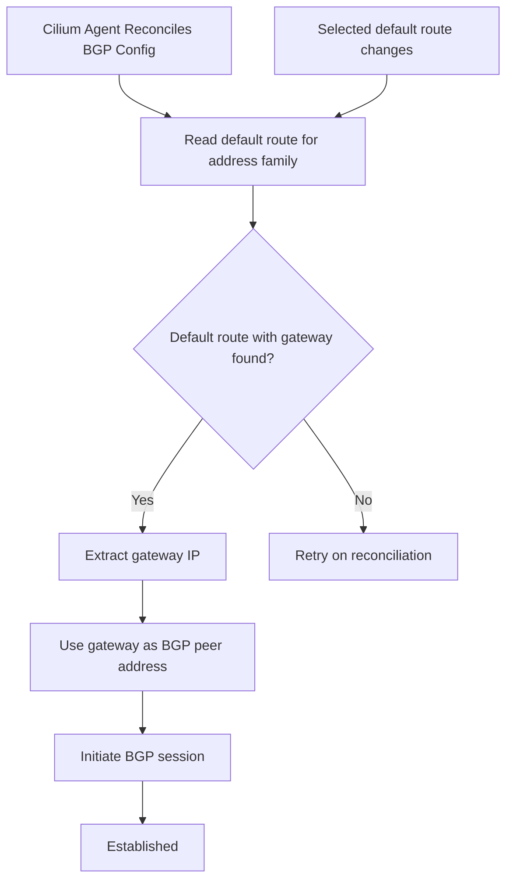

# Default Gateway Auto-Discovery in Cilium BGP

Author: [nawazdhandala](https://github.com/nawazdhandala)

Tags: Cilium, Kubernetes, Networking, BGP, eBPF

Description: Configure Cilium BGP Control Plane to automatically discover the default gateway as a BGP peer, simplifying bare-metal and cloud deployments where router IPs are dynamic.

---

## Introduction

In many Kubernetes deployments, especially on bare metal or in cloud VMs, the BGP peer for each node is simply the default gateway of that node's network interface. Hardcoding these gateway IPs in a `CiliumBGPClusterConfig` is fragile - IP addresses can change during maintenance, and new nodes may get different gateways in multi-rack designs.

Cilium's default gateway auto-discovery solves this by detecting the node's default route for a configured address family and automatically configuring that gateway as the BGP peer. This works by deriving the peer address from the node's default route and reconciling the BGP session when the selected default route changes. The feature is particularly useful in rack-based designs where each rack has a top-of-rack router, and in any environment where per-node router IPs are difficult to predict in advance.

This guide explains how to enable and validate default gateway auto-discovery in Cilium BGP, including the Helm configuration, policy setup, and verification steps.

## Prerequisites

- A Cilium version with the `cilium.io/v2` BGP resources and `DefaultGateway` peer auto-discovery support
- Nodes with a configured default route
- `cilium` CLI installed
- BGP-capable router at each node's default gateway, configured to accept dynamic neighbors

## Step 1: Verify Default Gateway on Nodes

Before configuring auto-discovery, confirm your nodes have the expected default route for the address family you want to peer over:

```bash
# Check default gateway on a node

kubectl debug node/worker-0 -it --image=busybox -- ip route show default

# Expected output:
# default via 10.0.0.1 dev eth0
```

## Step 2: Enable Gateway Auto-Discovery in Helm

Enable the BGP control plane in Cilium. The gateway auto-discovery setting itself is configured in the BGP peer definition, not as a Helm value:

```bash
helm upgrade cilium cilium/cilium \
  --namespace kube-system \
  --reuse-values \
  --set bgpControlPlane.enabled=true

kubectl -n kube-system rollout restart ds/cilium
```

## Step 3: Create Policy Using Auto-Discovered Peer

With BGP enabled, configure a peer with `autoDiscovery.mode: DefaultGateway` and specify the address family Cilium should use to find the default gateway:

```yaml
apiVersion: cilium.io/v2
kind: CiliumBGPPeerConfig
metadata:
  name: gateway-peer
spec:
  timers:
    holdTimeSeconds: 90
    keepAliveTimeSeconds: 30
  families:
    - afi: ipv4
      safi: unicast
      advertisements:
        matchLabels:
          advertise: bgp
---
apiVersion: cilium.io/v2
kind: CiliumBGPAdvertisement
metadata:
  name: pod-cidr-advertisement
  labels:
    advertise: bgp
spec:
  advertisements:
    - advertisementType: "PodCIDR"
---
apiVersion: cilium.io/v2
kind: CiliumBGPClusterConfig
metadata:
  name: gateway-autodiscovery
spec:
  nodeSelector:
    matchLabels:
      kubernetes.io/os: linux
  bgpInstances:
    - name: instance-65100
      localASN: 65100
      peers:
        - name: default-gateway
          peerASN: 65000
          autoDiscovery:
            mode: "DefaultGateway"
            defaultGateway:
              addressFamily: ipv4
          peerConfigRef:
            name: gateway-peer
```

## Step 4: Validate Auto-Discovered Sessions

```bash
# Check that Cilium resolved the default gateway peer
cilium bgp peers

# Sample output showing auto-resolved addresses:
# Node        Local AS  Peer AS  Peer Address  Session State  Family
# worker-0    65100     65000    10.0.0.1      established    ipv4/unicast
# worker-1    65100     65000    10.0.1.1      established    ipv4/unicast

# Inspect the resolved peer config
kubectl get ciliumbgpnodeconfig worker-0 -o yaml
```

## Step 5: Monitor Gateway Changes

```bash
# Watch for route changes that might affect BGP peering
kubectl logs -n kube-system -l k8s-app=cilium -f | grep -i "default gateway\|bgp\|peer"

# Confirm routes are being advertised to discovered peer
cilium bgp routes advertised ipv4 unicast
```

## Default Gateway Discovery Flow


```mermaid
flowchart TD
    A[Cilium Agent Reconciles BGP Config] --> B[Read default route for address family]
    B --> C{Default route with gateway found?}
    C -->|Yes| D[Extract gateway IP]
    C -->|No| E[Retry on reconciliation]
    D --> F[Use gateway as BGP peer address]
    F --> G[Initiate BGP session]
    G --> H[Established]
    I[Selected default route changes] --> B
```

## Conclusion

Default gateway auto-discovery simplifies BGP configuration in environments where each node's router is its default gateway. Instead of maintaining per-node peer IP addresses, Cilium reads the node's default route for the configured address family and configures the peer dynamically. This is especially powerful in multi-rack deployments and any environment where operator-controlled IP addressing makes static configuration impractical. Pair this with `CiliumBGPAdvertisement` for a fully automated, zero-touch BGP deployment.
