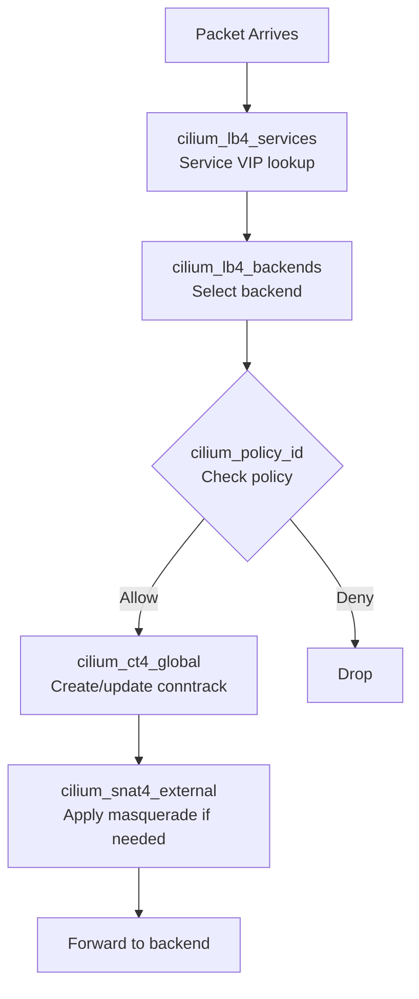

# Cilium BPF Map Inspection

Author: [nawazdhandala](https://github.com/nawazdhandala)

Tags: Cilium, Kubernetes, eBPF, BPF Maps, Troubleshooting

Description: Inspect Cilium's eBPF maps directly to debug data plane issues, verify policy state, examine connection tracking tables, and understand load balancer configuration at the kernel level.

---

## Introduction

Cilium implements its data plane entirely in eBPF, and all state — routing decisions, connection tracking, load balancer backends, policy verdicts, NAT translations — is stored in eBPF maps in the Linux kernel. When something is wrong with Cilium's behavior, the root cause is often visible in these maps. Cilium exposes inspection commands for all its BPF maps through the `cilium bpf` subcommand family, giving you direct visibility into the kernel data structures that govern packet processing.

BPF map inspection is the deepest level of debugging available in Cilium, below even log-level debugging. If Hubble shows a flow being dropped but the policy looks correct, checking the compiled policy map for that endpoint can reveal a stale entry or a policy that was compiled differently than the YAML implies. If a service isn't load balancing correctly, inspecting the LB map shows exactly which backends are registered. If connections are failing with timeout, the conntrack map shows whether the connection was tracked and what state it reached.

This guide covers the key BPF maps in Cilium, how to inspect each one, and what to look for when debugging specific classes of issues.

## Prerequisites

- Cilium installed
- `kubectl` installed
- Access to exec into Cilium pods

## Step 1: List All BPF Maps

```bash
# List all active BPF maps
kubectl exec -n kube-system cilium-xxxxx -- cilium bpf list

# Common maps you'll see:
# cilium_policy_<id>     - per-endpoint policy map
# cilium_ct4_global      - IPv4 connection tracking
# cilium_lb4_services    - IPv4 load balancer service VIPs
# cilium_lb4_backends    - IPv4 load balancer backends
# cilium_snat4_external  - IPv4 SNAT/masquerade table
# cilium_tunnel_map      - VXLAN/Geneve tunnel endpoints
```

## Step 2: Inspect Connection Tracking

```bash
# List all IPv4 connections in the conntrack table
kubectl exec -n kube-system cilium-xxxxx -- \
  cilium bpf ct list global

# Filter for specific source IP
kubectl exec -n kube-system cilium-xxxxx -- \
  cilium bpf ct list global | grep "10.1.0.5"

# Show connection state details
# ESTABLISHED, TIME_WAIT, SYN_SENT, etc.

# Delete stale conntrack entries (if needed)
kubectl exec -n kube-system cilium-xxxxx -- \
  cilium bpf ct flush global
```

## Step 3: Inspect Load Balancer Maps

```bash
# List all service VIPs
kubectl exec -n kube-system cilium-xxxxx -- \
  cilium bpf lb list --frontend

# List all backend pods
kubectl exec -n kube-system cilium-xxxxx -- \
  cilium bpf lb list --backend

# Inspect a specific service
kubectl exec -n kube-system cilium-xxxxx -- \
  cilium bpf lb list | grep "10.96.0.100"

# Check service revision (for session affinity debugging)
kubectl exec -n kube-system cilium-xxxxx -- \
  cilium service list --all
```

## Step 4: Inspect Policy Maps

```bash
# Get policy map for specific endpoint
ENDPOINT_ID=$(kubectl exec -n kube-system cilium-xxxxx -- \
  cilium endpoint list | grep my-pod | awk '{print $1}')

kubectl exec -n kube-system cilium-xxxxx -- \
  cilium bpf policy get ${ENDPOINT_ID}

# Sample output:
# Identity   Direction  Action  Bytes  Packets
# 1234       ingress    allow   10240  100
# 5678       ingress    deny    0      0
```

## Step 5: Inspect NAT Maps

```bash
# List NAT translations (for masquerade/SNAT debugging)
kubectl exec -n kube-system cilium-xxxxx -- \
  cilium bpf nat list

# Filter for specific IP
kubectl exec -n kube-system cilium-xxxxx -- \
  cilium bpf nat list | grep "203.0.113"

# Check egress gateway NAT entries
kubectl exec -n kube-system cilium-xxxxx -- \
  cilium bpf nat list | grep "egress"
```

## Step 6: Check BPF Map Capacity

```bash
# Check map utilization (important for capacity planning)
kubectl exec -n kube-system cilium-xxxxx -- \
  cilium bpf ct list global | wc -l
# Compare with max: cilium config get bpf-ct-global-max-entries

# Check all map sizes
kubectl exec -n kube-system cilium-xxxxx -- \
  cilium bpf list | awk '{print $1, $3}'
```

## BPF Map Hierarchy



## Conclusion

BPF map inspection gives you the ground truth about Cilium's data plane state — no interpretation required, just the actual kernel data structures that govern packet processing. Use `cilium bpf ct list` when debugging connection failures (look for missing or stale conntrack entries), `cilium bpf lb list` when load balancing isn't working (check if the right backends are registered), and `cilium bpf policy get <id>` when a policy appears correct in YAML but traffic is still being dropped (check what was actually compiled into the policy map). This level of visibility is unique to Cilium and unavailable in any other CNI plugin.
