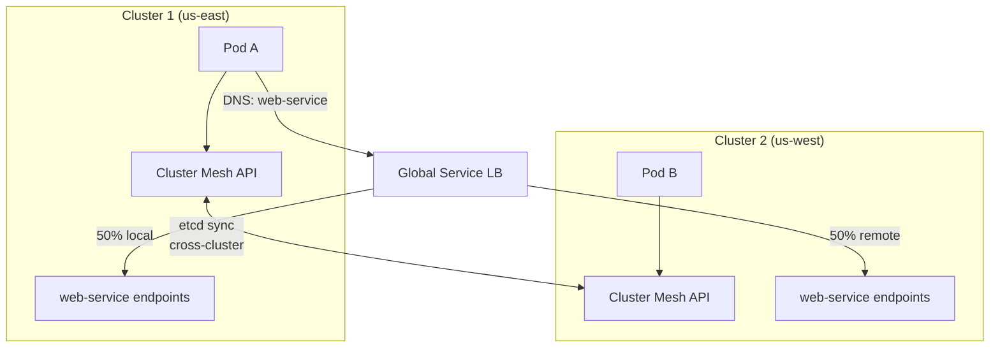

# Multi-Cluster Cilium Cluster Mesh

Author: [nawazdhandala](https://github.com/nawazdhandala)

Tags: Cilium, Kubernetes, Cluster Mesh, Multi-Cluster, Networking

Description: Connect multiple Kubernetes clusters with Cilium Cluster Mesh to enable cross-cluster service discovery, load balancing, and network policy enforcement across a global fleet.

---

## Introduction

As organizations grow their Kubernetes footprint across multiple regions, availability zones, or teams, the need for cross-cluster connectivity becomes critical. Cilium Cluster Mesh connects multiple Kubernetes clusters into a single logical network, enabling pods in cluster A to discover and connect to services in cluster B using standard Kubernetes DNS, and allowing network policies to reference endpoints in remote clusters.

Cluster Mesh works by connecting the Cilium agents across clusters through a shared key-value store (etcd). Each cluster exposes its etcd to peer clusters, and Cilium agents synchronize endpoint state across cluster boundaries. The result is that every Cilium agent in the mesh has visibility into all endpoints in all connected clusters, enabling native service discovery and consistent policy enforcement without a dedicated multi-cluster gateway.

This guide covers deploying Cluster Mesh across two clusters, enabling global services, and validating cross-cluster connectivity.

## Prerequisites

- Two or more Kubernetes clusters with Cilium v1.10+ installed
- Unique cluster names and cluster IDs for each cluster
- Network connectivity between clusters (overlapping pod CIDRs are not supported without special configuration)
- `cilium` CLI installed on management machine

## Step 1: Enable Cluster Mesh API Server

On each cluster:

```bash
cilium clustermesh enable \
  --service-type LoadBalancer \
  --context cluster1

cilium clustermesh enable \
  --service-type LoadBalancer \
  --context cluster2
```

## Step 2: Set Unique Cluster Identity

Each cluster requires a unique name and ID in Cilium config:

```bash
helm upgrade cilium cilium/cilium \
  --namespace kube-system \
  --kube-context cluster1 \
  --reuse-values \
  --set cluster.name=cluster1 \
  --set cluster.id=1

helm upgrade cilium cilium/cilium \
  --namespace kube-system \
  --kube-context cluster2 \
  --reuse-values \
  --set cluster.name=cluster2 \
  --set cluster.id=2
```

## Step 3: Connect Clusters

```bash
# Connect cluster1 to cluster2
cilium clustermesh connect \
  --context cluster1 \
  --destination-context cluster2

# Verify mesh status
cilium clustermesh status --context cluster1
cilium clustermesh status --context cluster2
```

## Step 4: Create Global Services

Expose a service as a global service that load-balances across clusters:

```yaml
apiVersion: v1
kind: Service
metadata:
  name: web-service
  annotations:
    service.cilium.io/global: "true"
    service.cilium.io/shared: "true"
spec:
  selector:
    app: web
  ports:
    - port: 80
      targetPort: 8080
```

Apply this service in both clusters.

## Step 5: Validate Cross-Cluster Connectivity

```bash
# From cluster1, reach service endpoint in cluster2
kubectl exec --context cluster1 -n default test-pod -- \
  curl http://web-service/health

# Check global endpoints in Cilium
kubectl exec --context cluster1 -n kube-system cilium-xxxxx -- \
  cilium endpoint list | grep cluster2

# Use Hubble to observe cross-cluster flows
hubble observe --context cluster1 \
  --follow | grep cluster2
```

## Cluster Mesh Architecture



## Conclusion

Cilium Cluster Mesh enables true multi-cluster networking without proprietary gateways, overlay tunnels between clusters, or application changes for service discovery. Global services automatically load-balance across all cluster instances, and network policies can reference remote cluster endpoints using the same label selectors as local policies. The Cluster Mesh architecture makes active-active multi-region deployments operationally straightforward, with the same Cilium tooling you use within a single cluster applicable across the entire mesh.
