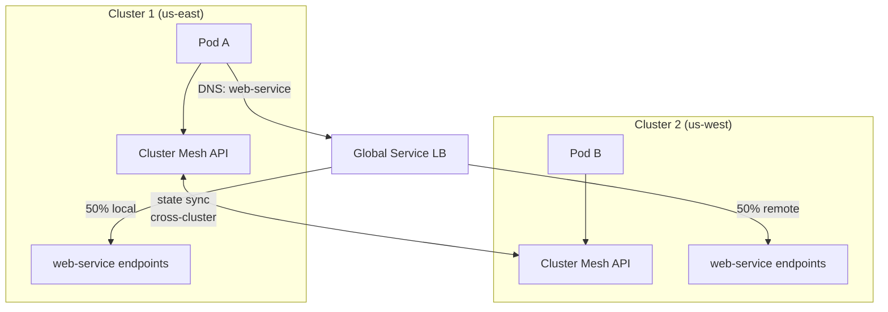

# Multi-Cluster Cilium Cluster Mesh

Author: [nawazdhandala](https://github.com/nawazdhandala)

Tags: Cilium, Kubernetes, Cluster Mesh, Multi-Cluster, Networking

Description: Connect multiple Kubernetes clusters with Cilium Cluster Mesh to enable cross-cluster service discovery, load balancing, and network policy enforcement across a global fleet.

---

## Introduction

As organizations grow their Kubernetes footprint across multiple regions, availability zones, or teams, the need for cross-cluster connectivity becomes critical. Cilium Cluster Mesh connects multiple Kubernetes clusters into a single logical network, enabling pods in cluster A to reach services backed by endpoints in cluster B through global Kubernetes services, and allowing network policies to reference endpoints in remote clusters.

Cluster Mesh works by exposing each cluster's Cilium state through the Cluster Mesh API server. Cilium agents synchronize endpoint, identity, and service state across cluster boundaries; in current Cilium releases, KVStoreMesh is enabled by default and caches remote cluster information in the local key-value store for scalability. The result is that Cilium can program cross-cluster connectivity, service load balancing, and policy enforcement without a dedicated multi-cluster gateway.

This guide covers deploying Cluster Mesh across two clusters, enabling global services, and validating cross-cluster connectivity.

## Prerequisites

- Two or more Kubernetes clusters with a supported Cilium release installed
- Unique cluster names and cluster IDs for each cluster
- The same Cilium datapath mode on all clusters
- Non-overlapping Pod CIDRs across all clusters and nodes
- Node network connectivity between clusters, with the required Cluster Mesh ports allowed
- `cilium` CLI installed on management machine

## Step 1: Set Unique Cluster Identity

Each cluster requires a unique name and ID in Cilium config. It is best to set these values when installing Cilium; if you change them on clusters with running workloads, restart those workloads so identities are regenerated correctly:

```bash
helm upgrade cilium cilium/cilium \
  --namespace kube-system \
  --kube-context cluster1 \
  --reuse-values \
  --set cluster.name=cluster1 \
  --set cluster.id=1

helm upgrade cilium cilium/cilium \
  --namespace kube-system \
  --kube-context cluster2 \
  --reuse-values \
  --set cluster.name=cluster2 \
  --set cluster.id=2
```

## Step 2: Enable Cluster Mesh API Server

On each cluster:

```bash
cilium clustermesh enable \
  --service-type LoadBalancer \
  --context cluster1

cilium clustermesh enable \
  --service-type LoadBalancer \
  --context cluster2

cilium clustermesh status --context cluster1 --wait
cilium clustermesh status --context cluster2 --wait
```

## Step 3: Connect Clusters

```bash
# Connect cluster1 to cluster2

cilium clustermesh connect \
  --context cluster1 \
  --destination-context cluster2

# Verify mesh status
cilium clustermesh status --context cluster1 --wait
cilium clustermesh status --context cluster2 --wait
```

## Step 4: Create Global Services

Expose a service as a global service that load-balances across clusters:

```yaml
apiVersion: v1
kind: Service
metadata:
  name: web-service
  annotations:
    service.cilium.io/global: "true"
    service.cilium.io/shared: "true"
spec:
  type: ClusterIP
  selector:
    app: web
  ports:
    - port: 80
      targetPort: 8080
```

Apply this service in the same namespace in both clusters.

## Step 5: Validate Cross-Cluster Connectivity

```bash
# Run Cilium's multi-cluster connectivity test
cilium connectivity test --context cluster1 --multi-cluster cluster2

# From cluster1, reach the global service. Repeated requests can hit local or remote backends.
kubectl exec --context cluster1 -n default test-pod -- \
  curl http://web-service/health

# Check global service backends in Cilium
kubectl exec --context cluster1 -n kube-system ds/cilium -- \
  cilium-dbg service list

# Use Hubble to observe cross-cluster flows
hubble observe -P --follow | grep cluster2
```

## Cluster Mesh Architecture


```mermaid
flowchart TD
    subgraph C1["Cluster 1 (us-east)"]
        A1[Pod A] --> CM1[Cluster Mesh API]
        B1[web-service endpoints]
    end
    subgraph C2["Cluster 2 (us-west)"]
        A2[Pod B] --> CM2[Cluster Mesh API]
        B2[web-service endpoints]
    end
    CM1 <-->|state sync\ncross-cluster| CM2
    A1 -->|DNS: web-service| D[Global Service LB]
    D -->|50% local| B1
    D -->|50% remote| B2
```

## Conclusion

Cilium Cluster Mesh enables true multi-cluster networking without proprietary gateways or application changes for service discovery. Global services automatically load-balance across all cluster instances, and network policies can reference remote cluster endpoints by combining application labels with Cilium's cluster label. The Cluster Mesh architecture makes active-active multi-region deployments operationally straightforward, with the same Cilium tooling you use within a single cluster applicable across the entire mesh.
