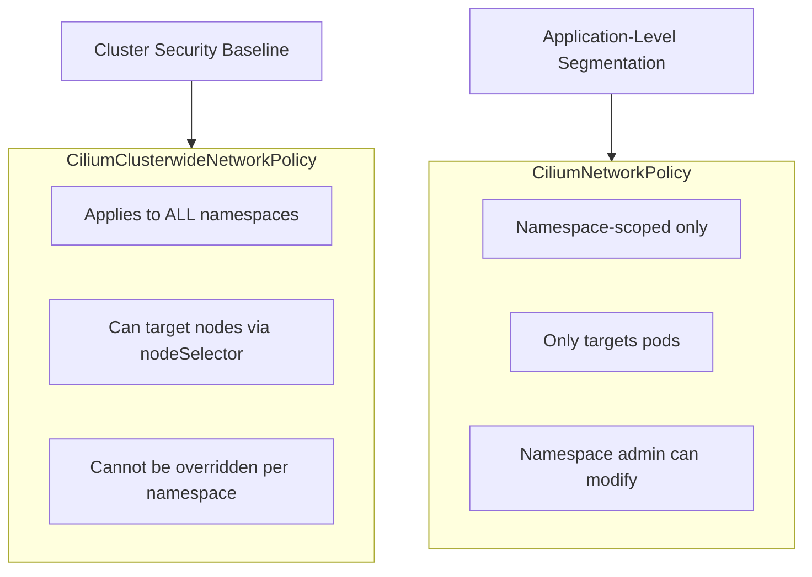

# CiliumClusterwideNetworkPolicy

Author: [nawazdhandala](https://github.com/nawazdhandala)

Tags: Cilium, Kubernetes, Network Policy, eBPF, Security

Description: Use CiliumClusterwideNetworkPolicy to enforce security policies across all namespaces simultaneously, including host networking and node-level traffic controls that namespace-scoped policies cannot reach.

---

## Introduction

`CiliumNetworkPolicy` is namespace-scoped, which means it only affects pods in the namespace where it is defined. This is appropriate for application-level segmentation but creates a gap for cluster-wide security requirements: you cannot enforce a single deny-all policy across all namespaces, control traffic to Kubernetes nodes (as opposed to pods), or establish baseline security rules that namespace owners cannot override.

`CiliumClusterwideNetworkPolicy` (CCNP) fills this gap. As a cluster-scoped resource, it applies to all endpoints across all namespaces and can also target host networking (node processes) using the `nodeSelector` field instead of `endpointSelector`. This makes CCNP the right tool for cluster security baselines, compliance requirements that span all workloads, and node-level traffic controls like allowing SSH from specific jump hosts or restricting kubelet access.

This guide covers the key use cases for CCNP with practical examples of cluster-wide default deny, host policies, and baseline allow rules.

## Prerequisites

- Cilium v1.10+ with cluster-scoped CRD support
- `kubectl` with cluster-admin permissions
- Understanding of CiliumNetworkPolicy fundamentals

## Step 1: Cluster-Wide Default Deny

Establish a baseline deny-all policy for all pods:

```yaml
apiVersion: cilium.io/v2
kind: CiliumClusterwideNetworkPolicy
metadata:
  name: default-deny-all
spec:
  endpointSelector: {}  # Empty selector matches ALL endpoints
  ingress:
    - fromEntities:
        - "kube-apiserver"   # Allow kubelet probes
  egress:
    - toEntities:
        - "kube-apiserver"   # Allow API server access
    - toEndpoints:
        - matchLabels:
            "k8s:io.kubernetes.pod.namespace": kube-system
            k8s-app: kube-dns
      toPorts:
        - ports:
            - port: "53"
              protocol: UDP
```

## Step 2: Node-Level Host Policy

Control traffic on the Kubernetes nodes themselves (not pods):

```yaml
apiVersion: cilium.io/v2
kind: CiliumClusterwideNetworkPolicy
metadata:
  name: node-host-policy
spec:
  nodeSelector:
    matchLabels:
      kubernetes.io/os: linux
  ingress:
    - fromCIDR:
        - "10.100.0.0/24"   # Jump host subnet
      toPorts:
        - ports:
            - port: "22"
              protocol: TCP
    - fromEntities:
        - "cluster"          # Allow intra-cluster node communication
  egress:
    - toEntities:
        - "world"
      toPorts:
        - ports:
            - port: "443"
              protocol: TCP
            - port: "80"
              protocol: TCP
```

## Step 3: Allow Monitoring Access Cluster-Wide

```yaml
apiVersion: cilium.io/v2
kind: CiliumClusterwideNetworkPolicy
metadata:
  name: allow-prometheus-scrape
spec:
  endpointSelector:
    matchLabels:
      prometheus-scrape: "true"
  ingress:
    - fromEndpoints:
        - matchLabels:
            app.kubernetes.io/name: prometheus
            "k8s:io.kubernetes.pod.namespace": monitoring
      toPorts:
        - ports:
            - port: "9090"
              endPort: 9100
              protocol: TCP
```

## Step 4: Verify Cluster-Wide Policy Application

```bash
# List all cluster-wide policies
kubectl get ciliumclusterwidenetworkpolicies

# Check policy status and endpoints covered
kubectl describe ciliumclusterwidenetworkpolicy default-deny-all

# Verify specific pod is covered
kubectl exec -n kube-system cilium-xxxxx -- \
  cilium endpoint list | grep -E "ID|POLICY"
```

## Policy Scope Comparison



## Conclusion

`CiliumClusterwideNetworkPolicy` is the right tool for cluster-wide security baselines that must apply uniformly across all namespaces and that namespace administrators should not be able to override. The `nodeSelector` field makes CCNP unique in its ability to enforce policies on Kubernetes nodes themselves, not just pods — essential for hardening node access to SSH, kubelet, and other system services. Use CCNP for the foundation layer of your security model and namespace-scoped CNP for application-specific rules on top.
