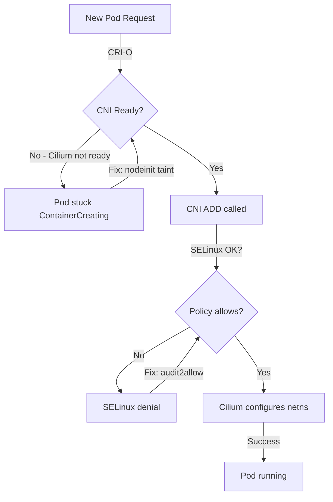

# Common CRI-O Issues with Cilium: Configure, Troubleshoot, Validate, and Monitor

Author: [nawazdhandala](https://github.com/nawazdhandala)

Tags: Cilium, Kubernetes, Networking, EBPF, IPAM

Description: A practical troubleshooting guide for the most common issues encountered when running Cilium with CRI-O, including CNI invocation failures, network namespace errors, and SELinux-related problems.

---

## Introduction

While CRI-O and Cilium work well together, a specific set of issues arises in this combination that does not occur with other runtimes. These issues stem from CRI-O's strict CNI invocation behavior, RHEL/OpenShift SELinux policies, differences in network namespace lifecycle management, and version-specific bugs in CRI-O that affect how it calls CNI plugins. Understanding these issues in advance prevents hours of troubleshooting when deploying Cilium on CRI-O-based clusters.

The most frequent issues include: CRI-O failing to call the CNI ADD command when Cilium is not yet ready, pods getting stuck when the CNI config disappears briefly during Cilium restarts, network namespace cleanup failures leaving stale state, and SELinux denials preventing Cilium from accessing CRI-O's socket or the BPF filesystem. Each of these has a specific diagnosis procedure and resolution.

This guide is a focused troubleshooting reference for CRI-O-specific issues with Cilium, with clear reproduce/diagnose/fix steps for each problem category.

## Prerequisites

- Kubernetes cluster running CRI-O with Cilium
- `kubectl` with cluster admin access
- Node access via SSH or `kubectl debug`
- Familiarity with `journalctl` and CRI-O logging
- For RHEL/OpenShift: SELinux tools (`ausearch`, `audit2allow`)

## Configure CRI-O for Reliable Cilium Operation

Tune CRI-O configuration for Cilium compatibility:

```bash
# Check current CRI-O configuration
cat /etc/crio/crio.conf

# Configure CRI-O to wait for CNI before starting pods
# Edit /etc/crio/crio.conf
sudo tee -a /etc/crio/crio.conf <<EOF
[crio.network]
# Path to the directory where CNI configuration files are located
cni_config_dir = "/etc/cni/net.d"
# Wait for CNI plugin to be ready before starting containers
plugin_dirs = ["/opt/cni/bin", "/usr/libexec/cni"]
EOF

# Restart CRI-O after configuration changes
sudo systemctl restart crio

# Verify CRI-O can see Cilium CNI config
crictl info | grep -A 5 "cni"
```

Configure Cilium to handle CRI-O gracefully during initialization:

```bash
# Configure Cilium to taint nodes until CNI is ready
helm upgrade cilium cilium/cilium \
  --namespace kube-system \
  --reuse-values \
  --set agentNotReadyTaintKey="node.cilium.io/agent-not-ready" \
  --set nodeinit.enabled=true \
  --set nodeinit.reconfigureKubelet=true
```

## Troubleshoot Common CRI-O Issues

**Issue 1: Pods stuck in ContainerCreating**

```bash
# Diagnose
kubectl describe pod <stuck-pod> | grep -A 10 Events
# Look for: "network: failed to setup network for sandbox"

# Check CRI-O logs
journalctl -u crio --since="5 minutes ago" | grep -i "cni\|network\|error"

# Verify Cilium CNI config exists
ls /etc/cni/net.d/05-cilium.conf
cat /etc/cni/net.d/05-cilium.conf

# Verify Cilium socket is accessible
ls /var/run/cilium/cilium.sock

# Fix: Restart affected pod
kubectl delete pod <stuck-pod>
```

**Issue 2: SELinux denying CRI-O socket access**

```bash
# Diagnose
ausearch -m avc -ts recent | grep crio
# Look for: denied { connectto } comm="cilium-agent" path="/var/run/crio/crio.sock"

# Fix Option 1: Create SELinux policy
ausearch -m avc -ts recent | grep crio | audit2allow -M cilium-crio
semodule -i cilium-crio.pp

# Fix Option 2: Label socket correctly
chcon -t container_runtime_exec_t /var/run/crio/crio.sock

# Verify fix
systemctl restart crio
kubectl -n kube-system rollout restart ds/cilium
cilium status
```

**Issue 3: Network namespace not cleaned up**

```bash
# Diagnose: stale network namespaces
ip netns list | wc -l
kubectl get pods -A | grep Running | wc -l
# If ns count >> running pods, stale namespaces exist

# Find stale namespaces
ip netns list
# Compare to: crictl ps --all

# Clean up stale namespaces (with caution)
# First identify the stale ones
for ns in $(ip netns list | awk '{print $1}'); do
  if ! crictl ps | grep -q "$ns"; then
    echo "Potentially stale: $ns"
  fi
done

# Fix: CRI-O cleanup bug workaround - restart CRI-O
sudo systemctl restart crio
```

**Issue 4: CNI ADD fails when Cilium is not ready**

```bash
# Diagnose
journalctl -u crio | grep "CNI ADD\|CNI failed"
kubectl -n kube-system logs ds/cilium | grep "not ready\|starting"

# Fix: Ensure node taint prevents pod scheduling until Cilium is ready
kubectl get node <node-name> -o yaml | grep "node.cilium.io/agent-not-ready"

# Configure node initialization properly
helm upgrade cilium cilium/cilium \
  --namespace kube-system \
  --reuse-values \
  --set nodeinit.enabled=true
```

## Validate CRI-O Issue Resolution

After applying fixes, validate the environment:

```bash
# Test pod creation works
kubectl run validation-test --image=nginx --restart=Never
kubectl wait pod/validation-test --for=condition=Ready --timeout=120s

# Verify endpoint was created
kubectl -n kube-system exec ds/cilium -- cilium endpoint list | \
  grep $(kubectl get pod validation-test -o jsonpath='{.status.podIP}')

# Test connectivity
kubectl exec validation-test -- curl -s -o /dev/null -w "%{http_code}" \
  http://kubernetes.default.svc.cluster.local
echo ""

# Clean up
kubectl delete pod validation-test

# Run full connectivity test
cilium connectivity test
```

## Monitor for CRI-O Issues



Monitor for ongoing CRI-O issues:

```bash
# Watch for CRI-O CNI errors in real-time
journalctl -u crio -f | grep -E "CNI|error|failed" &

# Monitor pod creation success rate
watch -n30 "kubectl get pods -A | grep -c ContainerCreating"

# Check SELinux denials related to Cilium/CRI-O
watch -n60 "ausearch -m avc -ts recent 2>/dev/null | grep -c crio"

# Monitor Cilium agent for runtime errors
kubectl -n kube-system logs ds/cilium --since=1h | grep -i "crio\|runtime" | tail -20
```

## Conclusion

CRI-O and Cilium work reliably together when configured correctly, but specific edge cases require targeted fixes. SELinux policies on RHEL and OpenShift are the most common blocker - audit2allow is your friend for generating precise SELinux policies rather than disabling SELinux enforcement. Ensuring Cilium's node initialization taint is correctly configured prevents the race condition where CRI-O attempts to create pods before Cilium is ready to handle CNI calls. Regular monitoring of pod creation success rates and CRI-O logs provides early warning of integration issues before they impact production workloads.
