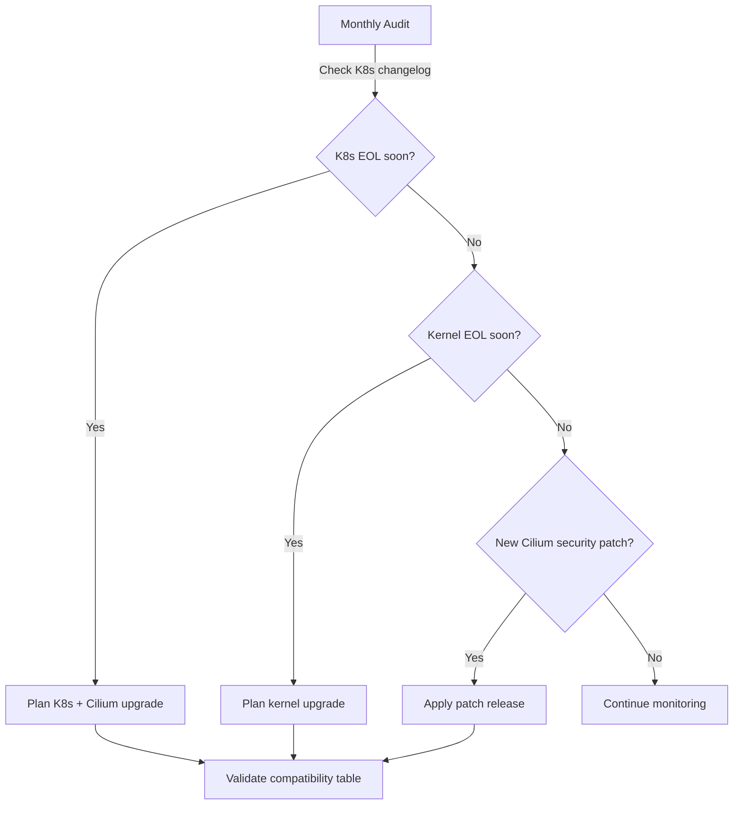

# Cilium Compatibility Table: Configure, Troubleshoot, Validate, and Monitor

Author: [nawazdhandala](https://github.com/nawazdhandala)

Tags: Cilium, Kubernetes, Compatibility, eBPF, Networking

Description: A practical guide to using the Cilium compatibility table to select the right Cilium version for your Kubernetes environment, troubleshoot version mismatches, and monitor for compatibility drift.

---

## Introduction

The Cilium compatibility table is the authoritative reference for determining which Cilium version works with which Kubernetes version, Linux kernel version, and container runtime. Ignoring this table before an installation or upgrade is one of the most common causes of Cilium deployment failures. The table is published with each Cilium release and updated when new Kubernetes versions are tested and validated.

Beyond simple version matching, the compatibility table also documents feature availability per kernel version, CNI chaining support, cloud provider integrations, and platform-specific considerations. Some features like BPF NodePort require kernel 4.17+, WireGuard encryption requires 5.6+, and the bandwidth manager requires 5.1+. Understanding these requirements helps you plan infrastructure upgrades alongside Cilium upgrades.

This guide walks through how to use the compatibility table effectively, configure your environment to match compatibility requirements, troubleshoot version conflicts, and validate that your deployment is within supported parameters.

## Prerequisites

- Access to Cilium documentation at https://docs.cilium.io
- `kubectl` with cluster admin access
- All node kernel versions documented
- Current Kubernetes server version identified

## Configure Based on Compatibility Matrix

Determine the correct Cilium version for your environment:

```bash
# Step 1: Identify your Kubernetes version
kubectl version -o json | jq -r '.serverVersion | "\(.major).\(.minor)"'

# Step 2: Get all node kernel versions
kubectl get nodes -o jsonpath='{range .items[*]}{.metadata.name}{"\t"}{.status.nodeInfo.kernelVersion}{"\n"}{end}'

# Step 3: Identify the Cilium version range for your K8s version
# Kubernetes 1.30 -> Cilium 1.15.x, 1.16.x
# Kubernetes 1.29 -> Cilium 1.14.x, 1.15.x, 1.16.x
# Kubernetes 1.28 -> Cilium 1.13.x, 1.14.x, 1.15.x
# Kubernetes 1.27 -> Cilium 1.12.x, 1.13.x, 1.14.x

# Step 4: Install the latest compatible version
K8S_VERSION="1.29"
CILIUM_VERSION="1.15.6"  # Latest for K8s 1.29

helm install cilium cilium/cilium \
  --version $CILIUM_VERSION \
  --namespace kube-system
```

Feature compatibility by kernel version:

```bash
# Kernel 4.19.57+ - Basic Cilium connectivity
# Kernel 5.1+     - Bandwidth Manager, DSR
# Kernel 5.3+     - Full kube-proxy replacement
# Kernel 5.6+     - WireGuard encryption
# Kernel 5.10+    - Recommended minimum
# Kernel 5.15+    - All features including BPF Host Routing

# Check which features to enable based on your kernel
KERNEL_VERSION=$(kubectl get nodes -o jsonpath='{.items[0].status.nodeInfo.kernelVersion}')
echo "Kernel: $KERNEL_VERSION"

# Enable only compatible features
helm upgrade cilium cilium/cilium \
  --namespace kube-system \
  --reuse-values \
  --set bandwidthManager.enabled=true   # Requires kernel 5.1+
```

## Troubleshoot Compatibility Mismatches

Identify version compatibility problems:

```bash
# Detect if Cilium version is outside supported range for K8s
K8S_MINOR=$(kubectl version -o json | jq -r '.serverVersion.minor' | tr -d '+')
CILIUM_VER=$(cilium version | grep "cilium-agent" | awk '{print $2}')
echo "K8s: 1.$K8S_MINOR, Cilium: $CILIUM_VER"
# Cross-reference with compatibility table manually

# Check for deprecated Kubernetes API usage by Cilium
kubectl -n kube-system logs ds/cilium | grep -i "deprecated\|removed api\|no longer"

# Check for beta API migration issues (e.g., CRD v1beta1 -> v1)
kubectl get crd ciliumnetworkpolicies.cilium.io -o jsonpath='{.apiVersion}'

# Identify Kubernetes feature gates that Cilium depends on
kubectl -n kube-system logs ds/cilium | grep -i "feature gate\|featuregate"
```

Handle common compatibility errors:

```bash
# Issue: EndpointSlice v1 not available (K8s < 1.21)
kubectl api-versions | grep "discovery.k8s.io/v1$"
# If missing, disable in Cilium
helm upgrade cilium cilium/cilium \
  --namespace kube-system \
  --reuse-values \
  --set endpointSlice.enabled=false

# Issue: CRD v1 not supported (K8s < 1.16)
# This requires a Cilium version that still uses v1beta1 CRDs (very old)
kubectl get crd ciliumnetworkpolicies.cilium.io -o jsonpath='{.spec.versions[*].name}'

# Issue: Cilium too new for current K8s
# E.g., Cilium 1.16 on K8s 1.26 (out of support range)
# Solution: Downgrade Cilium to a supported version
helm upgrade cilium cilium/cilium \
  --version 1.14.7 \
  --namespace kube-system \
  --values cilium-values.yaml
```

## Validate Compatibility

Confirm your environment is within the supported compatibility matrix:

```bash
# Comprehensive compatibility check script
K8S_VERSION=$(kubectl version -o json | jq -r '.serverVersion | "\(.major).\(.minor)"')
CILIUM_VERSION=$(kubectl -n kube-system exec ds/cilium -- cilium version 2>/dev/null | head -1)
KERNEL_VERSION=$(kubectl get nodes -o jsonpath='{.items[0].status.nodeInfo.kernelVersion}')

echo "=== Cilium Compatibility Check ==="
echo "Kubernetes: $K8S_VERSION"
echo "Cilium: $CILIUM_VERSION"
echo "Kernel: $KERNEL_VERSION"
echo ""
echo "Checking Cilium status..."
cilium status

# Run the Cilium connectivity test
cilium connectivity test --test-namespace cilium-test
```

## Monitor for Compatibility Drift



Set up automated compatibility monitoring:

```bash
# Monitor for Kubernetes API deprecation warnings in Cilium logs
kubectl -n kube-system logs ds/cilium --since=24h | grep -i deprecat | sort -u

# Check Cilium release notes for compatibility changes
# https://github.com/cilium/cilium/releases

# Create a monthly compatibility report
cat > /tmp/compat-check.sh <<'EOF'
#!/bin/bash
echo "Date: $(date)"
echo "K8s: $(kubectl version --short 2>/dev/null | grep Server)"
echo "Cilium: $(cilium version 2>/dev/null | head -1)"
echo "Kernels:"
kubectl get nodes -o jsonpath='{range .items[*]}{.metadata.name}{"\t"}{.status.nodeInfo.kernelVersion}{"\n"}{end}'
EOF
chmod +x /tmp/compat-check.sh
```

## Conclusion

The Cilium compatibility table is a living document that must be consulted before every installation, upgrade, or infrastructure change. Maintaining compatibility across Kubernetes, Cilium, and kernel versions requires proactive planning, especially since all three components follow independent release cycles. Set up regular compatibility audits and review the Cilium release notes when Kubernetes upgrades are planned to ensure your networking layer remains fully supported and feature-complete.
