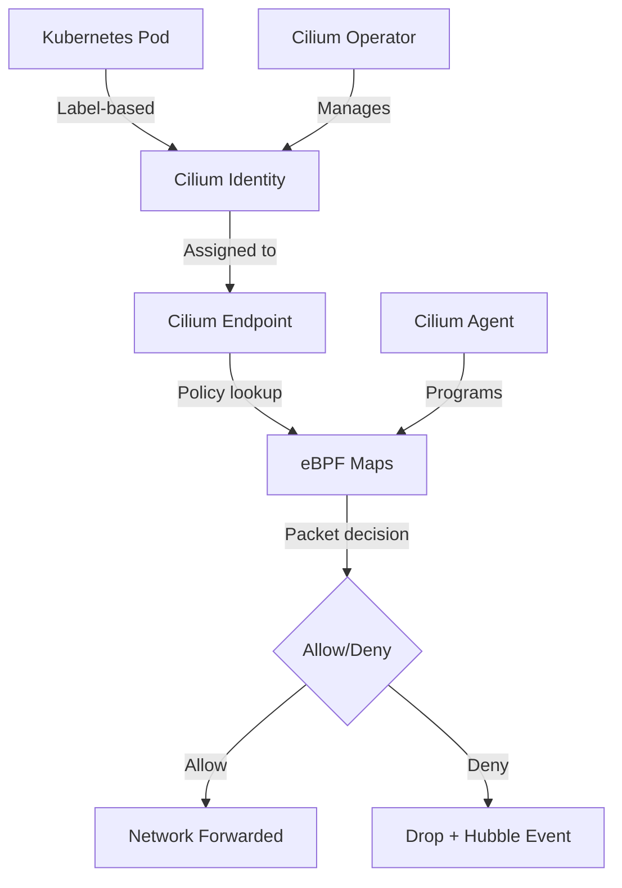

# Cilium Core Concepts: Configure, Troubleshoot, Validate, and Monitor

Author: [nawazdhandala](https://github.com/nawazdhandala)

Tags: Cilium, Kubernetes, Networking, eBPF, IPAM

Description: A comprehensive introduction to Cilium's core concepts including endpoints, identities, policies, and the eBPF datapath with practical configuration, troubleshooting, and monitoring guidance.

---

## Introduction

Understanding Cilium's core concepts is essential for operating it effectively. At its heart, Cilium introduces a security model based on cryptographic identities derived from Kubernetes labels rather than IP addresses. This identity-based approach enables policy enforcement that remains consistent even as pods are rescheduled across nodes and IP addresses change.

Cilium's architecture centers on the Cilium Agent (a DaemonSet on each node), the Cilium Operator (a deployment managing cluster-wide state), and Hubble (the observability layer). Each node's Cilium Agent manages endpoints - the abstraction of any networked process - and programs the eBPF datapath based on current policy state. The eBPF programs run in the Linux kernel, providing high-performance packet processing without the overhead of traditional userspace networking.

This guide explains each core concept, how to work with them operationally, troubleshoot when things go wrong, and monitor the health of each component.

## Prerequisites

- Cilium installed in a Kubernetes cluster
- `kubectl` with cluster admin access
- Cilium CLI installed
- Basic Kubernetes networking knowledge

## Configure Cilium Core Components

Understand and configure the key Cilium objects:

```bash
# Cilium Endpoints - representation of pods/processes on this node
kubectl -n kube-system exec ds/cilium -- cilium endpoint list

# Cilium Identities - security identity derived from labels
kubectl get ciliumidentities

# CiliumNodes - node-level networking state
kubectl get ciliumnodes

# CiliumNetworkPolicies - L3/L4/L7 network policies
kubectl get cnp -A
kubectl get ccnp  # Cluster-wide policies
```

Configure a basic identity-based policy:

```yaml
# identity-policy.yaml
apiVersion: "cilium.io/v2"
kind: CiliumNetworkPolicy
metadata:
  name: allow-frontend-to-backend
  namespace: default
spec:
  # Select the backend endpoints
  endpointSelector:
    matchLabels:
      app: backend
      tier: api
  ingress:
  # Allow only from frontend identity
  - fromEndpoints:
    - matchLabels:
        app: frontend
        tier: web
    toPorts:
    - ports:
      - port: "8080"
        protocol: TCP
```

```bash
kubectl apply -f identity-policy.yaml

# Verify identity assignment
kubectl get ciliumidentities | grep backend
kubectl -n kube-system exec ds/cilium -- cilium identity get <identity-id>
```

## Troubleshoot Core Concept Issues

Diagnose common Cilium conceptual issues:

```bash
# Issue: Endpoint not reaching "ready" state
kubectl -n kube-system exec ds/cilium -- cilium endpoint list
# Look for endpoints in "not-ready", "disconnected" state

kubectl -n kube-system exec ds/cilium -- cilium endpoint get <endpoint-id>
# Check "status.state" and "status.log"

# Issue: Identity not being created
kubectl get ciliumidentities
# Identities are auto-created when pods start
kubectl describe ciliumidentity <identity-id>

# Issue: Policy not enforced (traffic allowed when it should be blocked)
kubectl -n kube-system exec ds/cilium -- cilium policy get
kubectl -n kube-system exec ds/cilium -- cilium endpoint list | grep policy-enforcement
```

Debug identity and policy issues:

```bash
# Trace policy decision for a specific flow
kubectl -n kube-system exec ds/cilium -- \
  cilium policy trace --src-identity <src-id> --dst-identity <dst-id> --dport 8080

# Check which identities a policy matches
kubectl -n kube-system exec ds/cilium -- \
  cilium policy selectors

# Monitor live traffic decisions
kubectl -n kube-system exec ds/cilium -- cilium monitor --type policy-verdict
```

## Validate Cilium Concepts in Practice

Verify the core Cilium model is working correctly:

```bash
# Validate all endpoints are ready
TOTAL=$(kubectl -n kube-system exec ds/cilium -- cilium endpoint list --no-headers | wc -l)
READY=$(kubectl -n kube-system exec ds/cilium -- cilium endpoint list --no-headers | grep " ready" | wc -l)
echo "Endpoints: $READY/$TOTAL ready"

# Validate identities are correctly assigned
kubectl get pods -n default --show-labels
kubectl get ciliumidentities -o json | jq '.items[] | {id: .metadata.name, labels: .security-labels}'

# Test identity-based policy enforcement
# Deploy test pods
kubectl run frontend --image=nginx --labels="app=frontend,tier=web"
kubectl run backend --image=nginx --labels="app=backend,tier=api"
kubectl run attacker --image=nginx --labels="app=attacker"

# Test with policy applied
kubectl exec -it frontend -- curl backend  # Should succeed
kubectl exec -it attacker -- curl backend  # Should be blocked
```

## Monitor Cilium Component Health



Monitor component health metrics:

```bash
# Check overall Cilium health
cilium status

# Monitor endpoint health
kubectl -n kube-system exec ds/cilium -- cilium endpoint list | \
  awk '{print $8}' | sort | uniq -c

# Monitor identity churn (frequent identity creation indicates pod instability)
kubectl -n kube-system port-forward svc/cilium-operator 9963:9963 &
curl -s http://localhost:9963/metrics | grep identity

# Watch for policy enforcement issues via Hubble
cilium hubble port-forward &
hubble observe --verdict DROPPED -f

# Key metrics
# cilium_endpoint_count - total endpoints
# cilium_policy_count - number of policies
# cilium_identity_count - total security identities
```

## Conclusion

Cilium's identity-based security model represents a fundamental shift from IP-based network policies. By deriving security identities from Kubernetes labels and enforcing policies in the eBPF kernel layer, Cilium provides both better security and better performance than traditional approaches. Understanding endpoints, identities, policies, and the eBPF datapath is the foundation for effectively operating Cilium in production. Regular health checks of endpoints and identities ensure your cluster's networking layer remains stable and policy-enforced.
